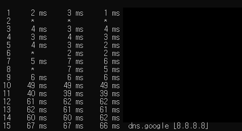
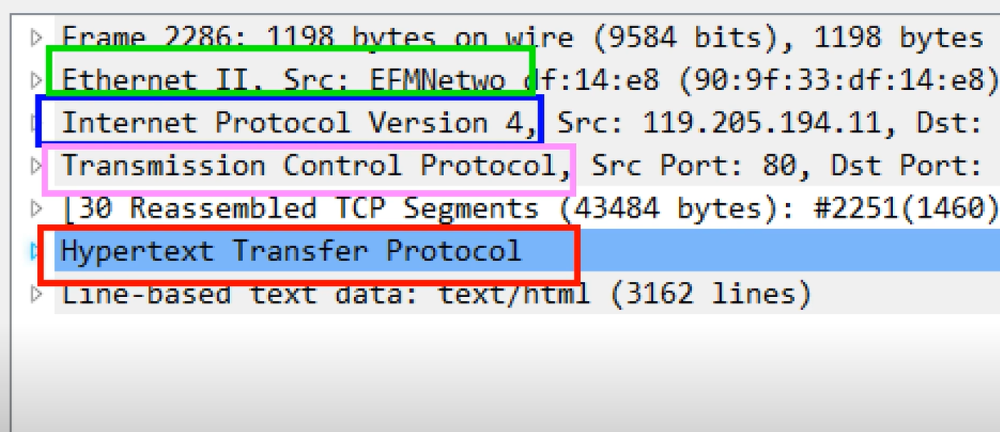
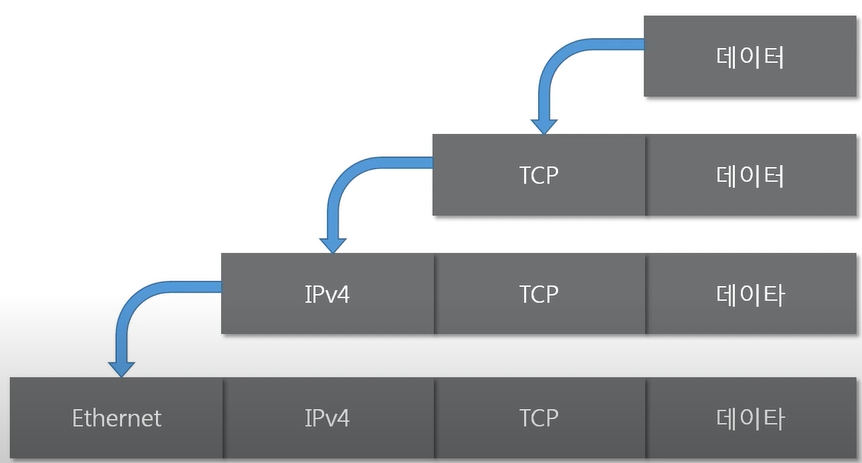
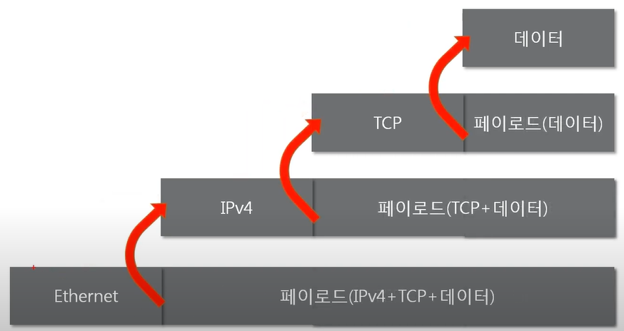

## [네트워크란?](https://youtu.be/Av9UFzl_wis?list=PL0d8NnikouEWcF1jJueLdjRIC4HsUlULi)

#### **네트워크란 무엇인가?**

- 노드들이 데이터를 공유할 수 있게 하는 디지털 전기 통신망의 하나
  - 노드 : 네트워크에 속한 컴퓨터 또는 통신 장비를 뜻하는 말
- 즉, 분산되어 있는 컴퓨터를 통신망으로 연결한 것
- 네트워크에서 여러 장치들은 노드 간 연결을 사용하여 서로에게 데이터를 교환한다.
- **인터넷이란?**
  - 문서, 그림 영상과 같은 여러가지 데이터를 공유하도록 구성된 세상에서 가장 큰 전세계를 연결하는 네트워크
  - www는 인터넷을 통해 웹과 관련된 데이터를 공유하는 것
    - www != 인터넷


#### **네트워크의 분류**

- **크기에 따른 분류**
  - LAN (Local Area Network)
    - 가까운 지역을 하나로 묶은 네트워크
    - ex) 스타크래프트
  - WAN (Wide Area Network)
    - 멀리 있는 지역을 한데 묶은 네트워크
    - 가까운 지역끼리 묶인 LAN과 LAN을 다시 하나로 묶은 것
  - MAN (Metropolitan Area Network)
    - LAN과 WAN의 중간
  - 기타 (VLAN, CAN, PAN 등등)
- **연결 형태에 따른 분류**
  - Star형
    - 중앙 장비에 모든 노드가 연결
    - LAN 대역을 만들 때 주로 Star형으로 연결
    - 공유기가 고장나면?
      - 모든 통신 불가
    - ex) 가정집에서 사용하는 공유기 (핸드폰, 컴퓨터, TV 등등 한 번에 연결)
  - Mesh형
    - 여러 노드들이 서로 그물처럼 연결
    - 하나가 고장나더라도 통신 가능
  - Tree형
  - 기타 (링형, 버스형, 혼합형 등)
    - 실제 인터넷은 여러 형태를 혼합한 혼합형


#### 네트워크의 통신 방식

- **유니캐스트**
  - 특정 대상이랑만 1:1로 통신
- **멀티캐스트**
  - 특정 다수와 1:N으로 통신
- **브로드캐스트**
  - 네트워크에 있는 모든 대상과 통신


#### 네트워크 프로토콜

- **프로토콜이란?**
  - 프로토콜은 일종의 약속, 양식
  - 네트워크에서 노드와 노드가 통신할 때 어떤 노드가 어느 노드에게 어떤 데이터를 어떻게 보내는지 작성하기 위한 양식
  - ex) 택배, 편지, 전화 모두 각각의 양식을 가짐
  - 각 프로토콜들도 해당 프로토콜만의 양식
- **여러가지 프로토콜**
  - 가까운 곳과 연락할 때
    - Ethernet 프로토콜 (MAC 주소)
  - 멀리있는 곳과 연락할 때
    - ICMP, IPv4, ARP (IP주소)
  - 여러가지 프로그램으로 연락할 때
    - TCP, UDP (포트 번호)
- 여러 프로토콜들로 캡슐화 된 패킷


### [실습1 (tracert)](https://youtu.be/paJf7JbBWqY?list=PL0d8NnikouEWcF1jJueLdjRIC4HsUlULi)

- 구글과 나는 어떻게 연결되어 있는지 확인해보기

  - ```bash
    # 8.8.8.8 : 구글의 dns 주소
    $ tracert 8.8.8.8
    ```

  - 

  - 총 15개의 네트워크 대역을 거쳐갔다.


### [실습2 (Wireshark)](https://youtu.be/vBrQ3yzerMg?list=PL0d8NnikouEWcF1jJueLdjRIC4HsUlULi)



- 프로토콜 여러 개 함께 사용 (encapsulation)
  - 멀리 떨어져 있을때 : IPv4 (Internet Protocol Version 4)
  - 가까운 곳 : Ethernet
  - 크롬 - 네이버 연결 : TCP (Transmission Control Protocol)
  - HTTP (Hypertext Transfer Protocol)


## [네트워크 모델](https://youtu.be/y9nlT52SAcg?list=PL0d8NnikouEWcF1jJueLdjRIC4HsUlULi)

#### 네트워크 모델의 종류


- **TCP / IP 모델**
  - 현재의 인터넷에서 컴퓨터들이 서로 정보를 주고받는데 쓰이는 통신 규약(프로토콜)의 모음
- **OSI 7계층 모델**
  - 데이터를 주고받을 때 데이터 자체의 흐름을 각 구간별로 나눠 놓은 것


#### 두 모델 비교

- **공통점**
  - 계층적 네트워크 모델
  - 계층간 역할 정의
- **차이점**
  - 계층의 수 차이
  - OSI는 역할 기반, TCP/IP는 프로토콜 기반
  - OSI는 통신 전반에 대한 표준
  - TCP/IP는 데이터 전송기술 특화


#### 네트워크를 통해 전달되는 데이터, 패킷

- **패킷이란?**
  - 네트워크 상에서 전달되는 데이터를 통칭하는 말
  - 블록 단위
  - 제어 정보와 사용자 데이터로 이루어지며 사용자 데이터는 페이로드라고도 한다.
- **패킷을 이용한 통신과정**
  - **캡슐화**
    - 여러 프로토콜을 이용해서 최종적으로 보낼 때 패킷을 만드는 과정
    - 
    - HTTP를 payload로 해서 TCP라는 header를 붙임
      - 이 패킷을 payload로 IPv4라는 헤더를 붙임
        - 이 패킷을 payload로 해서 Ethernet이라는 헤더를 붙임 ... 
    - 상위 계층 - 하위 계층 순서로
  - **디캡슐화**
    - 여러 프로토콜을 이용해서 최종적으로 받을 때 패킷을 만드는 과정
    - 
    - 낮은 계층에서 높은계층 순서로


- **계층별 패킷의 이름 PDU (Protocol Data Unit)**
  - 계층별로 이름이 다른 PDU
    - 4계층의 PDU = 세그먼트
    - 3계층의 PDU = 패킷
    - 2계층의 PDU = 프레임

