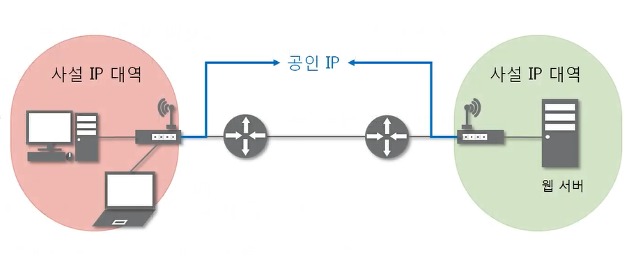
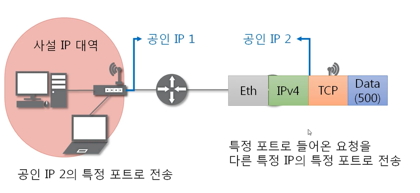

### [NAT란?](https://youtu.be/Qle5cfCcuEY?list=PL0d8NnikouEWcF1jJueLdjRIC4HsUlULi)

> Network Address Translation

- IP 패킷의 TCP/UDP 포트 숫자와 출발지 및 목적지의 IP 주소 등을 재기록하면서 라우터를 통해 네트워크 트래픽을 주고 받는 기술

- 패킷에 변화가 생기기 때문에 IP나 TCP/UDP의 checksum도 다시 계산되어 재기록해야 한다.
- NAT를 하는 이유는 대개 사설 네트워크에 속한 여러 개의 호스트가 하나의 공인 IP 주소를 사용하여 인터넷에 접속하기 위함이다.
- 하지만 꼭 사설 IP를 공인 IP로 변환하는 데에만 사용되지는 않음

- 바깥 세상에서는 사설 IP는 안보이고, 공유기가 통신하는 공인 IP만 보임

### 포트포워딩이란?

- 특정 IP 주소와 포트 번호의 통신 요청을 특정 다른 IP와 포트 번호로 넘겨주는 NAT의 응용 기술
- 게이트웨이(외부망)의 반대쪽에 위치한 사설 네트워크에 상주하는 호스트에 대한 서비스를 생성하기 위해 흔히 사용됨

- 공유기의 공인 IP로 보내면, 포트포워딩을 통해 사설 IP와 통신하는 방식

