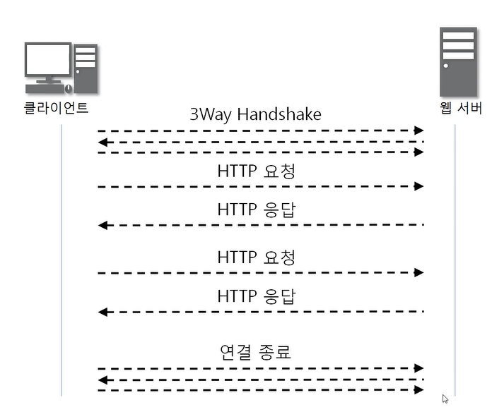
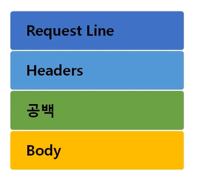
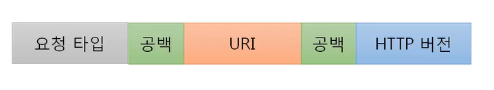
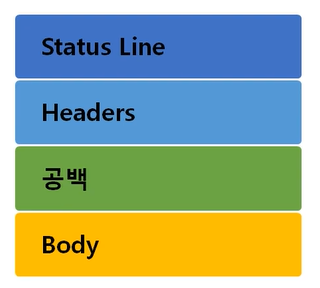

### [HTTP 프로토콜](https://youtu.be/TwsQX1AnWJU?list=PL0d8NnikouEWcF1jJueLdjRIC4HsUlULi)

> HyperText Transfer Protocol (하이퍼 텍스트 전송 프로토콜)

#### HTTP 프로토콜의 특징

- www에서 쓰이는 핵심 프로토콜로 문서의 전송을 위해 쓰이며, 거의 모든 웹 애플리케이션에서 사용됨
  - 음성, 화상 등 여러 종류의 데이터를 MIME로 정의하여 전송 가능
- Request / Response 동작에 기반하여 서비스 제공
- HTTP 1.0의 특징
  - "연결 수립, 동작, 연결 해제" 의 단순함이 특징
    - 하나의 URL은 하나의 TCP 연결
  - HTML 문서를 전송 받은 뒤 연결을 끊고 다시 연결하여 데이터를 전송
  - 문제점 : 단순 동작이 반복되어 통신 부하 문제 발생
    - 3Way Handshake - 요청 - 응답 - 연결 종료가 반복
- HTTP 1.1 에서는 이러한 문제를 개선해서 요청, 응답이 모두 종료된 이후 연결 종료

#### HTTP 프로토콜의 통신 과정

### [HTTP 요청 프로토콜](https://youtu.be/rxaBwwI_JnI?list=PL0d8NnikouEWcF1jJueLdjRIC4HsUlULi)

#### 요청 프로토콜의 구조

- **[요청 타입](https://developer.mozilla.org/ko/docs/Web/HTTP/Methods)**
  - 일반적으로 GET, POST만 사용
  - 둘 다 데이터를 보낼 수 있지만 GET은 내용을 URI에 포함, POST는 내용을 body에 포함
    - 중요한 내용은 GET보다는 POST

- [URI](https://youtu.be/2ikhZ_fNP5Y?list=PL0d8NnikouEWcF1jJueLdjRIC4HsUlULi) (Uniform Resource Identifier)
  - 인터넷 상에서 특정 자원(파일)을 나타내는 유일한 주소
  - `scheme ://host[:port][/path][?query]`
    - ex) `ftp://IP주소:포트/파일이름`, `http://도메인주소/폴더이름/파일이름`
    - 포트 지정 안하면 80 or 443

### [HTTP 응답 프로토콜](https://youtu.be/kuucNF4Zvbs?list=PL0d8NnikouEWcF1jJueLdjRIC4HsUlULi)

- 요청 프로토콜과 Status Line만 다르다

#### 응답 프로토콜의 구조

#### [상태 코드](https://developer.mozilla.org/ko/docs/Web/HTTP/Status)

- 100 ~ 199 : 단순 정보
- 200 ~ 299 : Client 요청이 성공
  - 200 OK
- 300 ~ 399 : Client 요청이 수행되지 않아 다른 URL로 재지정
- 400 ~ 499 : Client 잘못
  - 403 Forbidden
  - 404 Not Found
- 500 ~ 599 : Server 잘못
  - 500 Internal Server Error
  - 503 Service Unavailable

### [HTTP 헤더 포맷](https://youtu.be/mQTGmxendk8?list=PL0d8NnikouEWcF1jJueLdjRIC4HsUlULi)

#### [HTTP 헤더](https://developer.mozilla.org/ko/docs/Web/HTTP/Headers)

- **일반 헤더**
  - 일반적인 정보
  - Content-Length : 메시지 바디 길이를 나타냄
  - Content-Type : 메시지 바디에 들어있는 컨텐츠 종류 (ex. HTML 문서는 text/html)

- **요청 헤더**
  - 클라이언트 정보
  - Cookie : 서버로부터 받은 쿠키를 다시 서버에게 보내주는 역할
  - Host : 요청된 URL에 나타난 호스트명을 상세하게 표시
  - User-Agent : Client Program에 대한 식별 가능 정보 제공

- **응답 헤더**
  - 서버 정보
  - Server : 사용하고 있는 웹서버의 소프트웨어에 대한 정보
  - Set-Cookie : 쿠키를 생성하고 브라우저에 보낼 때 사용. 해당 쿠키 값을 브라우저가 서버에게 다시 보낼 때 사용

