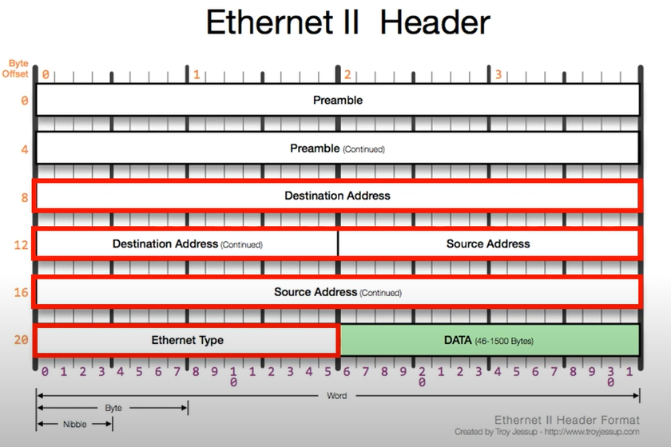

영상: [[따라學IT] 03. 가까이 있는 컴퓨터끼리는 이렇게 데이터를 주고받는다](https://youtu.be/HkiOygWMARs?list=PL0d8NnikouEWcF1jJueLdjRIC4HsUlULi)

### 2계층에서 하는일

- **2계층의 기능**
  - 하나의 네트워크(LAN) 대역에서 존재하는 여러 장비들 중에서 어떤 장비가 어떤 장비에게 전달을 하는지 **(흐름제어)**
  - 내가 전달하는 데이터가 오류가 있는지 없는지 제어 **(오류제어)**
- **2계층의 네트워크 크기**
  - 하나의 네트워크 대역 (LAN) 에서만 통신할 때 사용
  - 다른 네트워크와 통신할 때는 3계층이 도와주어야 한다.
    - 3계층의 IP 주소나 장비 등을 이용해야만 통신 가능

### 2계층에서 사용하는 주소

- **물리적인 주소**
  - MAC 주소
    - `6C-29-95-04-EB-A1`
      - 16진수 6byte
    - OUI : IEEE에서 부여하는 일종의 제조회사 식별 ID (6C-29-95)
    - 고유번호 : 제조사에서 부여한 고유번호 (04-EB-A1)

### 2계층(Ethernet) 프로토콜

- Ethernet 프로토콜
  - 
  - 목적지 주소(Destination Address)
  - 출발지 주소(Source Address)
  - 상위 프로토콜 타입 (Ethernet Type)
    - Payload 안에 들어있는 3계층 프로토콜을 미리 알려주는 것
    - 상위 프로토콜의 내용을 알려주지 않으면 무슨 내용인지 알 수 없다
    - 2바이트, IPv4 (0x0800), ARP(0x0806)

---

- `ipconfig /all`  - 이더넷 어댑터 물리적 주소에서 본인 MAC 주소 확인 가능
- `https://aruljohn.com/mac.pl` 에서 MAC 주소 앞에 6자리(OUI) 입력하면 제조 회사 확인 가능
  - FCB3BC : intel
- MAC 주소 직접 사용할 일은 없다.

