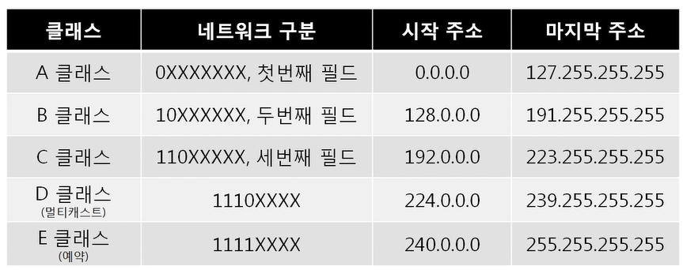
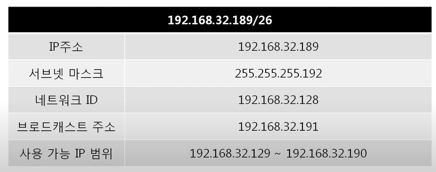
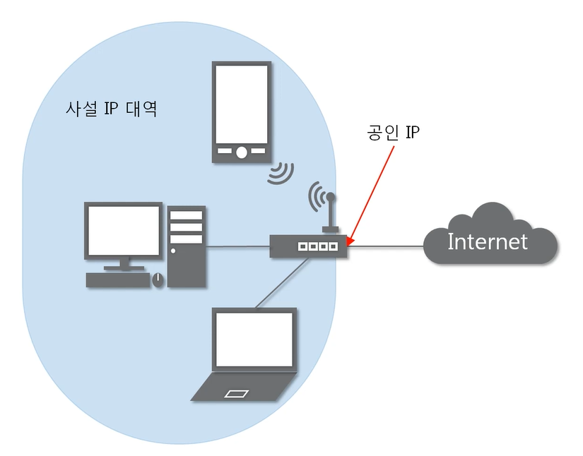

영상: [[따라學IT] 04. 실제로 컴퓨터끼리는 IP주소를 사용해 데이터를 주고받는다](https://youtu.be/s5kIGnaNFvM?list=PL0d8NnikouEWcF1jJueLdjRIC4HsUlULi)

### 3계층의 기능

- **3계층에서 하는 일**
  - 서로 다른 네트워크 대역을 연결시키는 역할
    - (LAN과 LAN을 연결시켜주는 역할)
    - 라우터와 같은 3계층 장비 필요
- **3계층에서 쓰는 주소**
  - WAN에서 통신할 때 사용하는 **IP주소**
  - IPv4에 서브넷 마스크 + 게이트웨이 등이 추가적으로 필요
    - IPv4 주소 : 현재 PC에 할당된 IP주소
    - 서브넷 마스크 : IP 주소에 대한 네트워크의 대역을 규정하는 것
    - 게이트웨이 주소 : 외부와 통신할 때 사용하는 네트워크의 출입구
- **3계층 프로토콜**
  - ARP 프로토콜
    - IP 주소를 이용해서 MAC 주소 알아온다.
  - IPv4 프로토콜
    - WAN에서 통신할 때 사용
  - ICMP 프로토콜
    - 서로가 통신되는지 확인할 때 사용

### 일반적인 IP 주소

- **Classful IP 주소**
  - 초창기에 쓰던 주소
  - **낭비가 심하다.**
  - 
- **Classless**
  - 
  - 서브넷 마스크를 이용해서 네트워크 구분
    - 255.255.255.192 = 11111111. 11111111. 11111111. 11/000000
      - 1: 네트워크 대역  구분, 0은 네트워크 대역에 속한 PC 구분
      - 64대 컴퓨터 구분 = 낭비 줄일 수 있음
    - 2진수로 표기했을 때 1로시작, 1과 1사이에는 0이 올 수 없다는 규칙을 가지고 있다.
- **사설 IP와 공인 IP**
  - 현재 사용하고 있는 IPv4 개념 
  - 공인 IP 1개당 2^32개의 사설 IP
  - NAT (Network Address Translation) : 특정 IP를 다른 특정 IP로 바꾸는 기술
  - **실제 인터넷 세상에서는 공인 IP로만 통신**
  - 외부 네트워크 대역에서는 사설 IP 대역이 보이지 않는다.
  - 

- IPv6 으로 넘어가면 더 많은 주소를 사용할 수 있지만, 현재 사용중인 장비를 교체해야 한다는 문제가 있다.

### 특수한 IP 주소

- **0.0.0.0**
  - Wildcard 주소
  - 나머지 모든 IP
- **127.0.0.1**
  - 나 자신을 나타내는 주소
- **게이트웨이 주소**
  - 공유기 IP
  - 주로 사설 IP 대역의 가장 크거나 작은 IP 사용

