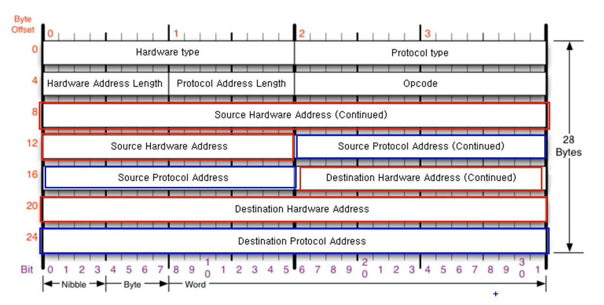
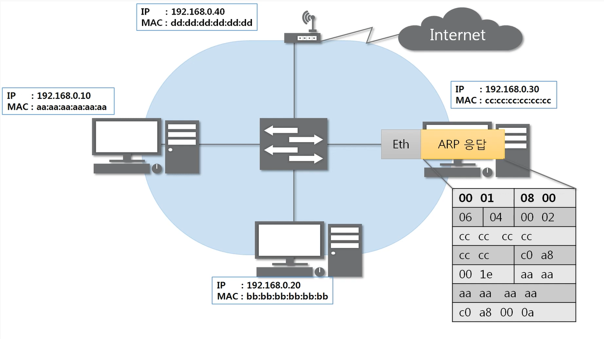
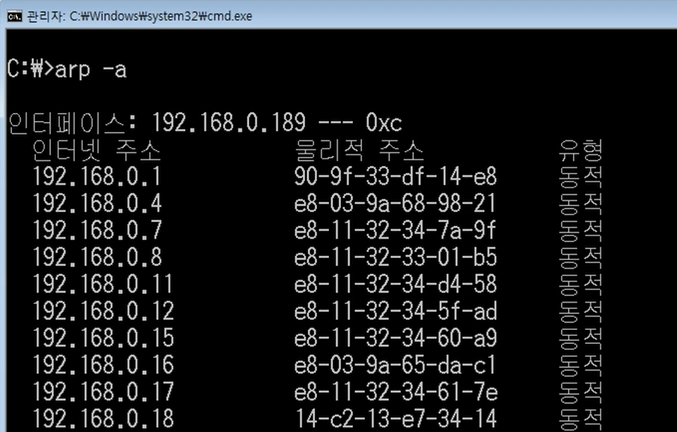
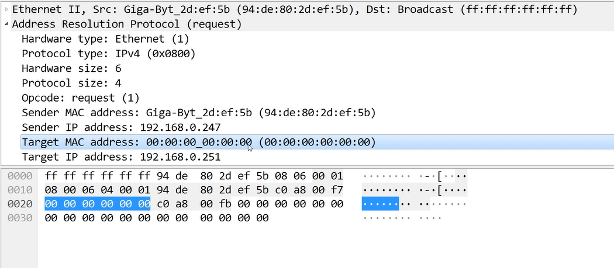

[[따라學IT] 05. 통신하기 전 반드시 필요한 ARP 프로토콜 - 이론](https://youtu.be/LDsp-Xb168E?list=PL0d8NnikouEWcF1jJueLdjRIC4HsUlULi)

### ARP 프로토콜 (Address Resolution Protocol)

- **ARP가 하는 일**
  - 같은 네트워크 대역에서 통신하기 위해 필요한 MAC 주소를 IP주소를 이용해서 알아오는 프로토콜
  - 같은 네트워크 대역에서 통신을 한다고 하더라도 데이터를 보내기 위해서는 7계층부터 캡슐화를 통해 데이터를 보내기 때문에 IP 주소와 MAC 주소가 모두 필요하다. 이때, IP 주소는 알고 MAC 주소는 모르더라도 ARP를 통해 통신이 가능하다.
  - 보안상으로도 중요한 프로토콜
- **ARP 프로토콜의 구조**
  - 
  - 28  bytes
  - Source / Destination
    - Hadrware Address : MAC 주소
    - Protocol Address : IPv4 주소
  - Ethernet만 목적지가 먼저 온다. 나머지는 출발지 먼저
  - Hardware type : 0001 (Ethernet)
  - Protocol type : 0800 (IPv4)
  - Hardware Addres Length , Protocol Address Length : 0604 (6byte, 4byte)
  - Opcode : 000x (operation code)
    - 물어보고 있는지 응답하고 있는지에 대한 코드

### ARP 프로토콜의 통신 과정

- IP주소로 MAC 주소를 알아오는 과정

  - 

  1. Eth/ARP 요청
     - Eth 도착지 전부 1로 채우면(FF FF FF FF FF) broadcast주소를 나타내는 것
  2. broadcast로 모두한테 요청 (2계층 장비인 스위치는 2계층만 확인 가능)
  3. 각자 받아서 2계층, 3계층 프로토콜 확인
  4. 본인의 IP주소와 목적지 IP주소가 일치하지 않으면 패킷을 버린다.
  5. 일치하면, 출발지 주소 넣어서 응답 프로토콜 만들어서 보내준다.
  6. 응답 프로토콜을 확인 후 MAC주소를 알아서 ARP 캐시테이블에 등록한다.

- 이러한 과정이 최초에 한 번 실행이 된 후 통신이 된다.

### ARP 테이블

- cmd 에서 `arp -a` 로 나와 통신했던 컴퓨터들 확인 가능
- 

[[따라學IT] 05. 통신하기 전 반드시 필요한 ARP 프로토콜 - 실습](https://youtu.be/-M_S50Ga384?list=PL0d8NnikouEWcF1jJueLdjRIC4HsUlULi)

- 
  - Broadcast 요청이기 때문에 Target MAC address가 비어있다.

