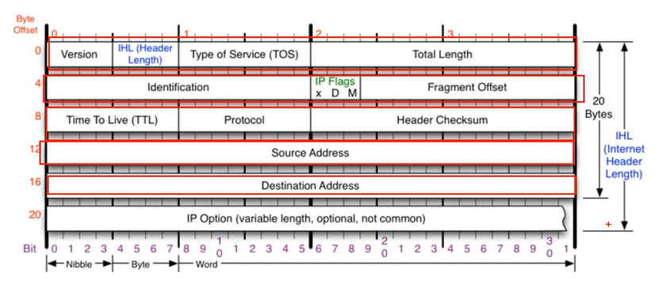

## **멀리 있는 컴퓨터끼리 데이터를 주고받는 방법**

### [IPv4 프로토콜](https://youtu.be/_i8O_o2ozlE?list=PL0d8NnikouEWcF1jJueLdjRIC4HsUlULi)

#### IPv4가 하는 일

- 네트워크 상에서 데이터를 교환하기 위한 프로토콜
- 데이터가 정확하게 전달될 것을 보장하지 않는다.
- 중복된 패킷을 전달하거나 패킷의 순서를 잘못 전달할 가능성도 있다. (악의적으로 이용하면 DoS 공격이 됨)
- 데이터의 정확하고 순차적인 전달은 그보다 상위 프로토콜인 TCP에서 보장한다.
- **신뢰성 있는 통신은 4계층, 여기서는 전달만 한다.**

#### IPv4 프로토콜의 구조

- 20 bytes
  - 옵션이 붙으면 4 byte씩 최대 10개까지 추가 가능
  - 보통은 옵션 없이 사용
- Version 
  - = 4
  - IPv6는 IP와 프로토콜 모양이 다르다.
- IHL (Header Length) 
  - 옵션길이 / 4 (20 ~ 60 / 4)
- TOS (Type of Service) 
  - 초창기에 사용했는데 최근에는 0으로 채워둔다.
  - 지금은 사용 안함
- Total Length
  - Payload 까지 합쳐진 전체 길이
- Identification, IP Flags, Fragment Offset
  - 쪼개진 애들을 알아볼 수 있게 하는 값
- Time To Live(TTL)
  - 패킷이 살아있는 시간
  - 10을 설정했으면 장비 하나를 거쳐갈 때마다 -1 하고 0이 되면 버린다.
  - 잘못된 경우 패킷이 루프를 돌면서 계속 쌓이게 될 수 있기 때문
- Protocol
  - 상위 프로토콜의 타입을 알려주는 용도
- Header Checksum
  - 헤더가 오류가 있는지 없는지 체크
- 출발지, 목적지
  - 4 byte씩

### [ICMP 프로토콜](https://youtu.be/JaBCIUsFE74?list=PL0d8NnikouEWcF1jJueLdjRIC4HsUlULi)

> Internet Control Message Protocol, 인터넷 제어 메시지 프로토콜

#### ICMP가 하는 일

- 특정 대상과 내가 통신이 잘 되는지 확인하기 위한 프로토콜

- 네트워크 컴퓨터 위에서 돌아가는 운영체제에서 오류 메시지를 전송받는 데 주로 쓰임
- 프로토콜 구조의 Type과 Code를 통해 오류메시지를 전송받는다.

#### ICMP 프로토콜의 구조

- Type
  - 대분류
  - 0 (Echo Reply), 8 (Echo) : 기본적인 것
    - 0: 응답
    - 8: 요청
  - 3 (Destination Unreachable), 11 (Time exceded) : 뭔가가 잘못되었을 때
    - 3 : 목적지까지 도달하지 못한 것 (ex. 라우터 경로 설정 오류)
    - 11 : 목적지까지 갔는데 응답을 못받은것 (ex. 상대방 방화벽)
  - 5 (Redirect) : 보안
    - 원격지에 있는 상대방 router table을 수정할 때 사용
- Code
  - type의 소분류
- Checksum

### [라우팅 테이블](https://youtu.be/CjnKNIyREHA?list=PL0d8NnikouEWcF1jJueLdjRIC4HsUlULi)

> 어디로 보내야 하는지 설정되어 있는 테이블

#### 내가 보낸 패킷은 어디로 가는가

- `netstat -r` 로 확인 가능
- 
- 라우팅 테이블에 없으면 0.0.0.0의 기본 게이트웨이로 보낸다.

1. A가 자신의 라우팅 테이블을 확인한다.
   - B의 네트워크를 아는 경우 2번 진행
   - 모든 과정에서 MAC주소 모르는 경우 ARP로 MAC주소 알아온 다음 진행
2. ICMP 요청 프로토콜 생성
   - ICMP + IPv4 + Eth
   - Eth MAC 주소 = cc cc cc cc cc cc (게이트웨이의 MAC주소)
3. 패킷을 보낸다.
4. 2계층, 3계층 확인 후 공유기의 라우팅 테이블 확인
5. Eth 프로토콜 새로 만든다.
   - 목적지 MAC 주소, 출발지 MAC 주소 변경
6. 목적지까지 반복
7. B에서 ICMP 요청 받은 후 응답 프로토콜 작성
8. 반대 방향으로 A로 응답

### [IPv4 조각화 이론](https://youtu.be/_AONcID7Sc8?list=PL0d8NnikouEWcF1jJueLdjRIC4HsUlULi)

#### **조각화란?**

- 큰 IP 패킷들이 적은 MTU(Maximum Transimission Unit)를 갖는 링크를 통하여 전송되려면 여러 개의 작은 패킷으로 쪼개어 전송해야 한다.
- 즉, 목적지까지 패킷을 전달하는 과정에 통과하는 각 라우터마다 전송에 적합한 프레임으로 변환이 필요하다.
- 일단 조각화되면, 최종 목적지에 도달할 때까지 재조립되지 않는 것이 일반적
- IPv4에서는 발신지 뿐만 아니라 중간 라우터에서도 IP  조각화 가능
- IPv6에서는 IP 단편화가 발신지에서만 가능
- 재조립은 항상 최종 수신지에서만 가능

#### **조각화하는 과정**

- 11980 byte를 보내려고 하는데 MTU = 3300 byte
- IPv4 프로토콜 20 byte 제외한 3280 byte씩 쪼갠다.
- MF = 1로 뒤에 데이터가 더 있다고 알려준다.
  - 마지막은 0으로 설정
- Offset은 앞의 데이터 크기만큼 (3280 / 8 = 410)

- MTU 시점 : **IPv4 붙고 MTU 거른 후 Eth 붙인다.**

