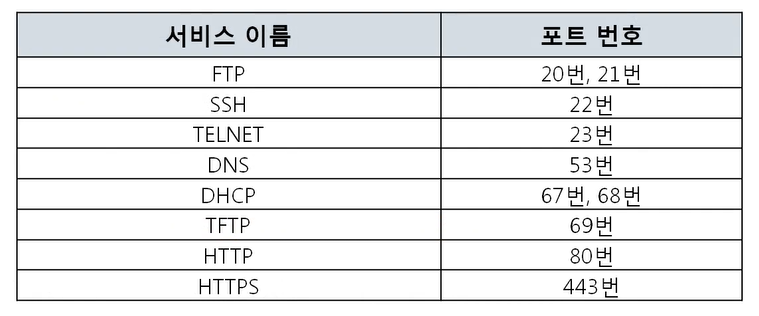

## 컴퓨터의 프로그램끼리 데이터를 주고 받는 방법

> 전송 계층 (Transport layer)

### [4계층 프로토콜](https://youtu.be/tG0ldt4sBzY?list=PL0d8NnikouEWcF1jJueLdjRIC4HsUlULi)

#### 4계층에서 하는 일

- 송신자의 프로세스와 수신자의 프로세스를 연결하는 통신 서비스 제공
- 연결 지향 데이터 스트림 지원, 신뢰성, 흐름 제어, 다중화 같은 편리한 서비스 제공
- 연결 지향 방식을 사용하는 전송 제어 프로토콜 (TCP) 와 단순한 전송에 사용되는 사용자 데이터그램 프로토콜 (UDP)이 있다.

#### 4계층 프로토콜의 종류

- **[TCP](./9장-TCP-연결지향형.md)**
  - 연결 지향
- **[UDP](./8장-UDP-비연결지향형.md)**
  - 비연결 지향

### 포트 번호

#### 포트번호의 특징

- 특정 프로세스와 특정 프로세스가 통신을 하기 위해 사용
  - **특정 프로그램이 사용하는 주소**
- 하나의 포트는 하나의 프로세스만 사용 가능
- 하나의 프로세스가 여러 개의 포트를 사용하는 것은 가능
- 포트 번호는 일반적으로 정해져 있지만 무조건 지켜야 하는 것은 아님
  - 일반적으로 웹 서비스는 80번 포트를 사용하지만 웹 서비스가 항상 80번을 사용해야하는 것은 아니다

#### Well-Known 포트

- 기본적으로 알아둬야 하는 포트 번호
- http, https : 80, 443

#### Registered 포트

- 등록된 포트
- 오라클 DB서버 : 1521
- MySQL 서버 : 3306
- MS 원격 데스크탑 : 3389

#### Dynamic 포트

- 일반 사용자들이 사용하는 포트
- 49152 ~ 65535 중에서 사용
- ex) chrome 포트번호 49153으로 naver의 80번 포트와 통신

- cmd에서 `netstat -ano` 으로 포트번호 확인 가능
- 작업관리자 PID로 프로세스 포트번호 확인 가능

