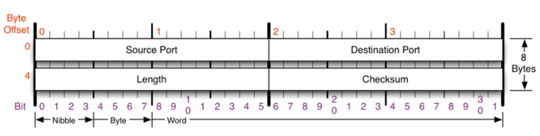
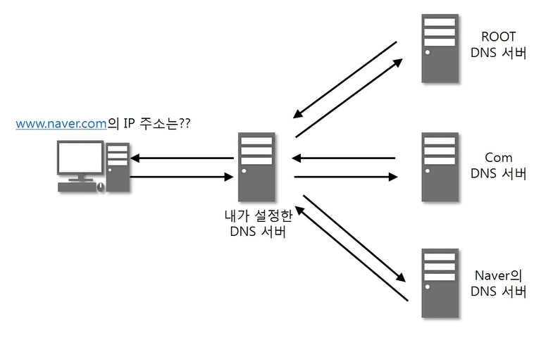
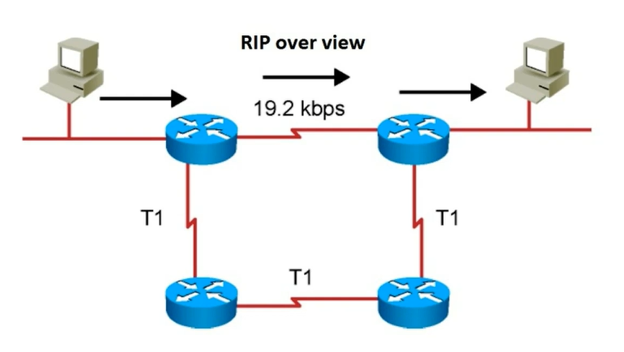

### [UDP 프로토콜](https://youtu.be/3MkI3FBFzX8?list=PL0d8NnikouEWcF1jJueLdjRIC4HsUlULi)

> 사용자 데이터그램 프로토콜 (User Datagram Protocol, UDP) = 유니버셜 데이터그램 프로토콜(Universal Datagram Protocol)

#### UDP가 하는 일

- 전송 방식은 너무 단순해서 서비스의 신뢰성이 낮고, 데이터그램 도착 순서가 바뀌거나, 중복되거나, 심지어는 통보 없이 누락시키기도 한다.
- 일반적으로 오류의 검사와 수정이 필요 없는 프로그램에서 수행할 것으로 가정

#### UDP 프로토콜의 구조

- 출발지, 도착지 포트만 있으면 되는 매우 단순한 구조

### UDP 프로토콜을 사용하는 프로그램

- **도메인을 물어보면 IP를 알려주는 DNS 서버**
  - `www.naver.com`의 IP 주소는?
  - 

- **UDP로 파일을 공유하는 tftp 서버**
- **라우팅 정보를 공유하는 RIP 프로토콜**
  - 

파일 전송 시

- 큰 파일은 보통 UDP로 전송하지 않는다.
- 동영상 같은 경우는 60프레임 중에 한장 빠져도 큰 영향이 없기 때문에 혼합해서 사용함
