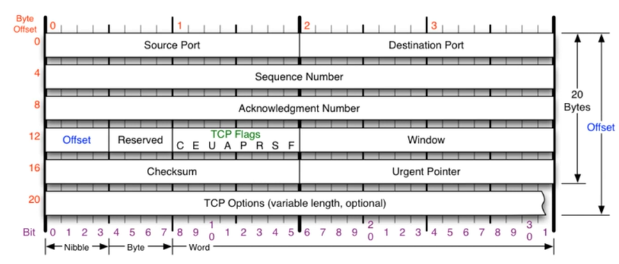
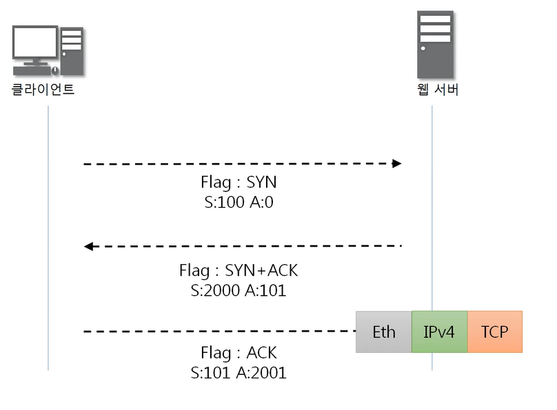
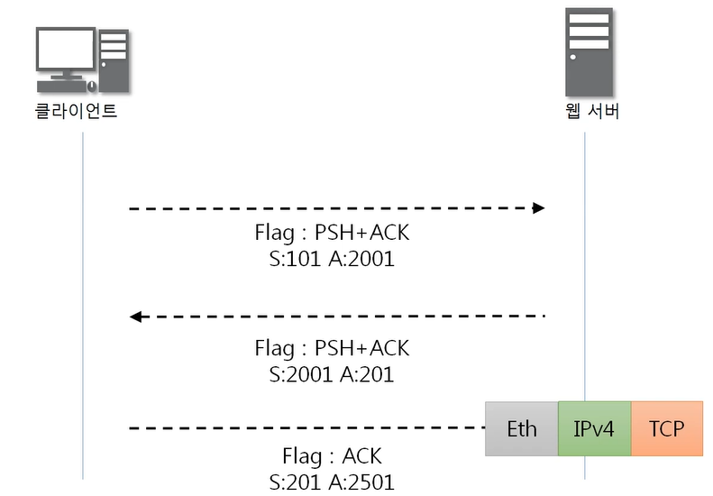
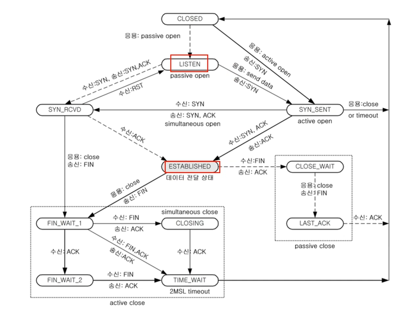
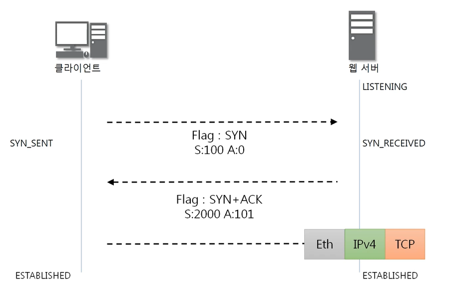

### [TCP 프로토콜](https://youtu.be/cOK_f9_k_O0?list=PL0d8NnikouEWcF1jJueLdjRIC4HsUlULi)

> 전송 제어 프로토콜 (Transmission Control Protocol, TCP)

#### TCP가 하는 일

- 인터넷에 연결된 컴퓨터에서 실행되는 프로그램 간에 통신을 안정적으로, 순서대로, 에러없이 교환할 수 있게 한다.
- TCP는 UDP보다 안전하지만 느리다.

#### TCP 프로토콜의 구조

- 20 byte (옵션에 따라 60 byte까지 가능)
- 출발지, 도착지 포트
- Offset
  - header의 길이 4로 나눈 값
- Reserved : 예약된 field로 사용 안함

- Window
  - 얼마만큼 더 보내야 하는지, 사용 공간이 얼마나 남아있는지 알려주는 용도
- Urgent Pointer
  - 어디부터가 긴급 데이터인지 알려주는 용도

#### TCP Flags

- U
  - 긴급 비트
  - 우선 순위 높음
- **A**
  - 승인 비트
  - 물어본 것에 대한 응답을 승인해 줄 때 (ex. 연결해도 되는지, 데이터 보내도 되는지)
- P
  - 밀어넣기 비트
  - TCP 버퍼가 일정한 크기만큼 쌓여야 하는데, 상관없이 데이터를 넣겠다
- **R**
  - 초기화 비트
  - 연결이 되어있는 상태에서 문제 발생 시 연결 관계를 새로고침
- **S**
  - 동기화 비트
  - 상대방과 연결을 시작할 때 무조건 사용
- **F**
  - 종료 비트
  - 연결 끊을 때 사용

### TCP를 이용한 통신 과정

#### 연결 수립 과정

- TCP를 이용한 데이터 통신을 할 때 프로세스와 프로세스를 연결하기 위해 가장 먼저 수행되는 과정
- 3Way Handshake

#### 3Way Handshake

1. 클라이언트가 서버에게 요청 패킷을 보내고 (Eth + IPv4 + TCP, Flag = sync)
2. 서버가 클라이언트의 요청을 받아들이는 패킷을 보내고 (서버에서 확인 후 Flag = sync + ack로 설정)
3. 클라이언트는 이를 최종적으로 수락하는 패킷을 보낸다. (Flag = ack)

- **Sequence Number**
  - 랜덤 하게 설정
  - 답장 할 때는 받은 acknowlege number
- **Acknowledge Number**
  - 받은 sync number + 1
- 이걸 이용해서 세션 하이재킹과 같은 문제 발생

#### 데이터 송수신 과정

- TCP를 이용한 데이터 통신을 할 때 단순히 TCP 패킷만을 캡슐화해서 통신하는 것이 아닌 페이로드를 포함한 패킷을 주고 받을 때의 일정한 규칙

1. 보낸 쪽에서 또 보낼 때는 SEQ번호와 ACK번호가 그대로다.
2. 받는 쪽에서 SEQ번호는 받은 ACK번호가 된다.
3. 받는 쪽에서 ACK번호는 받은 SEQ번호 + 데이터의 크기

### TCP 상태전이도

#### TCP 연결 상태의 변화

- 실선 : Client
- 점선 : Server
- LISTEN : 요청 하면 항상 응답할 수 있도록 듣고있는 상태
- ESTABLISHED : 연결이 서로 수립된 상태

#### 3Way Handshaking에서 보기

