# File Systems

> [File Systems #1](https://core.ewha.ac.kr/publicview/C0101020140516150939191200?vmode=f)

### File and File System

- **File**
  - A named collection of related information
  - 일반적으로 비휘발성의 보조기억장치에 저장
  - 운영체제는 다양한 저장 장치를 file이라는 동일한 논리적 단위로 볼 수 있게 해줌
  - Operation
    - create, read, write, reposition (lseek), delete, open, close 등
      - reposition (lseek) : 파일의 현재 접근 위치를 수정해주는 연산
      - open : open 이후 read/write, 파일의 메타데이터를 메모리에 올려놓는 작업

- **File attribute (혹은 파일의 metadata)**
  - 파일 자체의 내용이 아니라 파일을 관리하기 위한 각종 정보들
    - 파일 이름, 유형, 저장된 위치, 파일 사이즈
    - 접근 권한(읽기/쓰기/실행), 시간(생성/변경/사용), 소유자 등

- **File system**
  - 운영체제에서 파일을 관리하는 부분
  - 파일 및 파일의 메타데이터, 디렉토리 정보 등을 관리
  - 파일의 저장 방법 결정
  - 파일 보호 등

### Directory and Logical Disk

- **Directory**
  - 파일의 메타데이터 중 일부를 보관하고 있는 일종의 특별한 파일
  - 그 디렉토리에 속한 파일 이름 및 파일 attribute들
  - operation
    - search for a file, create a file, delete a file
    - list a directory, rename a file, traverse the file system
- **Partition (=Logical Disk)**
  - 하나의 (물리적) 디스크 안에 여러 파티션을 두는게 일반적
  - 여러 개의 물리적인 디스크를 하나의 파티션으로 구성하기도 함
  - (물리적) 디스크를 파티션으로 구성한 뒤 각각의 파티션에 **file system**을 깔거나 **swapping** 등 다른 용도로 사용할 수 있음

### open( )

> file의 메타데이터를 메모리에 올려놓는 것

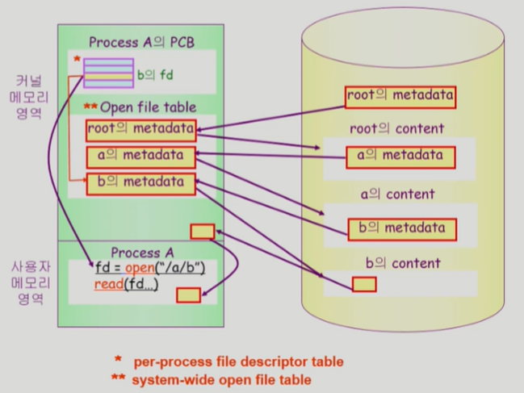

1. `fd = open("/a/b")`
   - system call 하여 CPU 제어를 운영체제에 넘김
2. root directory의 metadata는 이미 알고 있음.
   - root의 metadata를 메모리에 올림 (root open)
3. root의 metadata에 존재하는 content에서 a라는 metadata를 메모리에 올린다. (a open)
4. a에 존재하는 b의 metadata를 메모리에 올린다. (b open) 
   - open 끝
5. b파일의 metadata를 가리키는 pointer가 만들어짐
6. 몇번째 index인지 알려주는 fd(file descriptor)를 사용자 프로세스에 return
   - 사용자 프로세스는 fd를 이용하여 read/write 요청 가능
7. 사용자 프로그램에게 직접 주는 것이 아니라, 운영체제가 자신의 메모리공간 일부에 먼저 읽어놓는다.
   - 동일한 파일에 동일한 위치를 요청하면(read systemcall) 하면, disk까지 가는 것이 아니라 한 번 읽어놓은 것을 주면 된다. **(=buffer cache)**
8. 사용자 프로그램에게 내용을 copy해서 전달해준다.

- File System 의 buffer cache 환경에서는 운영체제가 모든 정보를 알고 있으므로 LRU, LFU 알고리즘을 사용할 수 있다. 

- per-process file descriptor table : fd는 프로세스마다 따로 존재

- Open file table
  - system-wide하게 하나만 존재
  - 각 프로그램이 어디를 접근하고 있는지에 대한 offset은 프로세스 별로 따로 관리

### File Protection

- 파일의 접근 권한
- 각 파일에 대해 누구에게 어떤 유형의 접근(read/write/execution)을 허락할 것인가?
- Access Control 방법
  - **Access control Matrix**
    - 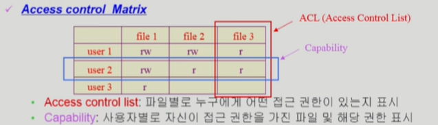
    - Access control list : 파일별로 누구에게 어떤 접근 권한이 있는지 표시
    - Capability : 사용자별로 자신이 접근 권한을 가진 파일 및 해당 권한 표시
    - 모든 사용자에 대해 모든 파일의 접근 권한 제어 가능
      - 부가적인 overhead가 너무 크다.
      - 따라서 대부분 아래의 grouping 사용
  - **Grouping**
    - 전체 user를 owner, group, public의 세 그룹으로 구분
    - 각 파일에 대해 세 그룹의 접근 권한(rwx)을 3비트씩으로 표시
    - **9개의 비트만으로 파일 접근 제어 가능하므로 효율적**
    - ex) UNIX
      - `rwx r-- r--`
  - **Password**
    - 파일마다 password를 두는 방법 (디렉토리 파일에 두는 방법도 가능)
    - 모든 접근 권한에 대해 하나의 password: all-or-nothing
    - 접근 권한별 password: 암기 문제, 관리 문제

### File System의 Mounting

> 다른 partition에 설치된 file system에 접근해야 하는 경우에는 어떻게 해야 되는가?

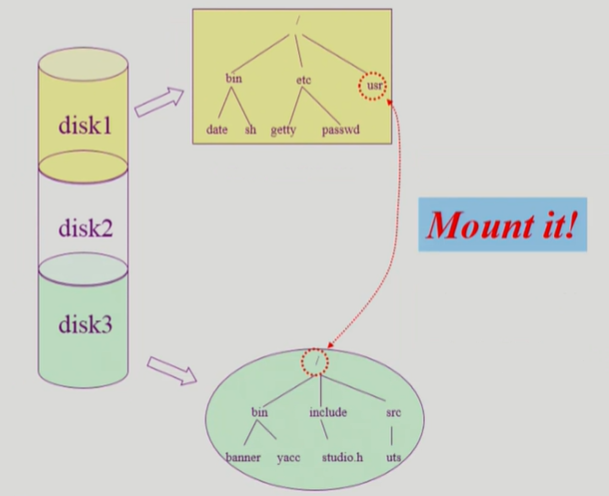

- mounting
  - root file system의 특정 이름에 다른 partition을 mount해준다.
- 서로 다른 partition의 file system 접근 가능

### Access Methods

- 시스템이 제공하는 파일 정보의 접근 방식
  - **순차 접근 (sequential access)**
    - 카세트 테이프를 사용하는 방식처럼 접근
    - 읽거나 쓰면 offset은 자동적으로 증가
  - **직접 접근 (direct access, random access)**
    - LP 레코드 판과 같이 접근하도록 함
    - 파일을 구성하는 레코드를 임의의 순서로 접근할 수 있음

# File Systems Implementations

> [File Systems Implementations #1](https://core.ewha.ac.kr/publicview/C0101020140520134614002164?vmode=f), [File Systems Implementations #2](https://core.ewha.ac.kr/publicview/C0101020140523142954456205?vmode=f)

### Allocation of File Data in Disk

- **Contiguous Allocation(연속 할당)**

  - 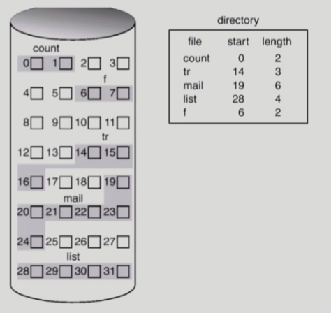
  - 단점
    - external fragmentation
    - File 크기를 키우기 어렵다
      - file 생성시 얼마나 큰 hole을 배당할 것인가?
      - grow 가능 vs 낭비 (internal fragmentation)
  - 장점
    - Fast I/O
      - 한번의 seek/rotation으로 많은 바이트 transfer
      - Realtime file용으로, 또는 이미 run 중이던 process의 swapping 용
    - Direct access(=random access) 가능

  

- **Linked Allocation**

  - **directory에는 시작 위치만 갖고 있는다.**
  - 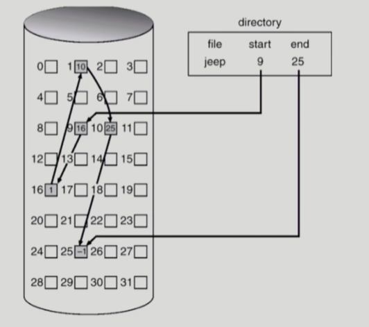
  - 장점
    - External fragmentation 발생 안 함
  - 단점
    - No random access (직접 접근 불가)
      - 순차 접근으로 인해 시간이 오래 걸림
    - Reliability 문제
      - 한 sector가 고장나 pointer가 유실되면 많은 부분을 잃음
    - Pointer를 위한 공간이 block의 일부가 되어 공간 효율성을 떨어뜨림
      - 512 bytes/sector, 4 bytes/pointer
  - 변형
    - File-allocation table (FAT) 파일 시스템
      - 포인터를 별도의 위치에 보관하여 reliability와 공간효율성 문제 해결

- **Indexed Allocation**
  - 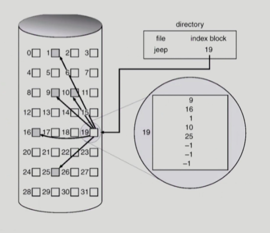
  - 파일이 저장되어 있는 위치정보를 block에 열거해놓는 방식
  - 장점
    - External fragmentation 발생하지 않음
    - Direct access 가능
  - 단점
    - Small file의 경우 공간 낭비 (실제로 많은 file들이 small)
    - Too large file의 경우, 하나의 block으로 index 저장 불가능
      - 해결방안
        - linked scheme : index 마지막 위치는 또 다른 index의 정보
        - multi-level index : index가 data 위치를 2번 거쳐서 가르킨다. (but, 공간 낭비 발생)

### UNIX 파일시스템의 구조

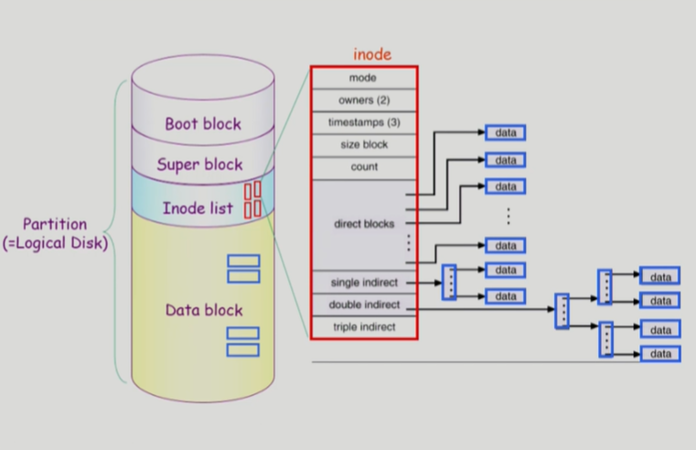

- **Boot block**

  - 모든 파일시스템은 boot block 이 제일 위에 있음

  - 부팅에 필요한 정보 (bootstrap loader)

- **Superblock**

  - 파일 시스템에 관한 총체적인 정보를 담고 있다.

- **Inode list**

  - 파일 이름을 제외한 파일의 모든 메타 데이터를 저장
  - file 이름은 directory가 직접 갖고 있다.

- **Data block**
  - 파일의 실제 내용을 보관

### FAT File System

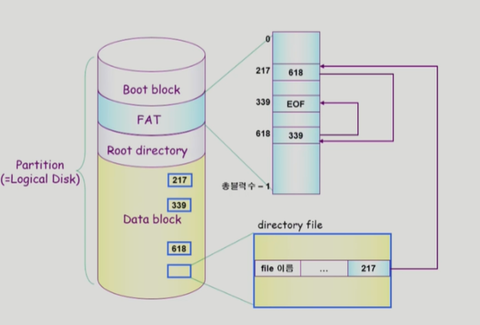

- **FAT**
  - 위치 정보에 대한 metadata 저장
    - linked allocation 활용
  - 직접 접근 가능
  - FAT 배열의 크기 = data block의 크기만큼
  - bad sector가 나더라도 FAT에 내용이 있기 때문에 안정적
    - disk에 2 copy 이상 저장

### Free-Space Management

- **Bit map or bit vector**
  - 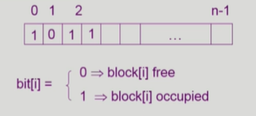
  - 부가적인 공간을 필요로 함
  - 연속적인 n개의 free block을 찾는데 효과적
- **Linked list**
  - 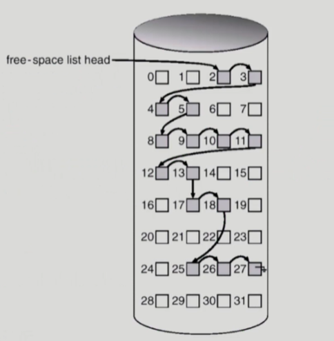
  - 모든 free block들을 링크로 연결(free list)
  - 비어있는 첫번째 위치만 갖고 있는다.
  - 연속적인 가용공간을 찾는 것은 쉽지 않다.
  - 공간의 낭비가 없다.
- **Grouping**
  - 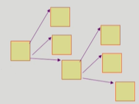
  - linked list 방법의 변형
  - 첫번쨰 free block이 n개의 pointer를 가짐
    - n-1 pointer는 free data block을 가리킴
    - 마지막 pointer가 가리키는 block은 또 다시 n pointer를 가짐
  - 연속적인 빈 block을 찾는데는 효과적이지 않음
- **Counting**
  - 연속적인 빈 block 찾는데 효과적인 방법
  - (first free block, # of contiguous free blocks) 방식으로 연속된 block 개수 저장

### Directory Implementation

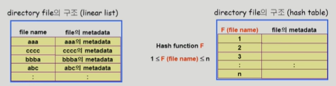

- **Linear list**
  - <file name, file의 metadata>의 list
  - 구현이 간단
  - 디렉토리 내에 파일이 있는지 찾기 위해서는 linear search 필요 (time-consuming)
- **Hash Table**
  - linear list + hashing
  - Hash table은 file name을 이 파일의 linear list의 위치로 바꾸어줌
  - search time을 없앰
  - Collision 발생 가능

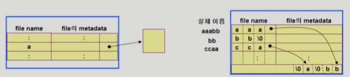

- **File의 metadata의 보관 위치**
  - 디렉토리 내에 직접 보관
  - 디렉토리에는 포인터를 두고 다른 곳에 보관
    - inode, FAT 등
- **Long file name의 지원**
  - <file name, file의 metadata>의 list에서 각 entry는 일반적으로 고정 크기
  - file name이 고정 크기의 entry 길이보다 길어지는 경우 entry의 마지막 부분에 이름의 뒷부분이 위치한 곳의 포인터를 두는 방법
  - 이름의 나머지 부분은 동일한 directory file의 일부에 존재

### VFS and NFS

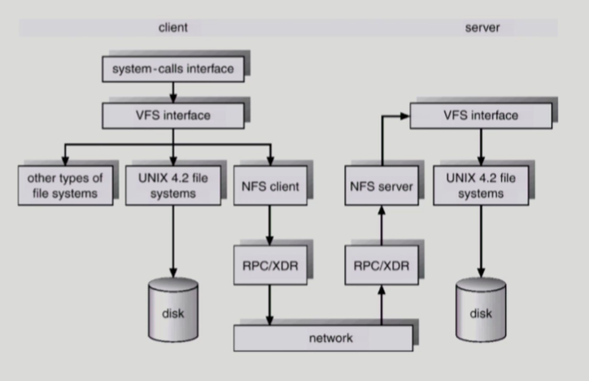

- **Virtual File System (VFS)**
  - 서로 다른 다양한 file system에 대해 동일한 시스템 콜 인터페이스(API)를 통해 접근할 수 있게 해주는 OS의 layer
- **Network File System (NFS)**
  - 분산 시스템에서는 네트워크를 통해 파일이 공유될 수 있음
  - NFS는 분산 환경에서의 대표적인 파일 공유 방법임

### Page Cache and Buffer Cache

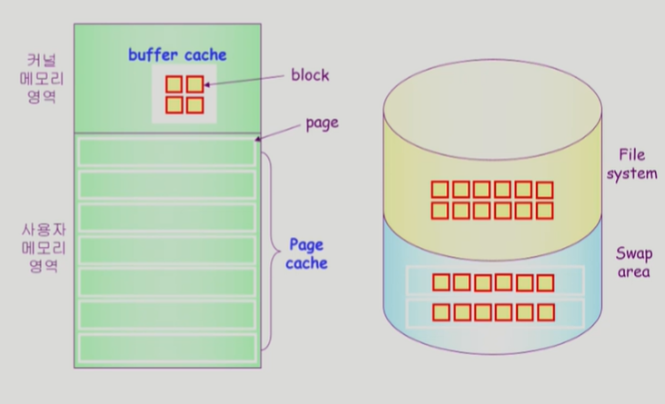

- **Page Cache**
  - Virtual memory의 paging system에서 사용하는 page frame을 caching의 관점에서 설명하는 용어
  - Memory-Mapped I/O를 쓰는 경우 file의 I/O에서도 page cache 사용
- **Memory-Mapped I/O**
  - File의 일부를 virtual memory에 mapping시킴
  - 매핑시킨 영역에 대한 메모리 접근 연산은 파일의 입출력을 수행하게 함
- **Buffer Cache**
  - 파일시스템을 통한 I/O 연산은 메모리의 특정 영역인 buffer cache 사용`
  - File 사용의 locality 활용
    - 한번 읽어온 block에 대한 후속 요청시 buffer cache에서 즉시 전달
  - 모든 프로세스가 공용으로 사용
  - Replacement algorithm 필요 (LRU, LFU 등)
- **Unified Buffer Cache**
  - 최근의 OS에서는 기존의 buffer cache가 page cache에 통합됨

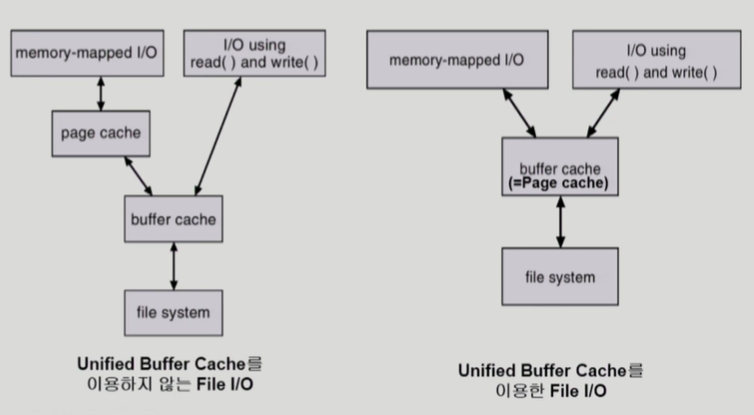

### 프로그램의 실행

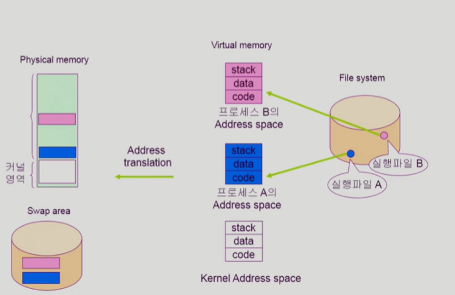

0. 프로그램이 실행파일로 File system에 저장되어 있음
1. 실행하면 process가 된다.
2. 독자적인 virtual memory가 만들어진다 (code, data, stack)
3. 당장 필요한 부분은 physical memory에 올라간다.
4. 공간이 한정되어있기 때문에 쫓겨난 것들은 swap area로 내려간다.
   - Virtual memory의 code는 swap area로 내려갈 필요가 없다. (이미 file system에 file 형태로 있기 때문)
5. 없으면 swap area가 아닌 file system에서 올린다.

#### memory mapped I/O

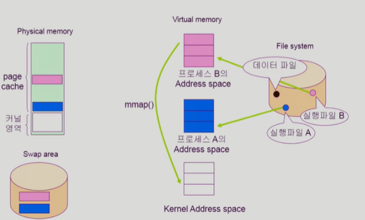

1. 데이터 파일 일부를 mmap() 해달라고 system call 요청

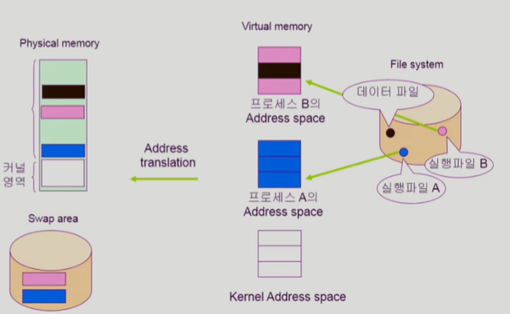

2. 데이터 파일의 일부를 주소 공간에 mapping
3. memory에 안올라와 있으면 page fault
   - physical memory에 올린다.
4. 프로세스B가 OS의 도움 없이 데이터 읽기 쓰기 가능
   - 나중에 physical memory에서 쫓겨날 때에는 swap area가 아닌 file에 쓴 후 쫓겨난다.
5. 프로세스 A도 mmap() 호출하면 내용 공유
   - **공유하기 때문에 일관성 문제 주의해야 한다.**

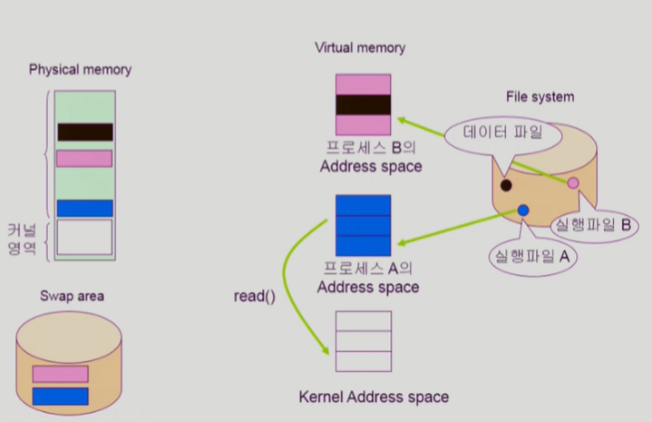

- read() system call했을 때, 요청한 내용이 이미 cache에 있으면, copy해서 사용자 process에 전달한다.
  - unified buffer cache인 경우는 page cache = buffer cache이기 때문

- mmap 장점
  - mapping해서 쓰기 때문에 직접 접근하기때문에 빠르다.
  - cache에 있는 내용을 copy해오는 overhead가 줄어든다.
  - 이미 올라와 있는 경우는 OS의 도움을 받을 필요가 없다.
- 주의할 점
  - page cache를 mapping해놓는 것이기 때문에 여러 곳에서 mmap하면 일관성 문제 주의

**사용자 프로그램이 파일을 접근하는 방식은 2가지 (read/write system call, memory mapped I/O)**

