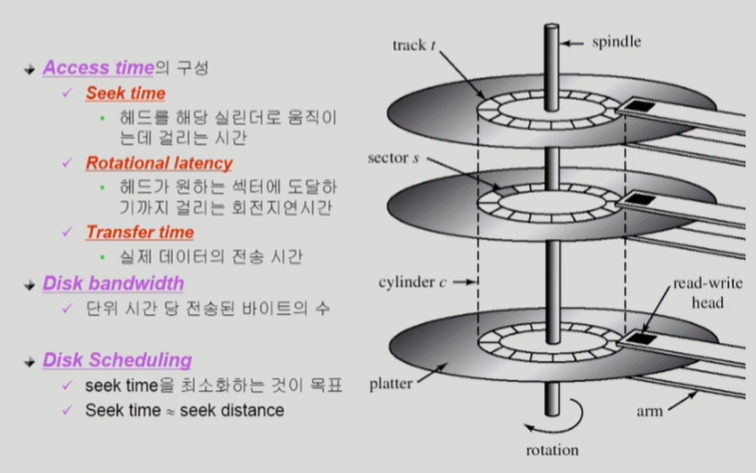
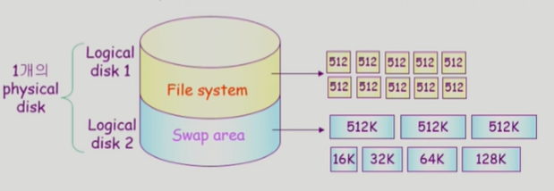
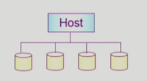

# Disk Management & Scheduling 

> [Disk Management & Scheduling #1](https://core.ewha.ac.kr/publicview/C0101020140523151255773807?vmode=f), [Disk Management & Scheduling #2](https://core.ewha.ac.kr/publicview/C0101020140527124647396004?vmode=f)

### Disk Structure

- **logical block**
  - 디스크의 외부에서 보는 디스크의 단위 정보 저장 공간들
  - 주소를 가진 1차원 배열처럼 취급
  - 정보를 전송하는 최소 단위
- **Sector**
  - 디스크 관리하는 최소 단위
  - Logical block이 물리적인 디스크에 매핑된 위치
  - Sector 0은 최외곽 실린더의 첫 트랙에 있는 첫 번째 섹터이다

### Disk Management

- **physical formatting (Low-level formatting)**
  - 디스크를 컨트롤러가 읽고 쓸 수 있도록 섹터들로 나누는 과정
  - 각 섹터는 header + 실제 data (보통 512 bytes) + trailer로 구성
  - header와 trailer는 sector number, ECC (Error-Correcting Code) 등의 정보가 저장되며 controller가 직접 접근 및 운영

- **Partitioning**
  - 디스크를 하나 이상의 실린더 그룹으로 나누는 과정 (ex. C, D 드라이브)
  - OS는 이것을 독립적 disk로 취급 (logical disk)
- **Logical formatting**
  - 파일 시스템을 만드는 것
  - FAT, inode, free space 등의 구조 포함
- **Booting**
  - ROM에 있는 "small bootstrap loader"의 실행
  - sector 0 (boot block)을 load하여 실행
  - sector 0은 "full Bootstrap loader program"
  - OS를 디스크에서 load하여 실행

### Disk Scheduling

- Disk를 읽고 쓰는 시간의 대부분은 Seek time

### Disk Scheduling Algorithm

> FCFS, SSTF, SCAN, C-SCAN, N-SCAN, LOOK, C-LOOK
>
> 엘리베이터 스케줄링과 유사

- **FCFS(First Come First Service)**
  - 들어온 순서대로 처리
- **SSTF(Shortest Seek Time First)**
  - 현재 head 위치에서 가장 가까운 요청 먼저 처리
- **SCAN**
  - disk arm이 디스크의 한쪽 끝에서 다른쪽 끝으로 이동하며 가는 길목에 있는 모든 요청을 처리
  - head 이동거리 측면에서 효율적
  - 문제점
    - 실린더 위치에 따라 대기 시간이 다름
- **C-SCAN**
  - SCAN과 같은 방식으로 길목에 있는 요청 처리
  - 반대쪽 끝에 도달했으면 출발점으로 다시 이동
  - SCAN보다 이동 거리는 길어질 수 있지만 균일한 대기 시간 제공
- **Other Algorithms**
  - 대부분 SCAN 기반 알고리즘 사용
  - **N-SCAN**
    - 지나가는 도중에 큐에 요청이 들어오면 다음번에 처리
  - **LOOK and C-LOOK**
    - 더이상 요청이 없으면 방향을 바꾼다. (무조건 0번이 아니고 제일 낮은 주소로 이동)

### Disk-Scheduling Algorithm의 결정

- SCAN, C-SCAN 및 그 응용 알고리즘은 LOOK, C-LOOK 등이 일반적으로 디스크 입출력이 많은 시스템에서 효율적인 것으로 알려짐
- File의 할당 방법에 따라 디스크 요청이 영향을 받음
- 디스크 스케줄링 알고리즘은 필요할 경우 다른 알고리즘으로 쉽게 교체할 수 있도록 OS와 별도의 모듈로 작성되는 것이 바람직하다

### Swap-Space Management

- Disk를 사용하는 두 가지 이유
  - memory의 volitale한 특성 : file system
  - 프로그램 실행을 위한 memory 공간 부족 : swap space (swap area)
- Swap-space
  - Virtual memory system에서는 디스크를 memory의 연장 공간으로 사용
  - 파일시스템 내부에 둘 수도 있으나 별도 partition 사용이 일반적
    - 공간 효율성보다는 속도 효율성이 우선
      - 프로세스 끝나면 사라질 내용이기 때문
    - 일반 파일보다 훨씬 짧은 시간만 존재하고 자주 참조됨
    - 따라서, block의 크기 및 저장 방식이 일반 파일시스템과 다름

### RAID

> Redundant Array of Independent DIsks

- 여러 개의 디스크를 묶어서 사용하는 방법

- **RAID의 사용 목적**
  - **디스크 처리 속도 향상**
    - 여러 디스크에 block의 내용을 분산 저장
    - 병렬적으로 읽어 옴(interleaving, striping)
      - striping : 디스크를 조금씩 나눠서 저장
      - interleaving : 동시에 조금씩 읽어오는 것
  - **신뢰성 향상**
    - 동일 정보를 여러 디스크에 중복 저장
    - 하나의 디스크 고장 시 다른 디스크에서 읽어옴 (mirroring, shadowing)
    - 단순한 중복 저장이 아니라 일부 디스크에 parity를 저장하여 공간의 효율성을 높일 수 있다.
      - parity : 중복저장의 정도를 낮게 해서 오류가 생겼는지 알아낼 수 있도록 하는 방법

