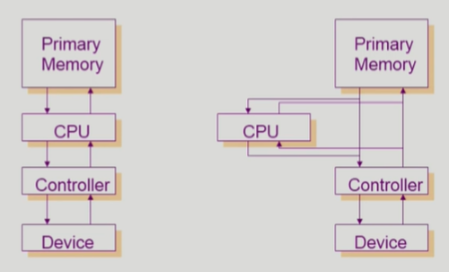
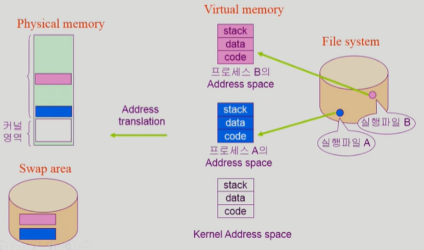

# [2. System Structure & Program Execution - 1](https://core.ewha.ac.kr/publicview/C0101020140311132925816476?vmode=f)

## 컴퓨터 시스템 구조

### Mode bit

- 운영체제인지 사용자 프로그램인지 구분
  - 인터럽트나 Exception 발생시 하드웨어가 mode bit을 0으로 바꿈
  - 사용자 프로그램에게 CPU를 넘기기 전에 mode bit을 1로 셋팅
- **0 : 모니터 모드(커널 모드, 시스템모드)**
  - 보안을 해칠 수 있는 중요한 명령어는 모니터 모드에서만 수행 가능
- **1: 사용자 모드**
  - 사용자 프로그램 수행

### Timer

- **특정 프로그램이 CPU를 독점하는 것을 막기 위한 것**
- OS가 특정 프로그램에 CPU를 넘겨줄 때 타이머에 일정 시간을 설정 한 뒤 넘겨준다.
- 정해진 시간이 흐른 뒤 운영체제에게 제어권이 넘어가도록 인터럽트를 발생시킴

### Device Controller

- I/O device controller
  - I/O 장치를 관리하는 작은 CPU durg
  - 제어 정보를 위해 control register, status register를 가짐
  - local buffer를 가짐 (일종의 data register)
- I/O는 실제 device와 local buffer 사이에서 일어남
- Device controller는 I/O가 끝났을 경우 interrupt로 CPU에 그 사실을 알림

### DMA controller

> 직접 메모리를 접근할 수 있는 컨트롤러

원래는 메모리에 직접 접근할 수 있는 장치는 CPU뿐이었는데, DMA를 통해 메모리에 접근할 수 있다.

CPU와 DMA가 동시에 메모리에 접근하는 것을 방지하는 역할을 memory controller가 한다. 누가 먼저 접근할지

- 빠른 입출력 장치를 메모리에 가까운 속도로 처리하기 위해 사용
- I/O 장치가 자주 인터럽트를 걸면 CPU가 너무 자주 방해를 받게 된다.
  - 1byte 읽어왔다고 인터럽트를 계속 걸면 너무 비효율적
- DMA를 사용해서 CPU는 자기일을 계속 하게하고 중간중간에 들어오는 값들을 메모리로 복사해준다. 
- **그 작업이 다 끝나면 CPU에 인터럽트를 한번만 걸어서 알려준다.**
  - CPU의 중재 없이 device controller가 device의 buffer storage의 내용을 메모리에 block 단위로 직접 전송
  - byte 단위가 아니라 block 단위로 인터럽트 발생
- 그래서 CPU가 인터럽트 당하는 빈도를 줄여서 장치를 더 효율적으로 사용할 수 있다.

### 입출력(I/O)의 수행

- 모든 입출력 명령은 특권 명령
- 사용자 프로그램은 어떻게 I/O를 하는가?
  - 시스템콜, trap, ISR
  - 올바른 I/O 요청인지 확인 후 수행
  - I/O 완료 시 제어권을 시스템콜 다음 명령으로 옮김

#### 인터럽트

- 인터럽트 당한 시점의 레지스터와 program counter를 save한 후 CPU의 제어를 인터럽트 처리 루틴에 넘긴다.
- 넓은의미
  - Interrupt (하드웨어 인터럽트) : 하드웨어가 발생시킨 인터럽트
  - Trap (소프트웨어 인터럽트)
    - Exception : 프로그램이 오류를 범한 경우
    - **System call (시스템콜) : 프로그램이 커널 함수를 호출하는 경우**
- 관련 용어
  - 인터럽트 벡터
    - 해당 인터럽트의 처리 루틴 주소를 가지고 있음
    - 몇 번 인터럽트가 어디있는 함수를 실행해야 하는지 벡터에 정의
  - 인터럽트 처리 루틴 (Interrupt Service Routine)
    - 해당 인터럽트를 처리하는 함수

# [3. System Structure & Program Execution - 2](https://core.ewha.ac.kr/publicview/C0101020140314151238067290?vmode=f)

### 동기식 입출력과 비동기식 입출력

#### 동기식 입출력(synchronous I/O)

-  I/O 요청 후 입출력 작업이 완료된 후에야 제어가 사용자 프로그램에 넘어감
- 구현 방법1
  - I/O가 끝날때 까지 CPU 낭비
  - 매시점 하나의 I/O만 일어날 수 있음
- 구현 방법2
  - I/O가 완료될 때까지 해당 프로그램에게서 CPU를 빼앗음
  - I/O 처리를 기다리는 줄에 그 프로그램을 줄 세움
  - 다른 프로그램에게 CPU를 줌

#### 비동기식 입출력 (asynchronous I/O)

- I/O가 시작된 후 입출력 작업이 끝나기를 기다리지 않고 제어가 사용자 프로그램에 즉시 넘어감
- ex) Write 작업

=> **두 경우 모두 I/O의 완료는 인터럽트로 알려줌**

### 서로 다른 입출력 명령어

- I/O를 수행하는 special instruction에 의해 (좌측)
- Memory Mapped I/O에 의해 (우측)
  - I/O장치에도 메모리 주소를 붙여서 접근

### 저장장치 계층 구조

- Primary (Executable)
  - CPU가 직접 접근해서 처리 가능한 저장장치
  - 위로 갈수록 속도가 빠르고 용량이 적다.
  - 휘발성이다 (Main Memory도 비휘발성 반도체가 나오고 있다.)
    - Main Memory : DRAM
  - 바이트 단위 접근 가능
- Secondary
  - CPU가 직접 접근 불가
  - 아래로 갈수록 가격이 저렴하고 속도가 느림
  - 비휘발성
  - 섹터 단위
- 캐싱(Caching)
  - 빠른 매체로 정보를 읽어서 쓰는 것
  - 재사용을 목적으로 쓴다.
  - 용량이 적기 때문에 어떤걸 저장할지 관리해야함.

### 프로그램의 실행 (메모리 load)

> 프로그램이 어떻게 실행되는가

#### Virtual Memory

독자적인 주소 공간

- code
  - 기계어 코드
- data
  - 변수, 전역변수 프로그램이사용하는 자료구조
- stack
  - 함수를 호출하거나 return 할때 쌓아두는 곳

#### Physical memory

커널은 메모리에 항상 올라가 있지만, 사용자 프로그램은 프로그램 실행시 주소 공간이 생겼다가 종료 시 사라진다.

- 당장 필요한 부분만 Physical memory에 올려서 사용해서 메모리 낭비를 막는다.
- 필요 없는 부분은 디스크(Swap area)로 내려놓는다.
  - 전원이 나가면 사라지는 데이터
- File System
  - 전원이 나가도 유지되는 비휘발성

### 커널 주소 공간의 내용

- code
  - 시스템콜, 인터럽트 처리 코드
  - 자원 관리를 위한 코드
  - 편리한 인터페이스 제공
- data
  - CPU, mem, disk, 현재 실행중인 프로세스 관리
  - 프로세스의 독자적인 주소공간을 관리하기 위한 PCB(Process Controll Block )이 있다.
- stack
  - 사용자 프로그램마다 시스템 콜을 할 수 있는 커널 스택을 따로 두고 있다.

### 사용자 프로그램이 사용하는 함수

#### 함수

- 사용자 정의 함수
  - 자신의 프로그램에서 정의한 함수
- 라이브러리 함수
  - 자신의 프로그램에서 정의하지 않고 갖다 쓴 함수
  - 자신의프로그램의 실행 파일에 포함되어 있다.
- 커널 함수 (커널영역 code에 있음)
  - 운영체제 프로그램의 함수
  - 커널 함수의 호출 = 시스템 콜

- A의 관점에서만 보면 프로그램은 유저모드, 커널모드를 반복하다가 시스템이 끝나는 지점에서 종료
- 중간에 인터럽트가 들어오면 B의 유저모드, 커널모드 반복

