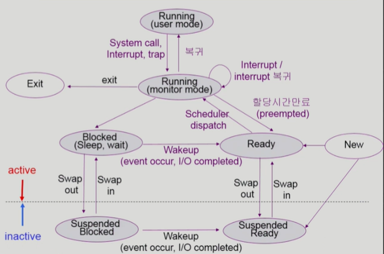
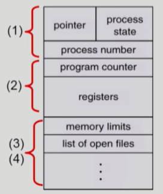
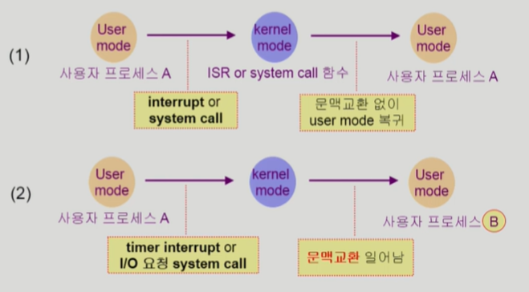
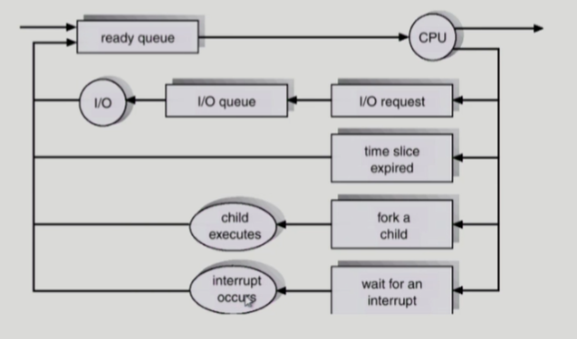

## [Process 1](https://core.ewha.ac.kr/publicview/C0101020140318134023355997?vmode=f)

### 프로세스의 개념

> 실행중인 프로그램

#### 프로세스의 문맥(context)

- CPU 수행 상태를 나타내는 하드웨어 문맥 **(CPU 관련)**
  - Program Counter
  - 각종 register
    - 어디까지 수행했는지, register가 어떤 값을 갖고 있는지
- 프로세스의 주소 공간 **(메모리 관련)**
  - code, data, stack
    - 어떤 내용이 들어있는가
- 프로세스 관련 커널 자료구조 **(운영체제 관련)**
  - PCB (Process Control Block)
  - Kernel stack

> **프로세스의 문맥을 파악하고 있다가 어느 시점까지 실행했는지 정확하게 알고 있어야 다음 시점부터 실행할 수 있다. **
>
> **(현대의 컴퓨터 시스템에서는 멀티태스킹 등 여러 프로세스들이 번갈아가며 실행되기 때문)**

### 프로세스의  상태 (Process State)

> 프로세스는 상태가 변경되며 수행된다.
>
> 크게 3가지 (Running, Ready, Blocked)

- **Running**
  - CPU를 잡고있거나
  - CPU를 잡고 instruction을 수행중인 상태
- **Ready**
  - 기다리거나
  - CPU를 기다리는 상태(메모리 등 다른 조건을 모두 만족)
- **Blocked (wait, sleep)**
  - 오래걸리는 작업을 하고있거나
  - CPU를 주어도 당장 instruction을 수행할 수 없는 상태
  - Process 자신이 요청한 event (I/O와 같은 작업)가 즉시 만족되지 않아 이를  기다리는 상태
  - ex) 디스크에서 file을 읽어와야 하는 경우
  - **자신이 요청한 event가 만족되면 Ready**
- **Suspended (Stopped)**
  - 외부적인 이유로 프로세스의 수행이 정지된 상태
  - 프로세스는 통째로 디스크에 swap out 된다.
  - **외부에서 resume 해주어야 Active**
  - ex)
    - 사용자가 프로그램을 일시 정지 시킨 경우 (break key)
    - 시스템이 여러 이유로 프로세스를 잠시 중단시킴 (중기스케줄러에서 빼앗음)
- New : 프로세스가 생성중인 상태
- Terminated : 수행이 끝난 상태

- Suspended Blocked에서 I/O같은 작업이 진행중이였다면 계속 진행가능 
  - Suspended ready로 넘어갈 수 있다.

### Process Control Block(PCB)

1. OS가 관리상 사용하는 정보
   - Process state, Process ID
   - scheduling information, priority

2. CPU 수행 관련 하드웨어 값
   - Program counter, registers

3. 메모리 관련
   - Code, Data, Stack이 메모리 어디에 위치해 있는가

4. 파일 관련
   - 프로세스가 오픈하고 있는 파일과 그 외 리소스 관련

### 문맥 교환 (Context Switch)

- CPU를 한 프로세스에서 다른 프로세스로 넘겨주는 과정
- CPU가 다른 프로세스에게 넘어갈 때 운영체제는 다음을 수행
  - CPU를 내어주는 프로세스의 상태를 그 프로세스의 PCB에 저장
  - CPU를 새롭게 얻는 프로세스의 상태를 PCB에서 읽어옴
    - 실행한 위치부터 재개하기 위해 프로세스의 문맥을 하드웨어에 복원시킨 후 CPU를 넘겨준다.

- 시스템 콜이나 인터럽트 발생시 반드시 문백교환이 일어나는 것은 아니다.
  - 사용자 프로세스에서 다른 사용자 프로세스로 넘어갈 때의 과정이다.

1) 문맥교환 X (인터럽트, 시스템콜)
   - CPU 수행 정보 등 문맥의 일부가 save가 되어야 하지만, A -> B 로 바뀌는 것보다는 훨씬 오버헤드가 적다.
2) 문맥교환이 일어나는 과정 (타이머 인터럽트, I/O요청)
   - eg. cache memory flush
   - 오버헤드가 크다.

### 프로세스를 스케줄링하기 위한 큐

- Job queue
  - 현재 시스템 내에 있는 모든 프로세스
- Ready queue
  - 현재 메모리 내에 있으면서 CPU를 잡아서 실행되기를 기다리는 프로세스
- Device queues
  - I/O device의 처리를 기다리는 프로세스

=> 프로세스들은 각 큐를 오가며 수행된다.

### 스케줄러 (Scheduler)

- **Long-term scheduler (장기 스케줄러 or job scheduler)**

  - 시작 프로세스 중 어떤 것들을 ready queue로 보낼지 결정
  - 어떤 프로세스에 memory(및 각종 자원)를 줄 지 결정
  - degree of Multiprogramming을 제어
    - **프로그램이 시작될 때 메모리에 몇개를 올려놓을지 결정**
  - time sharing system에는 보통 장기 스케줄러가 없음 (무조건 ready)

  

- **Short-term shcduler (단기 스케줄러 or CPU scheduler)**

  - **다음번에 어떤 프로세스에 CPU를 줄 지 결정**
  - 프로세스에 CPU를 주는 문제
  - 충분히 빨라야 함(ms 단위)

  

- **Medium-Term Scheduler (중기 스케줄러 or Swapper)**

  - 여유 공간 마련을 위해 프로세스를 통째로 메모리에서 디스크로 쫓아냄
  - 프로세스에게서 memory를 뺏는 문제
  - degree of Multiprogramming을 제어
    - **일단 메모리에 올려놓고 너무 많이 올라가 있으면 중기 스케줄러에서 쫓아내서 degree of Multiprogramming 제어**
  - 시스템 입장에선 중기 스케줄러가 효과적

## [Process 2](https://core.ewha.ac.kr/publicview/C0101020140321141759959993?vmode=f)

## [Process 3](https://core.ewha.ac.kr/publicview/C0101020140321143516139010?vmode=f)

