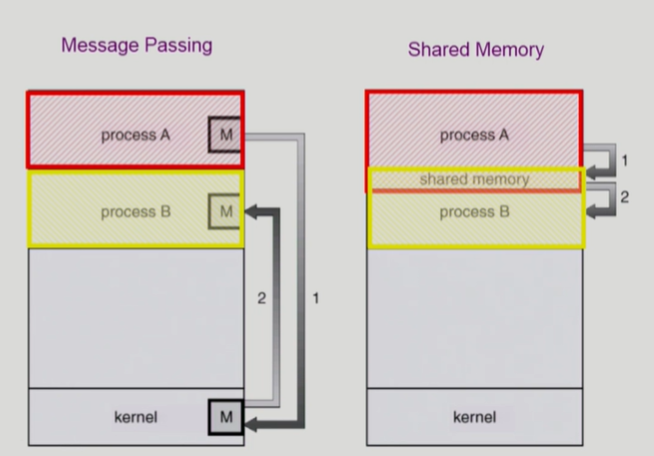

## [Process Management #1](https://core.ewha.ac.kr/publicview/C0101020140321144554159683?vmode=f)

### 프로세스 생성 (Process Creation)

#### Copy-on-write (COW)

- 부모 프로세스가 자식 프로세스 생성
- 프로세스의 트리(계층 구조) 형성
- 프로세스는 자원을 필요로 함
  - 운영체제로부터 받는다
  - 부모와 공유한다.
- 자원의 공유
  - 부모와 자식이 모든 자원을 공유하는 모델
  - 일부를 공유하는 모델
  - 전혀 공유하지 않는 모델
- 수행 (Execution)
  - 부모와 자식은 공존하며 수행되는 모델
  - 자식이 종료(terminate)될 때까지 부모가 기다리는(wait) 모델

- 주소공간 (Address space)
  - 자식은 부모의 공간을 복사함 (binary and OS data)
  - 자식은 그 공간에 새로운 프로그램을 올림
- 유닉스의 예
  - fork () 시스템 콜이 새로운 프로세스를 생성
    - 부모를 그대로 복사(OS data except PID + binary)
    - 주소 공간 할당
  - fork 다음에 이어지는 exec () 시스템 콜을 통해 새로운 프로그램을 메모리에 올림


### 프로세스 종료 (Process Termination)

- **프로세스가 마지막 명령을 수행한 후 운영체제에게 이를 알려줌 (exit)**
  - 자식이 부모에게 output data를 보냄 (via wait).
  - 프로세스의 각종자원들이 운영체제에게 반납됨
- **부모 프로세스가 자식의 수행을 종료시킴 (abort)**
  - 자식이 할당 자원의 한계치를 넘어섬
  - 자식에게 할당된 태스크가 더 이상 필요하지 않음
  - 부모가 종료(exit)하는 경우
    - 운영체제는 부모 프로세스가 종료하는 경우 자식이 더 이상 수행되도록 두지 않는다.
    - 단계적인 종료


## [Process Management #2](https://core.ewha.ac.kr/publicview/C0101020140325134428879622?vmode=f)

### 프로세스와 관련한 시스템 콜

#### fork()

> create a child (copy)

- fork하면 복사 이후 fork() 이후부터 실행
- 부모 프로세스는 fork 결과값이 양수
- 자식은 0 을 return 해서 부모와 자식 구분 가능

```c
int main() {
    int pid;
    pid = fork();
    if (pid==0) /* 자식 */
        printf("\n Hello, I am child!\n");
    else if (pid > 0) /* 부모 */
        printf("\n Hello, I am parent!\n");
}
```

#### exec()

> overlay new image

- exec 하면 자식에게 새로운 프로그램을 덮어씌워 새로운 프로그램으로 새롭게 태어남
- exec 하면 되돌아올 수 없다.

```c
int main() {
    int pid;
    pid = fork();
    if (pid==0) /* 자식 */
    {
        printf("\n Hello, I am child! Now I'll run date \n");
        execlp("/bin/date", "/bin/date", (char*) 0);
        /* execlp("echo", "echo", "hello", "3", (char *) 0); */
        /* 프로그램 이름을 2번 적고, 전달할 Argument를 적어준다. */
        printf("\n Hello, I am child! Now I'll run date \n"); 
        /* exec 이후의 코드는 영원히 실행 불가능 : 되돌아갈 수 없다.*/
    }
    else if (pid > 0) /* 부모 */
        printf("\n Hello, I am parent!\n");
}
```

#### wait()

> sleep until child is done

- 프로세스를 block 상태로 보내는 시스템콜 
- 커널은 child가 종료될 때까지 프로세스 A를 sleep 시킨다. (block 상태)
- 자식 프로세스가 종료되면 커널은 프로세스 A를 깨운다. (ready 상태)

```c
int main() {
    int childPID;
    s1;
    
    childPID = fork();
    
    if(childPID == 0) {
        /* 자식 실행할 내용 */
    } 
    else {
    	wait();   /* 부모 프로세스는 자식 프로세스 모두 끝날때까지 sleep 상태로 */
    }
    s2;
}
```

#### exit()

> 프로세스 종료하는 시스템콜 (frees all the resources, notify parent)

- 자발적 종료
  - 마지막 statement 수행 후 exit() 시스템 콜을 통해
  - 프로그램에 명시적으로 적어주지 않아도 main 함수가 return 되는 위치에 컴파일러가 넣어줌
- 비자발적 종료
  - 부모 프로세스가 자식 프로세스를 강제 종료시킴
    - 자식 프로세스가 한계치를 넘어서는 자원 요청
    - 자식에게 할당된 태스크가 더 이상 필요하지 않음
  - 키보드로 kill, break 등을 친 경우
    - ex) `Ctrl + c `, kill command 사용
  - 부모가 종료하는 경우
    - 부모 프로세스가 종료하기 전에 자식들이 먼저 종료됨


### 프로세스 간 협력

#### **독립적 프로세스 (Independent Process)**

- 프로세스는 각자의 주소공간을 가지고 수행되므로 원칙적으로 하나의 프로세스는 다른 프로세스의 수행에 영향을 미치지 못함

#### **협력 프로세스 (Cooperating process)**

- 프로세스 협력 메커니즘을 통해 하나의 프로세스가 다른 프로세스의 수행에 영향을 미칠 수 있음

#### **프로세스 간 협력 메커니즘(IPC: Interprocess Communication)**

- **메시지를 전달하는 방법(message passing)**
  - 커널을 통해 메시지 전달
- **주소 공간을 공유하는 방법 (shared memory)**
  - 서로 다른 프로세스 간에도 일부 주소 공간을 공유하게 함
  - thread
    - thread는 사실상 하나의 프로세스이므로 프로세스 간 협력으로 보기는 어렵지만 동일한 process를 구성하는 thread간에는 주소공간을 공유하므로 협력 가능


#### Message Passing

- **Message system**
  - 프로세스 사이에 공유 변수를 일체 사용하지 않고 통신하는 시스템
- **Direct Communication**
  - 통신하려는 프로세스의 이름을 명시적으로 표시
  - Send(Q, message) -> Receive(P, message)
- **Indirect Communication**
  - mailbox(또는 port)를 통해 메시지를 간접 전달
  - Send(Q, message) -> **mailbox** -> Receive(P, message)




- Shared Memory
  - 일부 주소공간을 공유
  - 처음에는 kernel한테 시스템콜해야함.
    - 이후엔 사용자 프로세스끼리 알아서 함
    - 프로세스간에 서로 신뢰할 수 있는 관계여야 함
