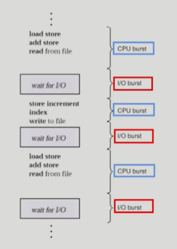
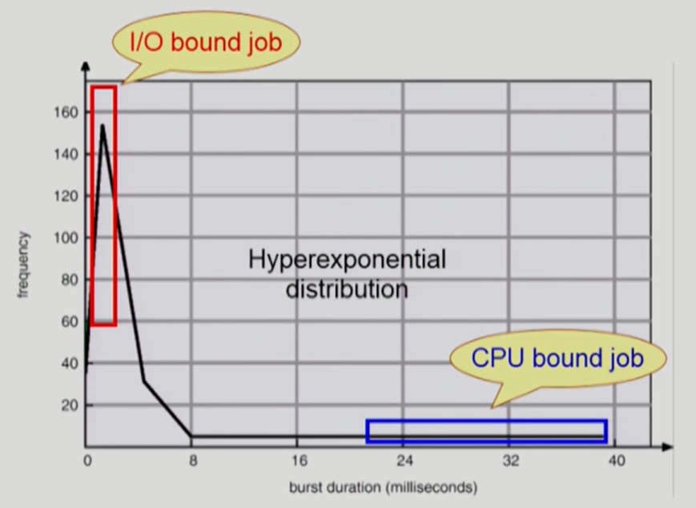

# CPU Scheduling

> [Process Management #2](https://core.ewha.ac.kr/publicview/C0101020140325134428879622?vmode=f) 48분부터 +  [CPU Scheduling #1](https://core.ewha.ac.kr/publicview/C0101020140328151311578473?vmode=f)

### CPU and I/O Bursts in Program Execution

- 어떤 프로그램이든 CPU burst와 I/O burst를 반복하면서 실행된다.
- 프로그램 종류에 따라 CPU와 I/O가 빈번하게 있는 경우가 있고, CPU만 나오다가 I/O 한번씩 나오는 경우도 있다.
- 주로 사람이 사용하는 작업이 CPU와 I/O burst가 빈번하게 있다.

### CPU-burst Time의 분포

 

- 여러 종류의 job(=process)이 섞여있기 때문에 CPU 스케줄링이 필요하다.
- Interactive job에게 적절한 response 제공 요망
- CPU와 I/O 장치 등 시스템 자원을 골고루 효율적으로 사용

#### 프로세스의 특성 분류

- I/O bound process
  - 주로 사람과 Interactive하는 job
  - CPU를 잡고 계산하는 시간보다 I/O에 많은 시간이 필요
  - CPU를 짧게 쓰는데 빈도가 높음
- CPU-bound process
  - 계산 위주의 job
  - CPU를 오래 쓰고 빈도가 적다.

### CPU Scheduler & Dispatcher

- **CPU Scheduler**
  - 운영체제 안에서 CPU Schedule 하는 코드 (하드웨어가 아님)
  - Ready 상태의 프로세스 중에서 이번에 CPU를 줄 프로세스를 고른다.

- **Dispatcher**
  - CPU의 제어권을 CPU scheduler에 의해 선택된 프로세스에게 넘긴다
  - 이 과정을 context switch(문맥교환)이라고 한다.

- **CPU 스케줄링이 필요한 경우**
  1. Running -> Blocked
     - I/O 요청하는 시스템콜
  2. Running -> Ready
     - 할당시간만료로 timer interrupt
  3. Blocked -> Ready
     - I/O 완료후 인터럽트
  4. Terminate

1, 4의 스케줄링은 **non-preemptive** (=강제로 빼앗지 않고 자진 반납, 비선점)

나머지는 **preemptive** (=강제로 빼앗음, 선점)

