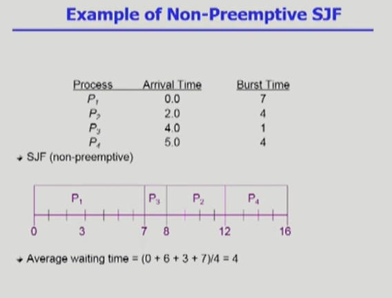
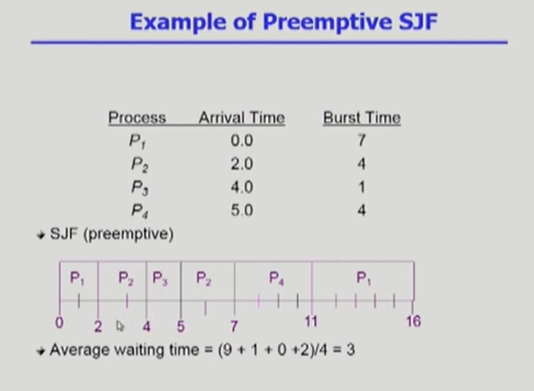
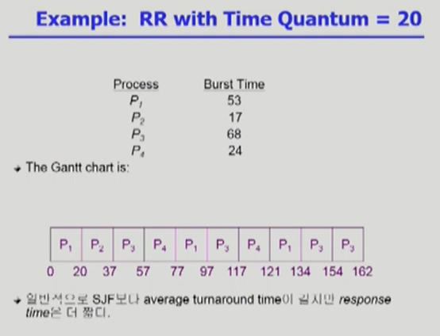
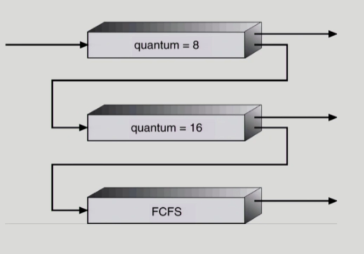
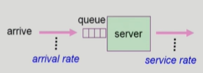

# CPU Scheduling

> [Process Management #2](https://core.ewha.ac.kr/publicview/C0101020140325134428879622?vmode=f) 48분부터 +  [CPU Scheduling #1](https://core.ewha.ac.kr/publicview/C0101020140328151311578473?vmode=f) , [CPU Scheduling #2](https://core.ewha.ac.kr/publicview/C0101020140401134252676046?vmode=f)

### CPU and I/O Bursts in Program Execution

- 어떤 프로그램이든 CPU burst와 I/O burst를 반복하면서 실행된다.
- 프로그램 종류에 따라 CPU와 I/O가 빈번하게 있는 경우가 있고, CPU만 나오다가 I/O 한번씩 나오는 경우도 있다.
- 주로 사람이 사용하는 작업이 CPU와 I/O burst가 빈번하게 있다.

### CPU-burst Time의 분포

 

- 여러 종류의 job(=process)이 섞여있기 때문에 CPU 스케줄링이 필요하다.
- Interactive job에게 적절한 response 제공 요망
- CPU와 I/O 장치 등 시스템 자원을 골고루 효율적으로 사용

#### 프로세스의 특성 분류

- I/O bound process
  - 주로 사람과 Interactive하는 job
  - CPU를 잡고 계산하는 시간보다 I/O에 많은 시간이 필요
  - CPU를 짧게 쓰는데 빈도가 높음
- CPU-bound process
  - 계산 위주의 job
  - CPU를 오래 쓰고 빈도가 적다.

공평한 것도 중요하지만, 어떻게 효율적으로 스케줄링 할지가 중요하다!

### CPU Scheduler & Dispatcher

- **CPU Scheduler**
  - 운영체제 안에서 CPU Schedule 하는 코드 (하드웨어가 아님)
  - Ready 상태의 프로세스 중에서 이번에 CPU를 줄 프로세스를 고른다.

- **Dispatcher**
  - CPU의 제어권을 CPU scheduler에 의해 선택된 프로세스에게 넘긴다
  - 이 과정을 context switch(문맥교환)이라고 한다.

- **CPU 스케줄링이 필요한 경우**
  1. Running -> Blocked
     - I/O 요청하는 시스템콜
  2. Running -> Ready
     - 할당시간만료로 timer interrupt
  3. Blocked -> Ready
     - I/O 완료후 인터럽트
  4. Terminate

1, 4의 스케줄링은 **non-preemptive** (=강제로 빼앗지 않고 자진 반납, 비선점형)

나머지는 **preemptive** (=강제로 빼앗음, 선점형)

### Scheduling Criteria

> Performance Index (=Performance Measure , 성능 척도)

#### 시스템 입장의 성능척도

- CPU utillization (이용률)
  - 전체 시간중에서 CPU가 놀지 않고 일한 시간의 비율
  - CPU는 가능한 바쁘게 일을 시켜야 좋은 스케줄링
- Throughput (처리량)
  - 주어진 시간동안에 몇 개의 일을 처리했는지
  - 많이 처리할수록 좋다.

#### 프로그램(고객) 입장에서의 성능척도

> Ready Queue에 들어온 프로세스 기준

- Turnaround time (소요시간, 반환시간)

  - CPU를 쓰러 들어와서 나갈때까지 걸리는 시간

- Waiting time (대기 시간)

  - CPU를 쓰기 위해 기다린 시간

  - 선점형의 경우에서는 한 번 얻었다고 끝까지 쓰는 것이 아닌데, 

    여러 번 queue에 줄을 설 경우 기다린 시간의 합이 waiting time

- Response time (응답 시간)

  - ready queue에 들어와서 처음으로 CPU를 얻기까지 걸린 시간

## Scheduling Algorithm

### FCFS (First-Come First-Served)

> 먼저 들어온 순서대로 먼저 서비스한다. (ex. 은행 번호표)
>
> 비선점형 스케줄링(non-preemptive)

- Interactive 작업의 시간이 매우 길어지기때문에 좋지 못한 방법이다.

- Convoy Effect : 작업 시간이 긴 프로세스가 시간을 오래 사용해서 뒤에서 오래 기다리게 되는 효과

### SJF (Shortest-Job First)

> CPU burst time이 짧은 프로세스를 먼저 스케줄
>
> 선점형 + 비선점형

#### 1. Nonpreemptive

- 일단 CPU를 잡으면 이번 CPU burst가 완료될 때까지 CPU를 선점당하지 않음
- 

#### 2. Preemtive

- 현재 수행중인 프로세스의 남은 burst time보다 더 짧은 CPU burst time을 가지는 새로운 프로세스가 도착하면 CPU를 빼앗김
- **Shorest-Remaining-Time-First (SRTF)**
- optimal
  - 주어진 프로세스들에 대해 minimum average waiting time을 보장
- 

#### 문제점

- **Starvation** (기아 현상) 발생

  - CPU 사용시간이 긴 특정 프로세스가 짧은 프로세스들이 계속해서 들어와서 실행하지 못하는 현상

  - 다음번 CPU Burst Time 예측 하는 방법으로 해결 가능
    - Exponential Averaging

### Priority Scheduling (우선순위 스케줄링)

> 우선순위를 할당하여 우선순위가 높은 순서대로 처리

- smallest integer = highest priority

- SJF도 일종의 priority scheduling
- 기아 현상 발생
  - **Agning (노화)** 기법으로 해결
    - 오래 기다린 프로세스의 우선순위를 높여서 처리하는 방법

### Round Robin (RR)

> 모든 프로세스에게 일정시간 만큼 동일하게 CPU를 할당
>
> 현대적인 컴퓨터 시스템에서 사용하는 방법들은 RR에 기반하고 있음

- 각 프로세스는 동일한 크기의 할당 시간(time quantum)을 가짐 (일반적으로 10 - 100ms)

- 할당 시간이 지나면 프로세스는 선점당하고, ready queue의 제일 뒤에 가서 다시 줄을 선다.
- n개의 프로세스가 ready queue에 있고 할당 시간이 q time unint 인 경우 각 프로세스는 최대 q time unint 단위로 CPU 시간의 1/n을 얻는다.
  - **어떤 프로세스도 (n-1)q time unit 이상 기다리지 않는다.**
- 성능
  - q large = > FCFS
  - q small => context switch (=오버헤드가 커진다.)

- SJF보다 turnaround time이나 waiting time은 길어질 수 있지만, 최초로 CPU를 얻는 response time은 짧아진다.

- 일반적으로는 짧은 프로세스와 긴 프로세스가 섞여있기 때문에 효율적이다.
  - 모두 비슷한 길이일 때는 비효율적

### Multilevel Queue

- Ready queue를 여러개로 분할
  - foreground (interactive)
  - background (batch - no human interaction)
- 각 큐는 독립적인 스케줄링 알고리즘을 가짐
  - foreground - RR
  - background - FCFS
- 큐에 대한 스케줄링이 필요
  - Fixed priority scheduling
    - 우선순위대로만 하면 starvation 발생
  - Time slice
    - 각 큐에 CPU time을 적절한 비율로 할당
    - 80%는 우선순위 높은 곳에, 20%는 낮은 곳에

### Multilevel Feedback Queue

- Three queues
  - Q0 - time quantum 8 ms
  - Q1 - time quantum 16 ms
  - Q2 - FCFS

- Scheduling
  - new job이 Q0로 들어감
  - CPU를 잡아서 할당 시간 8ms 동안 수행
  - 8 ms동안 끝내지 못했으면 Q1로 내려감
  - Q1에 줄서서 기다렸다가 CPU를 잡아서 16ms동안 수행
  - 16ms에 끝내지 못한 경우 Q2로 쫓겨남

### Multiple-Processor Scheduling

> CPU가 여러개 있는 경우 스케줄링

- **Homogeneous processor인 경우**
  - Queue에 한줄로 세워서 각 프로세서가 알아서 꺼내가게 할 수 있다.
  - 반드시 특정 프로세서에서 수행되어야 하는 프로세스가 있는 경우에는 문제가 더 복잡해짐
- **Load sharing**
  - 일부 프로세서에 job이 몰리지 않도록 부하를 적절히 공유하는 메커니즘 필요
  - 별개의 큐를 두는 방법 vs 공동 큐를 사용하는 방법
- **Symmetric Multiprocessing (SMP)**
  - 각 프로세서가 각자 알아서 스케줄링 결정
- **Asymmetric multiprocessing**
  - 하나의 프로세서가 시스템 데이터의 접근과 공유를 책임지고 나머지 프로세서는 거기에 따름

### Real-Time Scheduling

- **Hard real-time systems**
  - 정해진 시간 안에 반드시 끝내도록 스케줄링 해야 함
- **Soft real-time computing**
  - 일반 프로세스에 비해 높은 priority를 갖도록 함

### Thread Scheduling

- **Local Scheduling**
  - 사용자 관리하고 운영체제는 존재를 모르는 경우
  - User level thread의 경우 사용자 수준의 thread library에 의해 어떤 thread를 스케줄할지 결정
- **Global Scheduling**
  - 운영체제가 알고 있는 경우
  - Kernel level thread의 경우 일반 프로세스와 마찬가지로 커널의 단기 스케줄러가 어떤 thread를 스케줄할지 결정

## Algorithm Evaluation

> 어떤 알고리즘이 좋은지 평가하는 방법

- **Queueing models**
  - 최근에는 많이 사용하지 않지만 이론적으로는 자주 사용
  - 확률 분포로 주어지는 arrival rate와 service rate 등을 통해 각종 performance index 값을 계산
    - arrival rate : 프로세스가 도착하는 도착율
    - service rate : 프로세스 처리 능력(처리율)
- **Implementation (구현) & Measurement (성능 측정)**
  - 실제 시스템에 알고리즘을 구현하여 실제 작업(workload)에 대해서 성능을 측정 비교
  - ex) 원래 linux 설치한 컴퓨터와 알고리즘을 넣은 컴퓨터를 비교
- **Simulation (모의 실험)**
  - 알고리즘을 모의 프로그램으로 작성 후 trace를 입력으로 하여 결과 비교
  - trace : simulation의 input data

