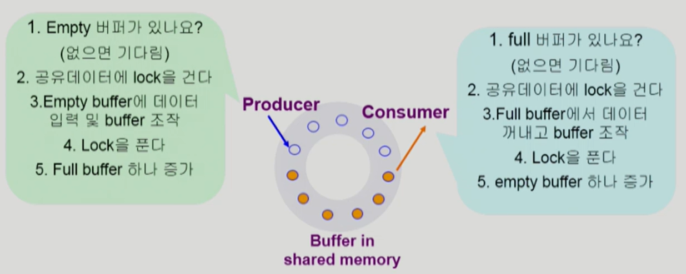
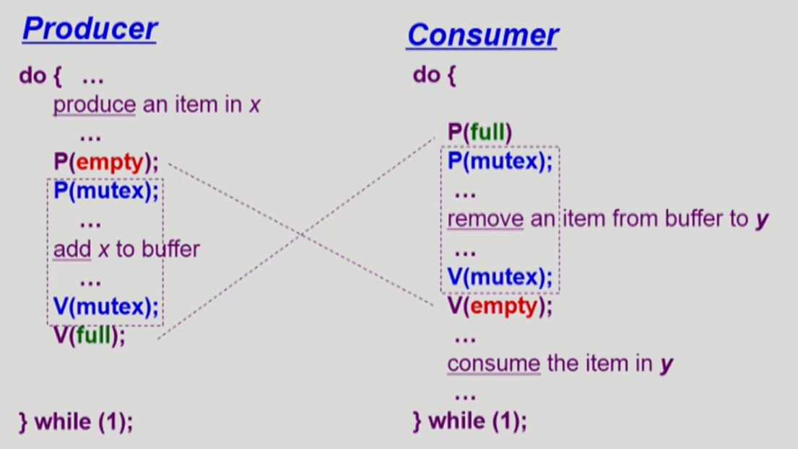
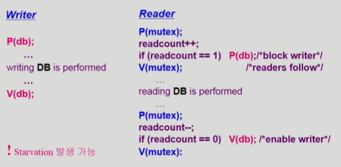
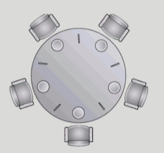
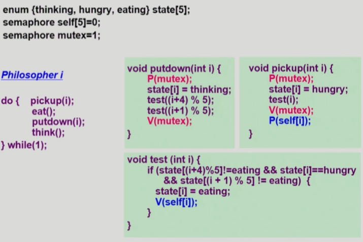
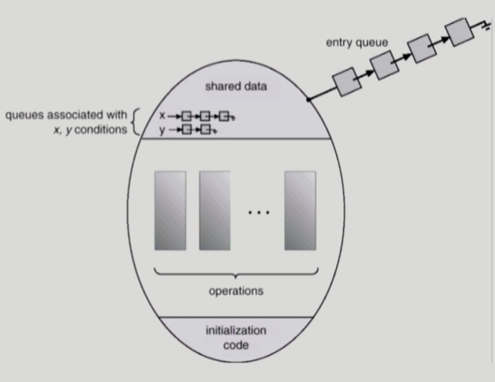

# Process Synchronization

> = **프로세스 동기화, Concurrency Control(병행 제어)**
>
> [CPU Scheduling #2](https://core.ewha.ac.kr/publicview/C0101020140401134252676046?vmode=f) 39분부터, [Process Synchronization #1](https://core.ewha.ac.kr/publicview/C0101020140404144354492628?vmode=f), [Process Synchronization #2](https://core.ewha.ac.kr/publicview/C0101020140404151340260748?vmode=f), [Process Synchronization #3](https://core.ewha.ac.kr/publicview/C0101020140408134626290222?vmode=f), [Process Synchronization #4](https://core.ewha.ac.kr/publicview/C0101020140411143154161543?vmode=f)

- 공유 데이터의 동시접근(concurrent access)은 데이터의 불일치(inconsistency) 문제를 발생시킬 수 있다.
- 일관성 유지를 위해서는 협력 프로세스 간의 실행 순서를 정해주는 메커니즘 필요

## Race Condition

>여러 프로세스들이 동시에 공유 데이터를 접근하는 상황
>
>데이터의 최종 연산 결과는 마지막에 그 데이터를 다룬 프로세스에 따라 달라짐


- Storage - Box를 공유하는 E-box가 여럿 있는 경우 발생
  - E-box : CPU, 컴퓨터 내부, 프로세스
  - Storage-BOX : Memory, 디스크, 프로세스의 주소 공간


### OS에서의 Race Condition

- **kernel 수행 중 인터럽트 발생 시**
  - 양쪽 다 커널코드이므로 kernel address space를 공유
  - 먼저 하던 일이 끝날떄까지 interrupt disable해서 해결


- **Process가 system call을 하여 kernel mode로 수행중인데 context switch가 일어나는 경우**


- 커널 모드에서 수행 중일 때는 CPU를 뺏지 않는다.

- **Multiprocessor에서 shared memory 내의 kernel data**


**race condition을 막기 위해서는 concurrent process는 동기화되어야 한다.**


### The Critical-Section Problem

- 각 프로세스의 code segment에는 critical section이 존재
  - **critical section (임계구역)** : 공유 데이터를 접근하는 코드
- 하나의 프로세스가 critical section에 있을 때 다른 프로세스는 critical section에 들어갈 수 없어야 한다.


### 프로그램적 해결법의 충족조건

**Mutual Execution (상호 배제)**

- 프로세스 Pi가 critical section 부분을 수행중이면 다른 모든 프로세스들은 그들의 critical section에 들어가면 안된다.

**Progress (진행)**

- 아무도 critical section에 있지 않은 상태에서 critical section에 들어가고자 하는 프로세스가 있으면 들어가게 해줘야한다.

**Bounded Waiting (유한 대기)**

프로세스가 critical section에 들어가려고 요청한 후부터 그 요청이 허용될 때까지 다른 프로세스들이 critical section에 들어가는 횟수에 한계가 있어야 한다.

가정 (starvation 형상이 발생하지 않아야한다.)

- 모든 프로세스의 수행 속도는 0보다 크다.
- 프로세스들 간의 상대적인 수행 속도는 가정하지 않는다.


### Algorithm

#### Algorithm1

> turn을 교대로 하는 방법

```c
do {
    while (turn != 0); /* My turn? */
    critical section;
    turn = 1; 			/* Now it's your turn */
    remainder section;
} while(1);
```

- while문에서 기다리다가 turn이 자기 차례로 넘어오면 critical section 진입

- 문제점
  - 다른 프로세스가 실행해서 turn을 바꿔주지 않으면 progress를 못하는 문제 발생

#### Algorithm2

> flag 사용

```c
do {
    flag[i] = true;		/* Pretend I an in */
    while(flag[j]);		/* Is he also in? then wait */
    critical section;
    flag[i] = false;	/* I an out now */
    remainder section;
} while(1);
```

- critical section 들어갈 땐, flag를 들고, 나올때 내린다.
- 다른 프로세스가 flag를 들고 있으면 기다린다.
- 문제점
  - flag를 든 상태(`flag[i]= true`)에서 CPU를 빼았기면 flag를 여럿이 같이 들어 계속해서 서로 양보하는 문제 발생

#### Algorithm3 (Peterson's Algorithm)

> turn + flag

```c
do {
    flag[i] = true;		/* My intention is to enter .... */
    turn = j;			/* Set to his turn */
    while (flag[j] && turn == j); 	/* wait only if ... */
    critical section;
    flag[i] = false;
    remainder section;
} while (1);
```

- 들어갈 때에는 turn을 따져서 교대로 진입
- 아무도 없으면 critical section 진입
- 문제점
  - **Busy Waiting(=spin lock)**
  - CPU 할당 시간 동안 while문만 돌다가 끝나는 문제 (CPU와 memory를 쓰면서 wait)

- 해결
  - 하드웨어적으로 Test & modify를 atomic하게 수핼할 수 있도록 지원하는 경우 앞의 문제는 간단하게 해결

  - 
  - Test_and_set : a를 read 하고 1로 설정

```c
Synchronization variable:
	boolean lock = false;

Process Pi
    do {
        while (Test_and_Set(lock));
        critical section;
        lock = false;
        remainder section;
    }
```


### Semaphores

> 앞의 방식들을 추상화 시킴

- Semaphore S
  - integer variable
  - 아래의 두 가지 atomic 연산에 의해서만 접근 가능
  - P 연산은 공유 데이터를 획득하는 과정, V 연산은 반납하는 과정 (P: lock, V: unlock)

```C
// P(S)
while (S<=0) do no-op;
	S--;

// V(S)
	S++;
```


#### Critical Section of n Process

```C
Synchronization variable:
    semaphore mutex; /* initially 1: 1개가 CS에 들어갈 수 있다. */

Process Pi:
    do {
        P(mutex);		/* If positive, dec-&-enter, Otherwise, wait. */
        critical section;
        V(mutex);		/* Increment semaphore */
        remainder section;
    } while(1);
```

- busy-wait는 효율적이지 못함 (=spin lock)

#### **Block & Wakeup 방식의 구현 (=sleep lock)**

```c
typedef struct {
    int value;			/* semaphore */
    struct process *L;	/* process wait queue */
} semaphore;
```

- block과 wakeup을 다음과 같이 가정
  - block
    - 커널은 block을 호출한 프로세스를 suspend 시킴
    - 이 프로세스의 PCB를 semaphore에 대한 wait queue에 넣음
  - wakeup(P)
    - block 된 프로세스 P를 wakeup 시킴
    - 이 프로세스의 PCB를 ready queue로 옮김

```c
//P(S)
S.value--; 			/* prepare to enter */
if (S.value < 0) {	/* Oops, negative, I cannot enter */
    add this process to S.L;
    block();
}

//V(S)
S.value++;
if (S.value <= 0) {
    remove a process P from S.L;
    wakeup(P);
}
```


#### Busy-wait vs Block/wakeup

- Critical section의 길이가 긴 경우 Block / Wakeup이 유리
- Critical section의 길이가 매우 짧은 경우 Block / Wakeup 오버헤드가 busy-wait 오버헤드보다 커질 수 있음
- 일반적으로는 Block / wakeup이 좋다.


#### Two Types of Semaphores

**Counting semaphore**

- 도메인이 0 이상인 임의의 정수값
- 주로 resource counting에 사용

**Binary semaphore (=mutex)**

- 0 또는 1값만 가질 수 있는 semaphore
- 주로 mutual exclusion (lock / unlock)에 사용


#### Deadlock

- 둘 이상의 프로세스가 서로 상대방에 의해 충족될 수 있는 event를 무한히 기다리는 현상

#### Starvation

- indefinite blocking : 프로세스가 suspend된 이유에 해당하는 세마포어 큐에서 빠져나갈 수 없는 현상
- deadlock도 일종의 starvation


## Classical Problems of Synchronization

> Synchronization문제

### Bounded-Buffer Problem



- Buffer의 크기가 유한한 환경
- Producer(생산자 프로세스) : 공유 버퍼에 데이터를 만들어서 집어넣는 역할
  - 비어있는 버퍼 : 처음부터 비어있던지, 생산자가 데이터를 집어넣었는데, Consumer가 데이터를 꺼내가서 비어있던지
  - 주황색 버퍼 : 생산자가 buffer를 넣어둔 것
- Consumer(소비자 프로세스) 
- producer / consumer가 여러개 있음
  - 사용했거나 소비했으면 버퍼 포인터 이동

- **Shared data**
  - buffer 자체 및 buffer 조작 변수(empty / full buffer의 시작 위치)

- **Synchronization variables**
  - mutual exclusion(Lock을 걸기 위해)
    - need binary semaphore (shared data의 mutual exclusion을 위해)
  - resource count(자원 개수 세기)
    - Need integer semaphore (남은 full/empty buffer의 수 표시)




### Readers-Writers Problem

- 한 process가 DB에 write 중일 때 다른 process가 접근하면 안됨
- read는 여럿이 동시에 가능
- solution
  - Writer가 DB에 접근 허가를 아직 얻ㅈ지 못한 상태에서는 모든 대기중인 Reader들을 다 DB에 접근하게 해준다.
  - Writer는 대기 중인 Reader가 하나도 없을 때 DB 접근이 허용된다.
  - 일단 Writer가 DB에 접근중이면 Reader들은 접근이 금지된다.
  - Writer가 DB에서 빠져나가야만 Reader의 접근이 허용된다.
- **Shared data**
  - DB 자체
  - readcount (현재 DB에 접근중인 Reader의 수)

- **Synchronization variables**
  - **mutex**
    - 공유 변수 readcount를 접근하는 코드(critical section)의 mutual exclusion 보장을 위해 사용
  - **DB**
    - Reader와 writer가 공유 DB 자체를 올바르게 접근하게 하는 역할



- 처음 reader면 DB writer lock 걸기
- reader 들어오면 readcount 증가
- readcount = 0 이면 나갈때 DB lock 풀어서 writer enable

Writer가 계속 기다리는 Starvation 발생 가능

- 우선순위 부여해서 해결

### Dining-Philosophers Problem



- 생각하거나 밥먹거나
- 왼쪽 + 오른쪽 젓가락 모두 사용해야 식사 가능

```c
// Philosopher i
do {
    P(chopstick[i]);
    P(chopstick[(i+1)%5]);
    ...;
    eat();
    ...;
    V(chopstick[i]);
    V(chopstick[(i+1)%5]);
    ...;
    think();
    ...;
    ...;
} while(1);
```

- 모든 철학자가 동시에 배가 고파져서 왼쪽 젓가락을 드는 경우 Deadlock 발생
- **Solution**
  - 4명의 철학자만이 테이블에 동시에 앉을 수 있도록 한다.
  - 젓가락을 두 개 모두 집을 수 있을 때에만 젓가락을 집을 수 있게 한다
  - 비대칭
    - 짝수(홀수) 철학자는 왼쪽(오른쪽) 젓가락부터 집도록




#### **Semaphore의 문제점**

- 코딩하기 힘들다
- 정확성(correctness)의 입증이 어렵다
- 자발적 협력(voluntary cooperation)이 필요하다
- 한번의 실수가 모든 시스템에 치명적 영향

```c
// ex.
V(mutex);
Critical Section;
P(mutex);
// P 하고 V해야하는데 V -> P를 하면, Mutual exclustion 깨짐

P(mutex);
Critical Section;
P(mutex);
// P 이후 P 하면 영원히 나올 수 없는 Deadlock 발생
```


## Monitor

> 동시 수행중인 프로세스 사이에서 abstract data type의 안전한 공유를 보장하기 위한 high-level synchronization construct
>
> **semaphore에서는 lock을 걸지만, monitor에서는 lock없이 if문으로 체크한다.**



- monitor 내에서는 한번에 하나의 프로세스만 활동 가능(동시 접근 불가능)
  - **lock을 걸 필요가 없다.**

- 프로세스가 모니터 안에서 기다릴 수 있도록 하기  위해 condition variable 사용
- Condition variable은 wait와 signal 연산에 의해서만 접근 가능
  - x.wait()
    - 프로세스를 잠들게 하겠다.
  - x.signal()
    - 잠들어 있는 프로세스를 깨운다.

**Bounded buffer problem monitor code**

```c
monitor bounded_buffer {
    int buffer[N];
    condition full, empty;
    /* condition var.은 값을 가지지 않고 자신의 큐에 프로세스를 매달아서 sleep 시키거나 큐에서 프로세스를 깨우는 역할만 함 */
    
    void produce(int x){
		if there is not empty buffer
        	empty.wait();
        add x to an empty buffer
        full.signal();
    }
    
    void consume(int *x) {
        if there is no full buffer
            full.wait();
        remove an item from buffer and store it to *x
        empty.signal();
    }
}
```

- monitor은 동시접근 막는 것, semaphore는 자원을 획득하기 위해 개발자가 작성하는 것

**Dining Philosophers Monitor Code**

```C
monitor dining_philosopher {
    enum {thinking,hungry, eating } state[5];
    condition self[5];
    void pickup(int i) {
        state[i] = hungry;
        test(i);
        if (state[i] != eating)
            self[i].wait(); /*wait here*/
    }

    void test(int i) {
        if ((state[(i+4)*5] != eating) && (state[i] == hungry) && (state[(i+1)%5] != eating )) {
            state[i] = eating;
            self[i].signal(); /* wake up Pi */
        }
    }

    void init() {
        for (int i=0; i<5; i++){
            state[i] = thinking;
        }
    }

	void putdown (int i) {
        state[i] = thinking;
        /* test left and right neighbors */
        test((i+4)%5); /* if L is waiting */
        test((i+1)%5);
	}
}

Each Philosopher:{
    pickup(i);
    eat();
    putdown(i);
    think();
}while(1);
```

