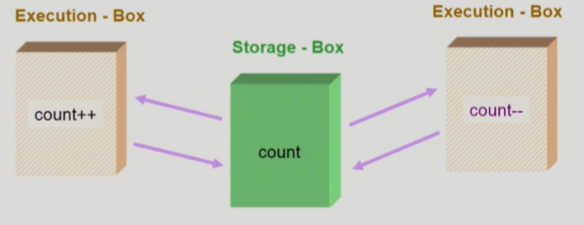
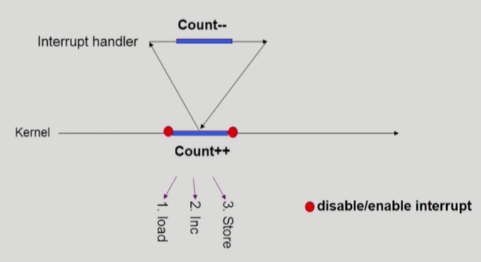
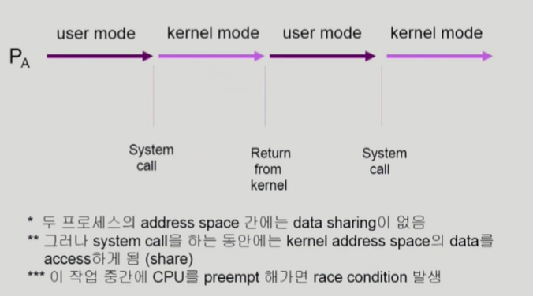
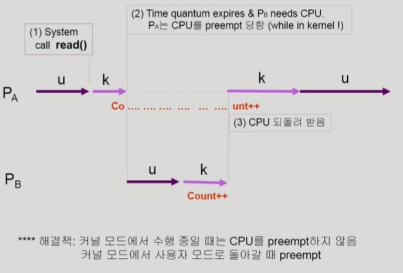
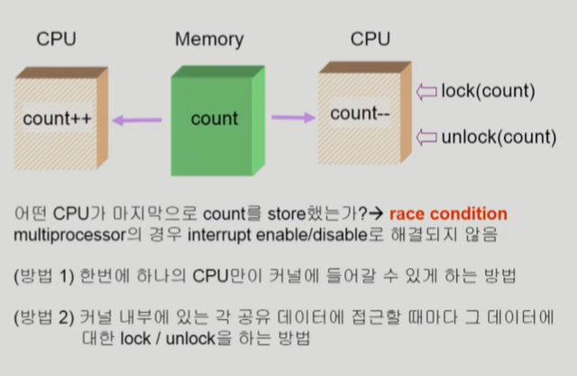
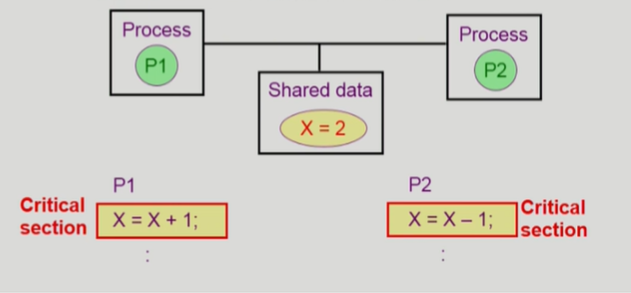

# Process Synchronization

> [CPU Scheduling #2](https://core.ewha.ac.kr/publicview/C0101020140401134252676046?vmode=f) 39분부터, [Process Synchronization #1](https://core.ewha.ac.kr/publicview/C0101020140404144354492628?vmode=f)

- 공유 데이터의 동시접근(concurrent access)은 데이터의 불일치(inconsistency) 문제를 발생시킬 수 있다.
- 일관성 유지를 위해서는 협력 프로세스 간의 실행 순서를 정해주는 메커니즘 필요

## Race Condition

>여러 프로세스들이 동시에 공유 데이터를 접근하는 상황
>
>데이터의 최종 연산 결과는 마지막에 그 데이터를 다룬 프로세스에 따라 달라짐

- Storage - Box를 공유하는 E-box가 여럿 있는 경우 발생
  - E-box : CPU, 컴퓨터 내부, 프로세스
  - Storage-BOX : Memory, 디스크, 프로세스의 주소 공간

### OS에서의 Race Condition

- **kernel 수행 중 인터럽트 발생 시**
  - 양쪽 다 커널코드이므로 kernel address space를 공유
  - 먼저 하던 일이 끝날떄까지 interrupt disable해서 해결

- **Process가 system call을 하여 kernel mode로 수행중인데 context switch가 일어나는 경우**

- 커널 모드에서 수행 중일 때는 CPU를 뺏지 않는다.

- **Multiprocessor에서 shared memory 내의 kernel data**

**race condition을 막기 위해서는 concurrent process는 동기화되어야 한다.**

### The Critical-Section Problem

- 각 프로세스의 code segment에는 critical section이 존재
  - **critical section (임계구역)** : 공유 데이터를 접근하는 코드
- 하나의 프로세스가 critical section에 있을 때 다른 프로세스는 critical section에 들어갈 수 없어야 한다.

### 프로그램적 해결법의 충족조건

**Mutual Execution**

- 프로세스 Pi가 critical section 부분을 수행중이면 다른 모든 프로세스들은 그들의 critical section에 들어가면 안된다.

**Progress**

- 아무도 critical section에 있지 않은 상태에서 critical section에 들어가고자 하는 프로세스가 있으면 들어가게 해줘야한다.

**Bounded Waiting**

프로세스가 critical section에 들어가려고 요청한 후부터 그 요청이 허용될 때까지 다른 프로세스들이 critical section에 들어가는 횟수에 한계가 있어야 한다.

가정
- 모든 프로세스의 수행 속도는 0보다 크다.
- 프로세스들 간의 상대적인 수행 속도는 가정하지 않는다.

