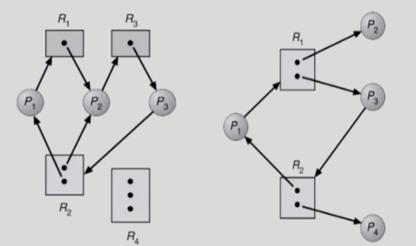
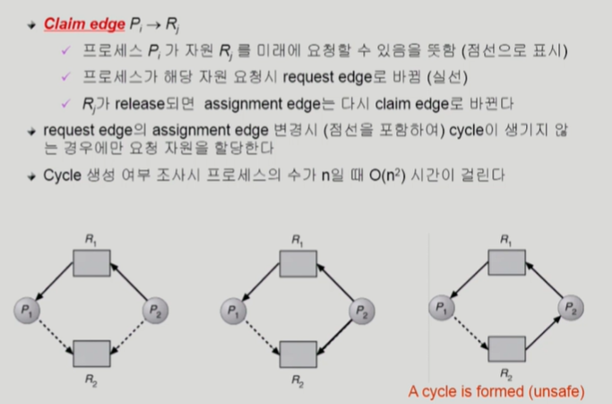
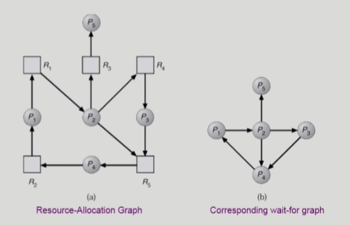
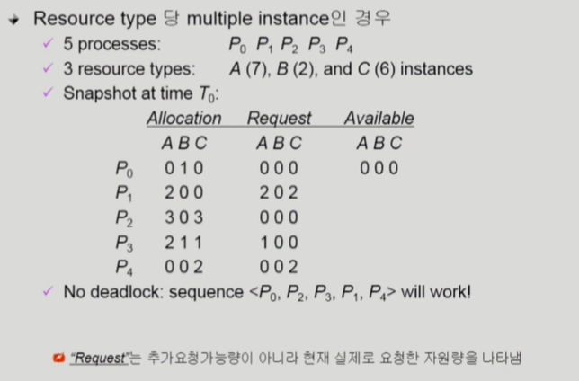

# Deadlock

> [Deadlock #1](https://core.ewha.ac.kr/publicview/C0101020140411151510275738?vmode=f), [Deadlock #2](https://core.ewha.ac.kr/publicview/C0101020140415131030840772?vmode=f)
>
> 교착상태

#### Deadlock

- 일련의 프로세스들이 서로가 가진 자원을 기다리며 block 된 상태

#### Resource (자원)

- 하드웨어, 소프트웨어 등을 포함하는 개념
- ex) I/O device, CPU cycle, memory space, semaphore 등
- 프로세스가 자원을 사용하는 절차
  - Request, Allocate, Use, Release
- Deadlock Example 1
  - 시스템에 2개의 tape drive가 있다.
  - 프로세스 P1과 P2 각각이 하나의 tape drive를 보유한 채 다른 하나를 기다리고 있다.
- Deadlock Example2
  - Binary semaphores A and B

### Deadlock 발생의 4가지 조건

> 4가지를 모두 만족하면 deadlock 발생

1. Mutual exclusion (상호 배제)
   - 매 순간 하나의 프로세스만이 자원을 사용할 수 있음

2. No preemption (비선점)
   - 프로세스는 자원을 스스로 내어놓을 뿐 강제로 빼앗기지 않음

3. Hold and await (보유대기)
   - 자원을 가진 프로세스가 다른 자원을 기다릴 때 보유 자원을 놓지 않고 계속 가지고 있음

4. Circular wait (순환대기)
   - 자원을 기다리는 프로세스간에 사이클이 형성되어야 함

#### Resource-Allocation Graph(자원할당그래프)

- 그래프에 cycle이 없으면 deadlock이 아니다.
- 그래프에 cycle이 있으면,
  - 자원 당 인스턴스가 하나밖에 없으면, cycle = deadlock
  - 인스턴스가 여러개면, deadlock 가능성이 있다.
    - R : 자원, dot: 인스턴스

## Deadlock의 처리 방법

### 1. Deadlock Prevention

> 자원 할당 시 Deadlock의 4가지 필요 조건 중 어느 하나가 만족되지 않도록 하는 것

#### Mutual Exclusion

- 공유해서는 안되는 자원의 경우 반드시 성립해야 함

#### Hold and Wait

- 프로세스가 자원을 요청할 때 다른 어떤 자원도 가지고 있지 않아야 한다.
- 방법1. 프로세스 시작 시 모든 필요한 자원을 할당받게 하는 방법
  - wait 할 일이 없어서 deadlock은 없지만, 비효율적
- 방법2. 자원이 필요할 경우 보유 자원을 모두 놓고 다시 요청
  - 기다려야 하는 상황이 되면 hold중인 것도 모두 내어놓고 기다림

#### No Preemption

- process가 어떤 자원을 기다려야 하는 경우 이미 보유한 자원이 선점됨
- 모든 필요한 자원을 얻을 수 있을 때 그 프로세스는 다시 시작된다
- State를 쉽게 save하고 restore할 수 있는 자원에서 주로 사용(CPU, memory)
  - preemption을 허용하기 어려운 자원의 경우에는 사용 불가

#### Circular Wait

- 모든 자원 유형에 할당 순서를 정하여 정해진 순서대로만 자원 할당
- 1번을 획득해야 2번을 획득할 수 있고, 2번을 획득해야 3번을 획득할 수 있다.

= **Utilization 저하, throughput 감소, starvation 문제**

= **생기지 않을 문제를 미리 생각해서 제약조건을 많이 걸어두기 때문에 비효율적이게 된다.**

### 2. Deadlock Avoidance

> 프로세스 시작 시 본인이 평생 사용할 maximun 자원을 declare한다. 
>
> 항상 safe한 상태를 유지한다.

- 자원 요청에 대한 부가적인 정보를 이용해서 deadlock의 가능성이 없는 경우에만 자원을 할당
- 시스템 state가 원래 state로 돌아올 수 있는 경우에만 자원 할당
- **자원당 Instance가 하나밖에 없을 경우**
  - Resource Allocation Graph Algorithm
  - 
  - 점선을 포함하여 cycle이 생길 **위험성**이 있으면 애초에 자원을 주지 않는다.
- **자원당 Instance가 여러개인 경우**
  - [Banker's Algorithm](https://en.wikipedia.org/wiki/Banker%27s_algorithm)
  - 가용 자원으로 maximun(최악의 경우)이 처리가 되면 할당, 못하면 대기

### 3. Deadlock Detection and recovery

> Deadlock 발생은 허용하되 그에 대한 detection 루틴을 두어 deadlock 발견시 recover

#### Deadlock Detection

- Resource type 당 single instance인 경우
  - 자원할당 그래프에서의 cycle이 곧 deadlock을 의미
- Resource type 당 multiple instance인 경우
  - Banker's algorithm과 유사한 방법 활용

#### Wait-for graph 알고리즘

- **Resource type 당 single instance인 경우**
- Wait-for graph
  - 자원할당 그래프의 변형
  - 프로세스만으로 node 구성
  - Pj 가 가지고 있는 자원을 Pk가 기다리는 경우 Pk -> Pj
- Algorithm
  - Wait-for graph에 사이클이 존재하는지를 주기적으로 조사
  - **O(n^2)** (DFS)

- **Resource type 당 multiple instance인 경우**
  - 

#### Recovery

- deadlock 발견하면 recovery

- **Process termination (종료)**

  1. deadlock 관련된 모든 process 종료

  2. deadlock 관련된 프로세스 하나씩 kill 해보면서 확인

- **Resource Preemption (자원 뺏음)**

  - 비용을 최소화할 victim의 선정
  - safe state로 rollback 하여 process를 restart
  - Starvation 문제
    - 동일한 프로세스가 계속해서 victim으로 선정되는 경우
    - cost factor에 rollback 횟수도 같이 고려

### 4. Deadlock Ignorance

> Deadlock이 일어나지 않는다고 생각하고 아무런 조치도 취하지 않음

- deadlock을 시스템이 책임지지 않음
- deadlock이 매우 드물게 발생하므로 deadlock에 대한 조치를 하는 것 자체가 더 큰 overhead일 수 있음
- 사용자가 deadlock을 느끼면 직접 process를 죽이는 등의 방법으로 대처
- UNIX를 포함한 대부분의 OS에서 주로 채택하는 방법

