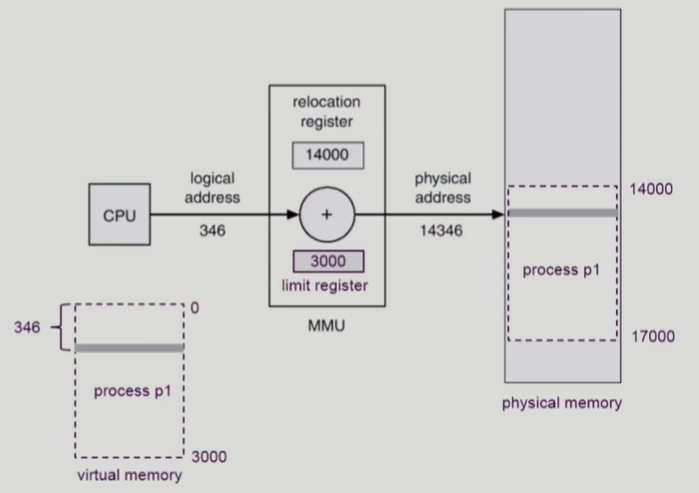
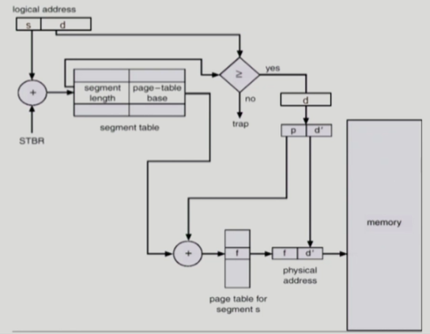

# Memory Management

> 메모리 관리
>
> [Memory Management #1](https://core.ewha.ac.kr/publicview/C0101020140425151219100144?vmode=f), [Memory Management #2](https://core.ewha.ac.kr/publicview/C0101020140429132440045277?vmode=f), [Memory Management #3](https://core.ewha.ac.kr/publicview/C0101020140502151452123728?vmode=f), [Memory Management #4](https://core.ewha.ac.kr/publicview/C0101020140509142939477563?vmode=f)

## Logical vs. Physical Address

#### Logical address (=virtual address)

- 프로세스마다 독립적으로 가지는 주소 공간
- 각 프로세스마다 0번지부터 시작
- **CPU가 보는 주소는 logical address**

#### Physical address

- 메모리에 올라가는 실제 위치

*** 주소 바인딩 : 주소를 결정하는 것**

Symbolic Address => Logical Address => (이 시점이 언제인가?) Physical address

### 주소바인딩(Address Binding)

- **Compile time binding**
  - 물리적 메모리 주소가 컴파일 시 알려짐
  - 시작 위치 변경 시 재컴파일
  - 컴파일러는 절대 코드(absoulte code) 생성

- **Load time binding**
  - Loader의 책임하에 물리적 메모리 주소 부여
  - 컴파일러가 재배치가능코드(relocatable code)를 생성한 경우 가능

- **Execution time binding (=Run time binding)**
  - 수행이 시작된 이후에도 프로세스의 메로리 상 위치를 옮길 수 있음
  - CPU가 주소를 참조할 때마다 binding을 점검 (address mapping table)
  - 하드웨어적인 지원이 필요
    - (e.g., base and limit registers, MMU)

## Memory-Management Unit(MMU)

> 주소 변환용 하드웨어
>
> logical address를 physical address로 매핑해주는 hardware device

- **MMU scheme**
- 사용자 프로세스가 CPU에서 수행되며 생성해내는 모든 주소값에 대해 base register (=relocation register)의 값을 더한다.
- **user program**
  - logical address만을 다룬다.
  - 실제 physical address를 볼 수 없으며 알 필요가 없다.

### Dynamic Relocation

- p1의 logical memory : 0 ~ 3000
- 0부터 346번째 떨어진 메모리를 요청
- physical memory에는 14000부터 올라가 있음
  - base register에 프로그램의 시작 위치를 저장해둔다.
  - 시작위치(14000) + 346 을 읽어서 CPU에 전달
- limit register
  - 본인의 크기가 3000인데 4000번을 달라고 하면 다른 프로그램의 메모리 위치를 요청하는 것이기 때문에 주면 안된다.

### Hadware Support for Address Translation

- 운영체제 및 사용자 프로세스 간의 메모리 보호를 위해 사용하는 레지스터
  - base + limit 범위 안에 있는 메모리를 요청하는지 체크
  - Relocation register(=base register) : 접근할 수 있는 물리적 메모리 주소의 최소값
  - limit register : 논리적 주소의 범위

## Some Treminologies

### 1. Dynamic Loading

- 프로세스 전체를 메모리에 미리 다 올리는 것이 아니라 해당 루틴이 불려질 때 메모리에 load하는 것
- memory utilization의 향상
- 가끔씩 사용되는 많은 양의 코드의 경우 유용
  - ex) 오류 처리 루틴
- 운영체제의 특별한 지원 없이 프로그램 자체에서 구현 가능(OS는 **라이브러리**를 통해 지원 가능)
  - 라이브러리를 사용하기 때문에 프로그래머가 자세하게 할 필요는 없다. (Overlays와의 차이점)
- 페이징 기법 != Dymamic Loading (원래는 다른 것)
  - 프로그래머가 명시적으로 하는 것이 dynamic loading이지만, 명시하지 않고 운영체제가 하는 것도 dynamic loading이라고도 한다.
- Loading : 메모리로 올리는 것

### 2. Dynamic Linking

> Linking을 실행 시간(execution time)까지 미루는 기법

#### **Static linking**

- 라이브러리가 프로그램의 실행 파일 코드에 포함됨
- 실행 파일의 크기가 커짐
- 동일한 라이브러리를 각각의 프로세스가 메모리에 올리므로 메모리 낭비
  - eg. printf함수의 라이브러리 코드
  - printf 쓰는 프로그램 100개를 올리면 100개가 메모리에 올라감

#### **Dynamic linking**

> (= dynamic link library, shared library, shared object)

- 라이브러리가 실행시 연결됨
- 라이브러리 호출 부분에 라이브러리 루틴의 위치를 찾기 위한 stub이라는 작은 코드를 둠
- 라이브러리가 이미 메모리에 있으면 그 루틴의 주소로 가고 없으면 디스크에서 읽어옴
- 운영체제의 도움이 필요
  - printf 호출하는 지점에 오면, printf 해당하는 라이브러리 파일을 찾아서 메모리에 올려서 실행
  - 이미 올라와 있으면 다시 안올림

### 3. Overlays

- 메모리에 프로세스의 부분 중 실제 필요한 정보만을 올림
- 프로세스의 크기가 메모리보다 클 때 유용
- **운영체제의 지원없이** 사용자에 의해 구현
- 작은 공간의 메모리를 사용하던 초창기 시스템에서 **수작업으로 프로그래머가 구현**
  - Manual Overlay
  - 프로그래밍이 매우 복잡

### 4. Swapping

> 프로세스를 일시적으로 메모리에서 backing store로 쫓아내는 것

#### **Backing store(=swap area)**

- 디스크
  - 많은 사용자의 프로세스 이미지를 담을 만큼 충분히 빠르고 큰 저장 공간

#### **Swap in/ Swap out**

- 일반적으로 중기 스케줄러(swapper)에 의해 swap out 시킬 프로세스 선정
- priority-based CPU scheduling algorithm
  - **priority가 낮은 프로세스를 swapped out 시킴**
  - **priority가 높은 프로세스를 메모리에 올려 놓음**
- Compile time 혹은 load time binding 에서는 원래 메모리 위치로 swap in 해야함
- **Run time binding**에서는 추후 빈 메모리 영역 아무 곳에나 올릴 수 있어 가장 효율적
- swap time은 대부분 transfer time (swap되는 양에 비례하는 시간)임

## Allocation of Physical Memory

- 메모리는 일반적으로 두 영역으로 나뉘어 사용
  - 
  - OS 상주영역
    - interrupt vector와 함께 낮은 주소 영역 사용
  - 사용자 프로세스 영역
    - 높은 주소 영역 사용

- 사용자 프로세스 영역의 할당 방법
  - [Contiguous allocation](#contiguous-allocation-(연속-할당))
    - 각각의 프로세스가 메모리의 연속적인 공간에 적재되도록 하는 것
      - Fixed partition allocation
      - Variable partition allocation
  - NonContiguous allocation
    - 하나의 프로세스가 메모리의 여러 영역에 분산되어 올라갈 수 있음
      - Paging
      - Segmentation
      - Paged Segmentation

## Contiguous Allocation (연속 할당)

#### 외부 조각(External fragmentation)

- 프로그램 크기보다 분할의 크기가 작은 경우
- 아무 프로그램에도 배정되지 않은 빈 곳인데도 프로그램이 올라갈 수 없는 작은 분할

#### 내부 조각(Internal fragmentation)

- 프로그램 크기보다 분할의 크기가 큰 경우
- 하나의 분할 내부에서 발생하는 사용되지 않는 메모리 조각
- 특정 프로그램에 배정되었지만 사용되지 않은 공간

### 1. 고정분할(Fixed partition) 방식

- 물리적 메모리를 몇 개의 영구적 분할(partition)으로 나눔
- 분할의 크기가 모두 동일한 방식과 서로 다른 방식이 존재
- 분할당 하나의 프로그램 적재
- 융통성이 없음
  - 동시에 메모리에 load되는 프로그램의 수가 고정됨
  - 최대 수행 가능 프로그램 크기 제한
- Internal fragmentation 발생 (external fragmentation도 발생)

### 2. 가변분할(Variable partition) 방식

- 프로그램의 크기를 고려해서 할당
- 분할의 크기, 개수가 동적으로 변함
- 기술적 관리 기법 필요
- External fragmentation 발생

#### Hole

- 가용 메모리 공간
- 다양한 크기의 hole들이 메모리 여러곳에 흩어져 있음
- 프로세스가 도착하면 수용가능한 hole을 할당
- 운영체제는 다음의 정보를 유지
  - 할당 공간
  - 가용 공간(hole)

#### Dynamic Storage-Allication Problem

> 가변 분할 방식에서 size n 인 요청을 만족하는 가장 적절한 hole을 찾는 문제

- First-fit
  - Size가 n 이상인 것 중 최초로 찾아지는 hole에 할당
- Best-fit
  - Size가 n 이상인 가장 작은 hole을 찾아서 할당
  - Hole들의 리스트가 크기순으로 정렬되지 않은 경우 모든 hole의 리스트를 탐색해야함
  - 많은 수의 아주 작은 hole들이 생성됨
- Worst-fit
  - 가장 큰 hole에 할당
  - 역시 모든 리스트를 탐색해야 함
  - 상대적으로 아주 큰 hole들이 생성됨

*First-fit과 Best-fit이 Worst-fit보다 속도와 공간 이용률 측면에서 효과적인 것으로 알려짐

- compaction
  - external fragmentation 문제를 해결하는 방법
  - 사용중인 메모리 영역을 한군데로 몰고 hole들을 다른 한 곳으로 몰아 큰 block을 만드는 것
  - 매우 비용이 많이 드는 방법
  - 최소한의 메모리 이동으로 compaction 하는 방법 (매우 복잡함)
  - Compaction은 프로세스의 주소가 실행 시간에 동적으로 재배치 가능한 경우에만 수행될 수 있다.
    - runtime-binding 지원 시 가능

## Paging

### Paging Example

- logical memory page 수 만큼 page table에 index가 존재
- page table을 이용해서 주소 변환

### Address Translation Architecture

- 논리적인 주소를 주면 물리적인 주소로 변환하는 과정

### Implementation of Page Table

- Page table은 main memory에 상주
- **Page-table base register (PTBR)**가 page table을 가리킴
- **Page-table length register (PTLR)**가 테이블 크기를 보관
- 모든 메모리 접근 연산에는 2번의 memory access가 필요
  - page table 접근 + 실제 data/instruction 접근
- 속도 향상을 위해 associative register 혹은 translation look-aside buffer (TLB)라 불리는 고속의 lookup hardware **cache** 사용

### Paging Hardware with TLB

- 2번의 메모리 접근이 필요하기때문에 속도개선을 위해 TLB라는 Hardware를 둔다.
  - 주소 변환을 위한 캐시 메모리
- Associative registers (TLB) : parallel search가 가능
  - TLB에는 page table의 일부 정보만 저장
- 주소변환 정보 중에 TLB에 저장되어 있는지 체크
  - 없으면, 2번 접근해야함
  - 있으면 TLB에서 바로 주소변환 가능
- page table은 각 process마다 존재, TLB도 process마다 다름
  - TLB는 context switch 때 flush

### Two-Level Page Table

> 2단계 페이지 테이블 = 시간은 더 걸리지만, page 공간 줄이는 것이 목적

- 현대의 컴퓨터는 address space가 매우 큰 프로그램 지원
  - 32 bit address에서는 2^32B(4GB)의 주소공간
    - page size가 4K시 1M개의 page table entry 필요
    - 각 page entry가 4B시 프로세스당 4M의 page table 필요
    - 그러나, 대부분의 프로그램은 4G 의 주소공간 중 지극히 일부분만 사용하므로 page table 공간이 심하게 낭비됨
  - page table 자체를 page로 구성
  - 사용되지 않는 주소 공간에 대한 outer page table의 엔트리 값은 NULL(대응하는 inner page table이 없음)

- **시간, 공간 모두 손해인데 쓰는 이유?**

  - 상당 부분의 page들이 사용되지 않지만, page table에는 entry를 만들어야 한다.
  - 2단계를 쓰면 해소 가능
    - 바깥 테이블은 전체 물리적 크기만큼 만들어지지만, 사용되지 않는 주소의 포인터는 NULL
    - 사용 안되는 주소가 많은 경우 2단계 페이징으로 효율적으로 공간을 줄일 수 있다.

  

- **Address-Translation Scheme**

p: 위에서부터 몇번째 entry인지 구분하는 숫자

- **Two-Level Paging Example**

### Multilevel Paging and Performance

- Address space가 더 커지면 다단계 페이지 테이블 필요
- 각 단계의 페이지 테이블이 메모리에 존재하므로 logical address의 physical address 변환에 더 많은 메모리 접근 필요
- TLB를 통해 메모리 접근 시간을 줄일 수 있음
- 4단계 페이지 테이블을 사용하는 경우
  - 메모리 접근 시간이 100ns, TLB 접근 시간이 20ns이고,
  - TLB hit ratio가 98%인 경우
    - effective memory access time = 0.98 x 120 + 0.02 x 520 = 128ns
    - 결과적으로 주소변환을 위해 28ns만 소요

**다단계 테이블이 크게 오버헤드가  들지는 않는다!**

### Valid (v)/ Invalid (i) Bit in a Page Table

- 주소 변환 정보만 들어있는 것이 아니고, 부가적인 정보가 들어있음
- valid-invalid bit로 표시
  - valid : 0번 페이지가 2번 프레임에 올라와있다.
  - 6번 페이지는 올라가있지 않다.
- index를 통해 접근해야하기 때문에 모든 entry가 만들어 져야 하기 때문

### Memory Protection

- Page table의 각 entry 마다 아래의 bit를 둔다.
  - **Protection bit**
    - page에 대한 접근 권한 (read/write/read-only)
  - **Valid-invalid bit**
    - valid는 해당 주소의 frame에 그 프로세스를 허용하는 유효한 내용이 있음 (접근 허용)
    - invalid는 해당 주소의 frame에 유효한 내용이 없음을 뜻함 (접근 불허) 

### Inverted Page Table

- page table이 매우 큰 경우

  - 모든 process 별로 그 logical address에 대응하는 모든 page에 대해 page table entry가 존재
  - 대응하는 page가 메모리에 있든 아니든 간에 page table에는 entry로 존재

- Inverted Page Table Architecture

  

  - 시스템 안에 page table이 하나만 존재
    - Page frame 하나당 page table에 하나의 entry를 둔 것 (system-wide)
  - page table entry가 process의 page 개수만큼 존재하는 것이 아니고, 물리적인 메모리의 frame 개수만큼 존재
    - 각 page table entry는 각각의 물리적 메모리의 page frame이 담고 있는 내용 표시 (process-id, process의 logical address)
  - physical address를 보고 logical을 바꾸는 테이블
    - page 번호가 주어지면 전부 검색해야만 주소 변환을 할 수 있다. 
      - 공간을 줄이기 위한 것
  - 단점 : 테이블 전체를 탐색해야 함
  - 조치: associative register 사용 (expensive)

### Shared Page

- **Shared code**
  - Re-entrant Code (=Pure code)
  - **read-only**로 하여 프로세스 간에 하나의 code만 메모리에 올림
    - (eg. text editors, compilers, window systems)
  - Shared code는 모든 프로세스의 **logical address space**에서 동일한 위치에 있어야 함
- **Private code and data**
  - 각 프로세스들은 독자적으로 메모리에 올림
  - Private data는 logical address space의 아무 곳에 와도 무방

## Segmentation

- 프로그램은 **의미 단위**인 여러 개의 segment로 구성
  - 작게는 프로그램을 구성하는 함수 하나하나를 세그먼트로 정의
  - 크게는 프로그램 전체를 하나의 세그먼트로 정의 가능
  - 일반적으로는 code, data, stack 부분이 하나씩의 세그먼트로 정의됨
- Segment는 다음과 같은 logical unit 들임
  - main(),
  - function,
  - global variables,
  - stack,
  - symbol table, arrays

### Segmentation Architecture

- Logical address는 다음의 두 가지로 구성

​			**< segment-number , offset >**

- Segment table
  - each table entry has:
    - **base** - starting physical address of the segment
    - **limit** - length of the segment
- **Segment-table base register (STBR)**
  - 물리적 메모리에서의 segment table의 시작 위치
- **Segment-table length register (STLR)**
  - 프로그램이 사용하는 segment의 수
    - segment number s is legal if s < STLR

### Segmentation Hardware

### Segmentation Architecture (Cont.)

- **Protection**
  - 각 세그먼트 별로 protection bit가 있음
  - Each entry:
    - Valid bit = 0 -> illegal segment
    - Read / Write / Execution 권한 bit
- **Sharing**
  - shared segment
  - same segment number
  - **segment는 의미 단위이기 때문에 공유(sharing)와 보안(protection)에 있어서 paging보다 훨씬 효과적이다.**
- **Allocation**
  - first fit / best fit
  - external fragmentation 발생
  - segment의 길이가 동일하지 않으므로 가변분할 방식에서와 동일한 문제점들이 발생

### Example of Segmetation

- 일반 시스템에서 페이지는 개수가 많지만, 세그먼트는 많지 않다.
  - 메모리 낭비는 세그먼트가 더 적다

### Sharing of Segments

- 같은 역할을 하는 0번 segment는 같은 위치에 있다.

### Segmentation with Paging

- pure segmentation과의 차이점
  - **segment-table entry**가 segment의 base address를 가지고 있는 것이 아니라 segment를 구성하는 **page table의 base address**를 가지고 있음

- **Allocation 문제가 생기지 않는다**

---

8장 : 주소 변환을 통해서 메모리 접근하는 과정 - 하드웨어가 하는 일

이 챕터에서는 사실상 운영체제가 하는 역할은 없다.
