# Virtual Memory

> [Virtual Memory #1](https://core.ewha.ac.kr/publicview/C0101020140509151648408460?vmode=f), [Virtual Memory #2](https://core.ewha.ac.kr/publicview/C0101020140513133424380501?vmode=f)

### Demand Paging

- 실제로 필요할 때 page를 메모리에 올리는 것
  - I/O 양의 감소
  - Memory 사용량 감소
  - 빠른 응답 시간
  - 더 많은 사용자 수용
- Valid/Invalid bit의 사용
  - Invalid의 의미
    - 사용되지 않는 주소 영역인 경우
    - 페이지가 물리적 메로리에 없는 경우
  - 처음에는 모든 page entry가 invalid로 초기화
  - address translation 시에 invalid bit이 set되어 있으면
    - "page fault"

### Page Fault

>요청한 페이지가 메모리에 없는 경우

- invalid page를 접근하면 MMU가 trap을 발생시킴 (page fault trap)
- Kernel mode로 들어가서 page fault handler가 invoke됨
- 다음과 같은 순서로 page fault를 처리한다.
  1. Invalid reference? (eg. bad addresss, protection violation) => abort
  2. Get an empty page frame (없으면 뺏어온다: replace)
  3. 해당 페이지를 disk에서 memory로 읽어온다.
     1. disk I/O가 끝나기까지 이 프로세스는 CPU를 preempt 당함 (block)
     2. Disk read가 끝나면 apge tables entry 기록, valid/invalid bit = "valid"
     3. ready queue에 process를 insert -> dispatch later
  4. 이 프로세스가 CPU를 잡고 다시 running
  5. 아까 중단되었던 instruction을 재개

#### Steps in Handling a Page Fault

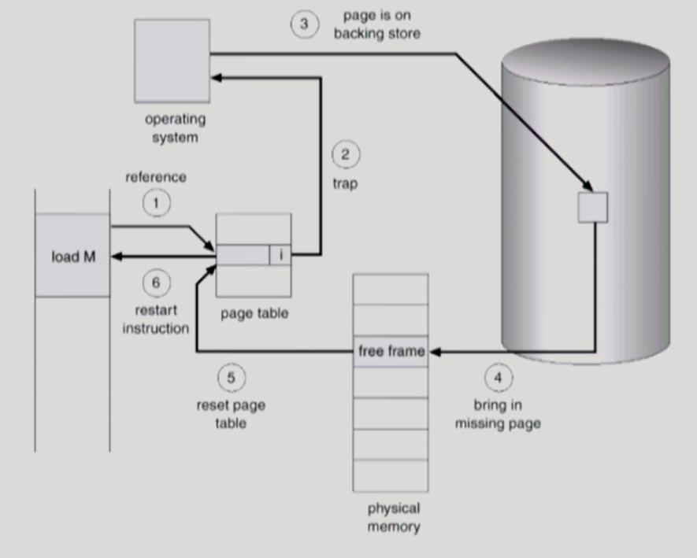

#### Performance of Demand Paging

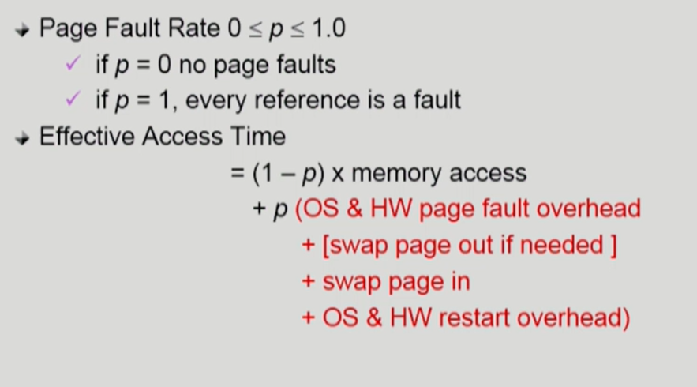

#### Free frame이 없는 경우

- **Page replacement**
  - 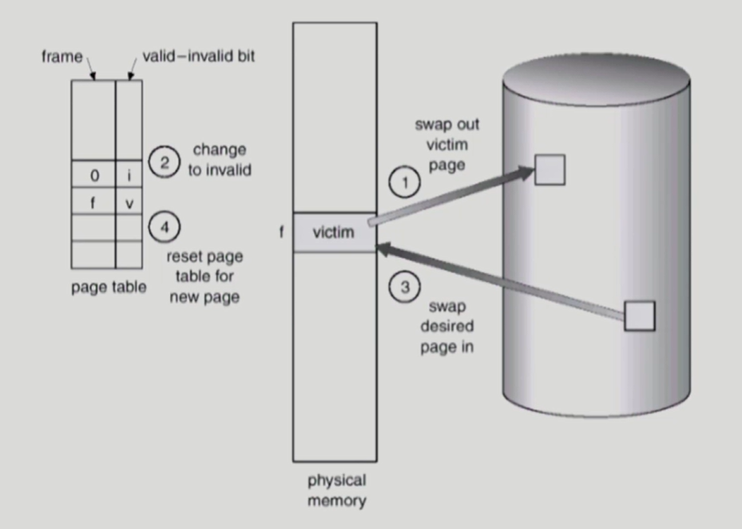
  - 어떤 frame을 빼앗아 올 지 결정해야 함
  - 곧바로 사용되지 않을 page를 쫓아내는 것이 좋음
  - 동일한 페이지가 여러 번 메모리에서 쫓겨났다가 다시 들어올 수 있음
- **Replacement Algorithm**
  - page-fault rate을 최소화하는 것이 목표
  - 알고리즘의 평가
    - 주어진 page reference string에 대해 page fault를 얼마나 내는지 조사
  - reference string의 예
    - 1,2,3,4,1,2,5,1,2,3,4,5

## Replacement Algorithm

### Optimal Algorithm

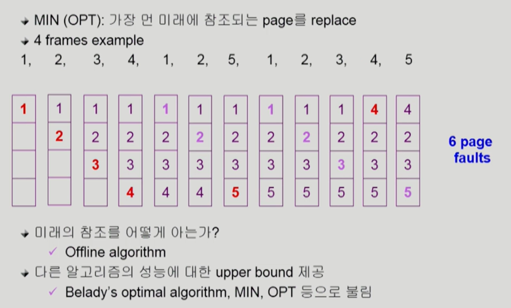

- 미래에 참조되는 페이지를 미리 알고있다고 가정한다.
  - 미래를 다 안다고 가정하기 때문에 실제로 사용하는 것은 불가능하고, 다른 알고리즘의 성능에 대한 upper bound 제공
    - 아무리 좋은 algorithm을 만들어도 이것보다 좋을 수는 없다.
- 가장 먼 미래에 참조되는 페이지를 교체

**미래를 모르는 상태에서 운영하는 알고리즘**

---

### FIFO(First In First Out) Algorithm

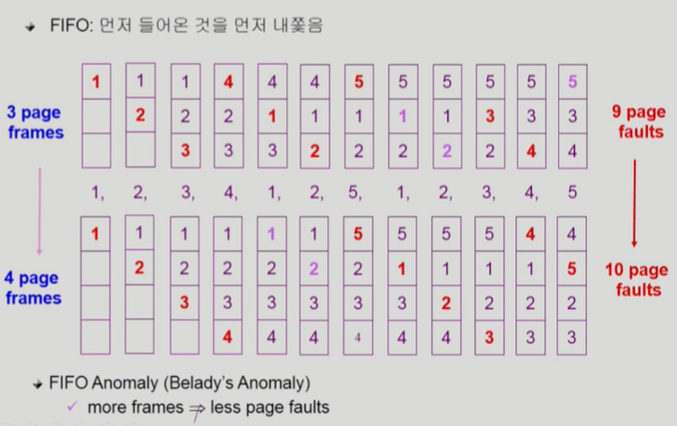

- 메모리 크기를 늘리면 성능이 나빠지는 경우가 발생할 수 있다.

### LRU(Least Recently Used) Algorithm

- 가장 오래 전에 참조된 것을 지움

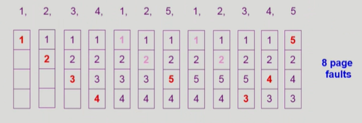

### LFU(Least Frequently Used) Algorithm

- 참조 횟수가 가장 적은 페이지를 지움
  - 최저 참조 횟수인 page가 여럿 있는 경우
    - LFU 알고리즘 자체에서는 여러 page 중 임의로 선정 
    - 성능 향상을 위해 가장 오래 전에 참조된 apge를 지우게 구현할 수도 있다.
  - 장단점
    - LRU처럼 직전 참조 시점만 보는 것이 아니라 장기적인 시간 규모를 보기 때문에 page의 인기도를 좀 더 정확히 반영할 수 있음
    - 참조 시점의 최근성을 반영하지 못함
    - LRU보다 구현이 복잡함

### LRU와 LFU 알고리즘의 예제 및 구현

#### LRU, LFU 예제

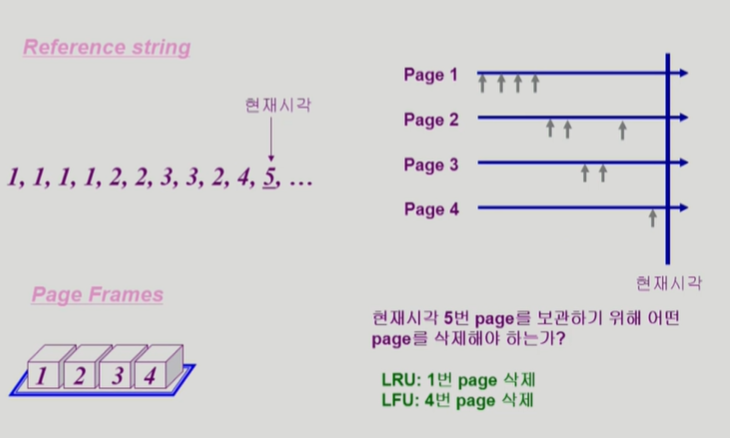

#### LRU, LFU 구현

- **LRU**
  - 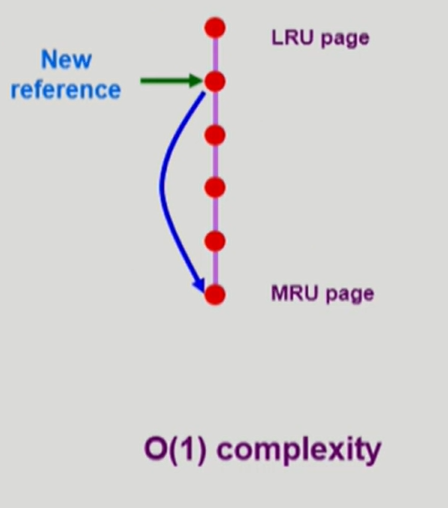
  - linked-list로 새롭게 참조되는 것을 맨 아래로 올리고, 가장 위에 있는 페이지 제거 = O(1) 시간복잡도로 가능
- **LFU**
  - 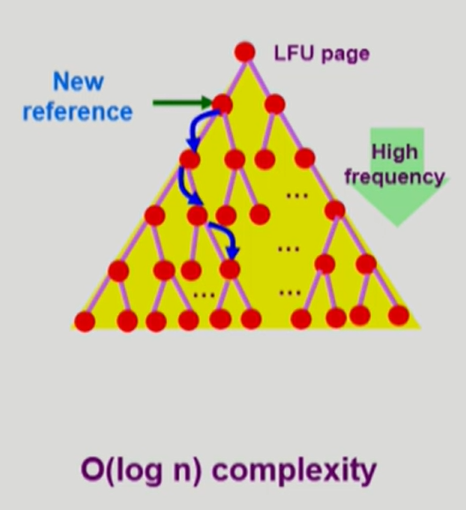
  - 하나하나 비교하면서 내려보낸다 = O(n)
  - Heap 구조 사용 = O(log n)

### 다양한 캐싱 환경

- 캐싱 기법
  - 한정된 빠른 공간 (=캐시)에 요청된 데이터를 저장해 두었다가 후속 요청시 캐시로부터 직접 서비스하는 방식
  - paging system 외에도 cache memory, buffer caching, Web caching 등 다양한 분야에서 사용
- 캐시 운영의 시간 제약
  - 교체 알고리즘에서 삭제할 항목을 결정하는 일에 지나치게 많은 시간이 걸리는 경우 실제 시스템에서 사용 불가
  - Buffer caching이나 Web caching의 경우
    - O(1)에서 O(log n) 정도까지 허용
  - Paging system인 경우
    - page fault인 경우에만 OS가 관여함
    - 페이지가 이미 메모리에 존재하는 경우 참조시각 등의 정보를 OS가 알 수 없음
    - O(1)인 LRU의 list 조작조차 불가능

**LRU, LFU는 OS에서 사용할 수 없기 때문에 아래와 같은 알고리즘 사용**

---

### Clock Algorithm

> = Second chance algorithm, NUR (Not  Used Recently) 또는 NRU (Not Recently Used)

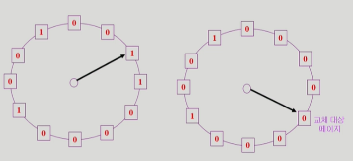

- LRU의 근사(approximation) 알고리즘
- Reference bit을 사용해서 교체 대상 페이지 선정(circular list)
- reference bit가 0인 것을 찾을 때까지 포인터를 하나씩 앞으로 이동
- 포인터 이동하는 중에 reference bit 1은 모두 0으로 바꿈
- Reference bit이 0인 것을 찾으면 그 페이지를 교체
- 한 바퀴 되돌아와서도(=second chance) 0이면 그때에는 replace당함
- 자주 사용되는 페이지라면 second chance가 올 때 1
- **Clock algorithm의 개선**
  - reference bit과 modified bit (dirty bit)을 함께 사용
  - reference bit = 1: 최근에 참조된 페이지
  - modified bit = 1: 최근에 변경된 페이지 (I/O를 동반하는 페이지)

### Page Frame의 Allocation

- Allocation problem: 각 process에 얼마만큼의 page frame을 할당할 것인가?
- Allocation의 필요성
  - 메모리 참조 명령어 수행시 명령어, 데이터 등 여러 페이지 동시 참조
    - 명령어 수행을 위해 최소한 할당되어야 하는 frame의 수가 있음
  - **Loop를 구성하는 page들은 한꺼번에 allocate 되는 것이 유리함**
    - 최소한의 allocation이 없으면 매 loop마다 page fault

- Allocation Scheme
  - **Equal allocation** : 모든 프로세스에 똑같은 갯수 할당
  - **Proportional allocation** : 프로세스 크기에 비례하여 할당
  - **Priority allocation** : 프로세스의 priority에 따라 다르게 할당

### Global vs. Local Replacement

> 그때 그때 경쟁해서 할당 vs 할당받은 자기 몫 안에서 사용

- **Global replacement**
  - Replace 시 다른 process에 할당된 frame을 빼앗아 올 수 있다
  - Process별 할당량을 조절하는 또 다른 방법임
  - FIFO, LRU, LFU 등의 알고리즘을 global replacement로 사용시에 해당
  - Working set, PFF 알고리즘 사용
- **Local replacement**
  - 자신에게 할당된 frame 내에서만 replacement
  - FIFO, LRU, LFU 등의 알고리즘을 process별로 운영시

### Thrashing

> Page fault가 과도하게 발생하는 상황

- 프로세스의 원활한 수행에 필요한 최소한의 page frame 수를 할당 받지 못한 경우 발생
- Page fault rate이 매우 높아짐
- CPU utilization이 낮아짐
- OS는 MPD (Multiprogramming degree)를 높여야 한다고 판단
- 또 다른 프로세스가 시스템에 추가됨 (higher MPD)
- 프로세스 당 할당된 frame의 수가 더욱 감소
- 프로세스는 page의 swap in / swap out으로 매우 바쁨
- 대부분의 시간에 CPU는 한가함
- low throughput

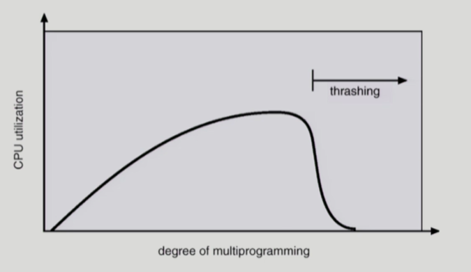

**Thrashing 막는법 (Global replacement)**

---

### Working-Set Model

- Locality of reference
  - 프로세스는 특정 시간 동안 일정 장소만을 집중적으로 참조한다.
  - 집중적으로 참조되는 해당 page들의 집합을 locality set이라 함
  - ex) Loop
- Locality에 기반하여 프로세스가 일정 시간 동안 원활하게 수행되기 위해 한꺼번에 메모리에 올라와 있어야 하는 page들의 집함을 **Working Set**이라 정의
- Working Set 모델에서는 process의 working set 전체가 메모리에 올라와 있어야 수행되고 그렇지 않을 경우 모든 frame을 반납한 후 swap out (suspend)
- Thrashing을 방지함
- **Multiprogramming degree를 결정함**

### Working-Set Algorithm

>과거를 통해 working set 추정

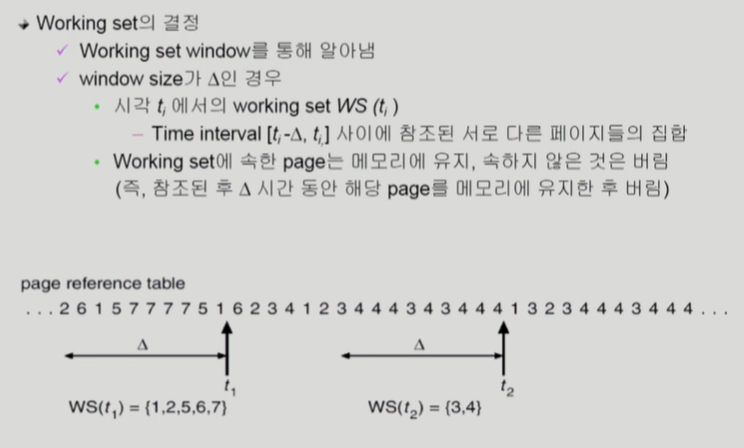

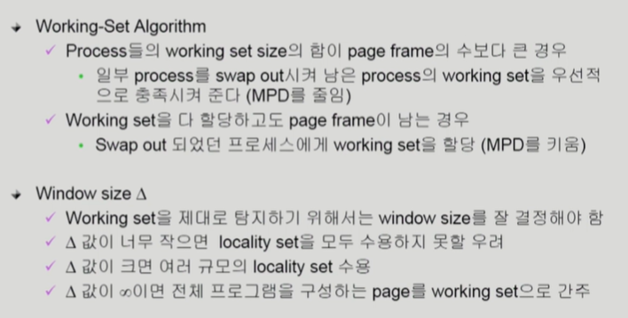

### PFF(Page-Fault Frequency) Scheme

> Working-set을 추정하는 것이 아니고, 직접 page-fault rate를 보는 것

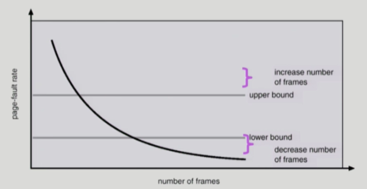

- page-fault rate의 상한값과 하한값을 둔다
  - Page fault rate이 상한값을 넘으면 frame을 더 할당
  - Page fault rate이 하한값 이하이면 할당 frame 수를 줄인다.
- 빈 frame이 없으면 일부 프로세스를 swap out

### Page Size의 결정

- Page size를 감소시키면?
  - 페이지 수 증가
  - 페이지 테이블 크기 증가
  - Internal fragmentation 감소
  - Disk transfer의 효율성 감소
    - Seek/rotation vs. transfer
  - 필요한 정보만 메모리에 올라와 메모리 이용이 효율적
    - Locality의 활용 측면에서는 좋지 않음
- **최근에는 페이지 크기를 키우는 추세**

