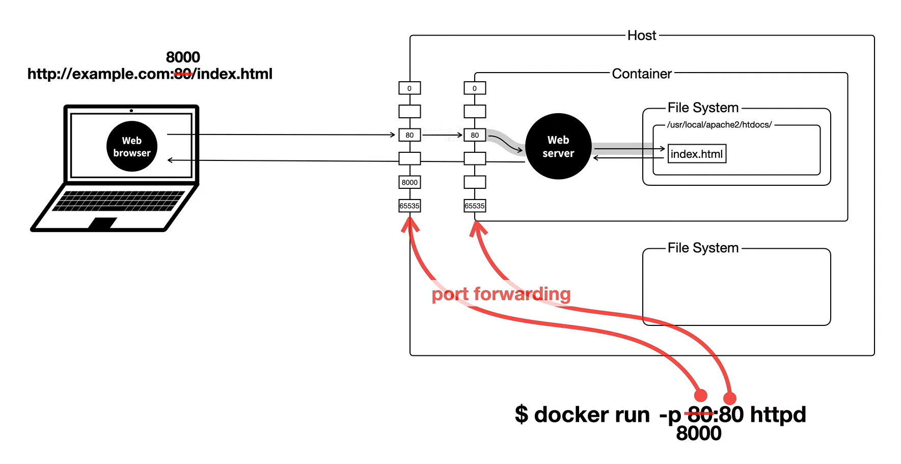
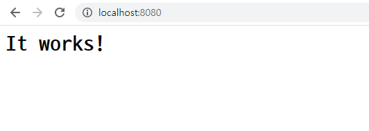
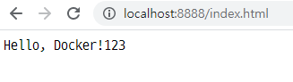

# Docker기초

[생활코딩 Docker 입구 수업](https://www.youtube.com/watch?v=Ps8HDIAyPD0&list=PLuHgQVnccGMDeMJsGq2O-55Ymtx0IdKWf)


## Docker란?

> 컨테이너 기반의 오픈소스 가상화 플랫폼

### Docker를 사용하는 이유

- Environment Disparity를 해결하기 위해 (개발환경이 다른 문제 해결)
  - 프로세스 ,파일 등등 가상으로 분리
  - 다양한 작업환경에서의 배포가 자유로워 질 수 있고, 빠른 배포가 가능하다.
  
- 하드웨어 자원 절감

- 가상머신처럼 독립적으로 실행되지만 가상머신보다 빠르고, 쉽고, 효율적

  

#### Docker / Virtual Machine

Docker는 커널을 공유, VM은 OS마다 커널을 갖는다.

- VM은 Hypervisor위에 OS를 올리기 때문에 성능 측면에서는 Docker가 유리하다.
  - Docker는 저장 공간도 절약할 수 있다.
- 보안적인 면에서는 각각의 커널을 가진 VM이 유리하다.
  - 신뢰할 수 있는 Docker 이미지 사용 필요(Docker certificate, Official image)


### Docker 설치

> https://docs.docker.com/get-docker/
>
> 환경에 맞게 설치

```bash
$ docker images
# cmd에서 문제 없으면 잘 설치된것
```


### Docker 명령어

> docker hub (https://hub.docker.com/)

```bash
$ docker pull httpd # 도커허브에서 도커 이미지 pull 받기
$ docker images # 도커 이미지 확인
```

```bash
$ docker ps # 현재 실행중인 컨테이너 확인
$ docker ps -a # 전체 컨테이너 보기
```

```bash
$ docker run --name "name" "image_name"
$ docker start ws2 # 컨테이너 실행
$ docker logs ws2 # 로그 한번 확인
$ docker logs -f ws2 # 계속해서 확인
$ docker rm ws2 # 컨테이너 삭제
$ docker rmi httpd # 도커 이미지 삭제
```


### Docker Host

> Container가 설치된 운영체제



- 하나의 Docker Host에는 여러개의 Docker Container가 존재할 수 있다.

- Container, Host 모두 독립적이므로 각각 포트번호를 갖고 있다.
- Host와 Container의 포트번호를 연결시켜줘야 한다.
- CLI
  - ws3이라는 이름의 httpd docker 이미지 container를 만들고, 8081포트와 80포트를 연결한다.

```bash
$ docker run --name ws3 -p 8081:80 httpd
```




### Docker exec

> https://docs.docker.com/engine/reference/commandline/exec/

```bash
# docker exec ws3 /bin/sh
# docker exec -it ws3 /bin/sh
# docker exec -it ws3 /bin/bash
```

- 터미널과 지속적으로 연결할땐 -it 사용!

#### index.html 수정하기

- nano editor 설치
  - https://opentutorials.org/module/3747/22523

```bash
# apt update
# apt install nano
```

- `Ctrl + y` + x + enter 로 저장


### Container File System과 Host의 File System 연결하기

```bash
$ docker run -p 8888:80 -v C:\Users\user\htdocs\:/usr/local/apache2/htdocs/ httpd
```



