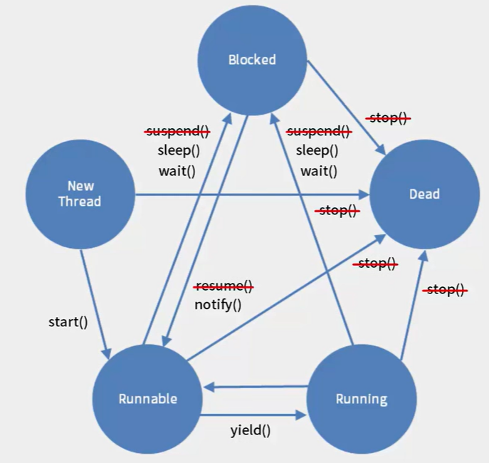

[TOC]


# 쓰레드

> https://programmers.co.kr/learn/courses/9

### 쓰레드란?

> 동시에 여러가지 작업을 동시에 수행할 수 있게하는것

- 프로세스란 현재 실행되고 있는 프로그램
- 자바 프로그램은 JVM에 위해 실행된다. 이 JVM도 프로그램중에 하나이다.
- 운영체제 입장으로 보면 자바도 하나의 프로세스로 실행을 하는 것
- 워드프로세서가 하나의 프로세스라면, 하나의 프로세스 안에서도 여러개의 흐름이 동작할 수 있다. 이것은 Thread라고 말을 합니다.


#### 쓰레드 상속

1. 클래스 생성 시 java.lang.thread 를 superclass로 설정
2. source -> run을 override 해서 사용

```java
// MyThread1.java
public class MyThread1 extends Thread {

	String str;
	public MyThread1(String str) {
		this.str = str;
	}
	
	
	
	@Override
	public void run() {
		for(int i = 0; i < 10; i++) {
			System.out.print(str);
		}
		
		try {
			Thread.sleep((int)(Math.random()*1000));
		} catch (InterruptedException e) {
			e.printStackTrace();
		}
	}
	
}
```

```java
// ThreadExam.java

public class TheradExam {

	public static void main(String[] args) {
		MyThread1 t1 = new MyThread1("*");
		MyThread1 t2 = new MyThread1("-");
		
		
		t1.start();
		t2.start();
		
		System.out.println("main end!!!");
	}

}
```

```java
main end!!!
***--------*******--
// main 쓰레드가 종료 되더라도 다른 쓰레드는 종료되지 않는다.
// 랜덤으로 sleep을 줬기 때문에 -와 *이 랜덤하게 나온다.
```


#### Runable interface 사용

> 자바는 단일 상속만을 지원하기때문에 interface 지원(interface는 여러 개 상속 가능)

```java
// MyThread2.java
public class MyThread2 implements Runnable {

	String str;
	public MyThread2 (String str) {
		this.str = str;
	}
	
	@Override
	public void run() {
		 for(int i=0;i<10;i++) {
			 System.out.println(str);
			 try {
				Thread.sleep((int)(Math.random()*100));
			} catch (InterruptedException e) {
				e.printStackTrace();
			}
		 }

	}

}
```

```java
// ThreadExam2.java
public class ThreadExam2 {

	public static void main(String[] args) {
		MyThread2 t1 = new MyThread2("*");
		MyThread2 t2 = new MyThread2("-");
		
		Thread thread1 = new Thread(t1);
		Thread thread2 = new Thread(t2);
		
		thread1.start();
		thread2.start();
		
		System.out.println("main end!!");
	}

}
// 결과는 같다.
main end!!
*----*-*--*-*--*****
```


### 공유객체

> 하나의 객체를 여러개의 Thread가 사용한다는 것을 의미
>
> 아래 예제를 보면 하나의 MuxicBox 객체를 세개의 Thread가 사용한다.

```java
// MusicBox
public class MusicBox {
    public void playMusicA() {
        for (int i = 0; i < 10; i++) {
            System.out.println("신나는 음악!!!");

            try {
                Thread.sleep((int) (Math.random() * 1000));
            } catch (InterruptedException e) {
                e.printStackTrace();
            }
        }
    }

    public void playMusicB() {
        for (int i = 0; i < 10; i++) {
            System.out.println("슬픈 음악!!!");

            try {
                Thread.sleep((int) (Math.random() * 1000));
            } catch (InterruptedException e) {
                e.printStackTrace();
            }
        }
    }

    public void playMusicC() {
        for (int i = 0; i < 10; i++) {
            System.out.println("카페 음악!!!");

            try {
                Thread.sleep((int) (Math.random() * 1000));
            } catch (InterruptedException e) {
                e.printStackTrace();
            }
        }
    }
}
```

```java
// MusicPlayer
public class MusicPlayer extends Thread {
    int type;
    MusicBox musicBox;

    public MusicPlayer(int type, MusicBox musicBox) {
        this.type = type;
        this.musicBox = musicBox;
    }

    @Override
    public void run() {
        switch (type){
            case 1:
                musicBox.playMusicA();
                break;
            case 2:
                musicBox.playMusicB();
                break;
            case 3:
                musicBox.playMusicC();
                break;

        }
        super.run();
    }
}
```

```java
// MusicBoxExam - 실행
public class MusicBoxExam1 {

    public static void main(String[] args) {
        MusicBox box = new MusicBox();

        MusicPlayer kang = new MusicPlayer(1, box);
        MusicPlayer kim = new MusicPlayer(2, box);
        MusicPlayer lee = new MusicPlayer(3, box);

        kang.start();
        kim.start();
        lee.start();

    }
}

```

``` markd
<출력>
신나는 음악!!!
카페 음악!!!
슬픈 음악!!!
슬픈 음악!!!
카페 음악!!!
신나는 음악!!!
슬픈 음악!!!
카페 음악!!!
카페 음악!!!
```


### 동기화 메소드와 동기화 블록

>  공유객체가 가진 메소드를 동시에 호출되지 않도록 하는 방법
>
> 메소드 앞에 synchronized 추가
>
> 여러개의 Thread들이 공유객체의 메소드를 사용할 때 메소드에 synchronized가 붙어 있을 경우 먼저 호출한 메소드가 객체의 사용권(Monitoring Lock)을 얻는다.
>
> synchronized block을 이용하면 필요한 부분만 동기화 가능

```java
synchronized (this) {
    System.out.println("카페 음악!!!");
}
```


### 쓰레드와 상태제어



- 쓰레드는 실행가능상태인 Runnable과 실행상태인 Running상태로 나뉜다.
- 실행 되었다가 멈췄다를 반복
- sleep() 메소드를 사용하면 Block 상태가 된다.
  - 특정 시간이 지나면 Runnable / Running 상태가 된다.
- Object가 가지고 있는 wait()메소드는 다른 쓰레드가 notify()나 notifyAll()메소드를 호출하기 전에는 블록상태에서 해제되지 않는다.
- Run이 종료되면 쓰레드가 종료되는 Dead 상태가 된다.
- yield 메소드가 호출되면 해당 쓰레드는 다른 쓰레드에게 자원을 양보한다.
- join 메소드를 호출하면 종료될 때까지 대기한다.


#### 쓰레드(join)

> join : 쓰레드가 멈출때까지 기다리는 메소드
>
> main 쓰레드가 시작하고, thread가 끝날때까지 기다렸다가 종료되는 것을 확인할 수 있다.

```java
public class JoinExam {
    public static void main(String[] args) {
        MyThread5 thread = new MyThread5();
        thread.start();

        System.out.println("시작");
        try {
            thread.join();
        } catch (InterruptedException e) {
            e.printStackTrace();
        }

        System.out.println("종료!");
    }
}
```

```markdown
// 결과
시작
MyThread5 : 0
MyThread5 : 1
MyThread5 : 2
MyThread5 : 3
MyThread5 : 4
종료!
```


#### 쓰레드(Wait, Notify)

> wait와 notify는 동기화된 블록안에서 사용해야 한다. wait를 만나게 되면 해당 쓰레드는 해당 객체의 모니터링 락에 대한 권한을 가지고 있다면 모니터링 락의 권한을 놓고 대기한다.
>
> wait 상태의 쓰레드는 다른 쓰레드에서 notify 메소드를 실행시켜줘야 깨어난다.

```java
public class ThreadA {
    public static void main(String[] args) {
        ThreadB b = new ThreadB();
        b.start();

        synchronized (b) {
            try {
                System.out.println("b가 완료될때까지 기다립니다.");
                b.wait(); // notify 호출될떄까지 기다린다.
            } catch (InterruptedException e) {
                e.printStackTrace();
            }
            System.out.println("Total is : " + b.total);
        }
    }
}
```

```java
public class ThreadB extends Thread {
    int total;

    public void run() {
        synchronized (this) {
            for (int i = 0; i < 5; i++) {
                System.out.println(i + "를 더합니다.");
                total += i;

                try {
                    Thread.sleep(500);
                } catch (InterruptedException e) {
                    e.printStackTrace();
                }
            }
            notify(); // 5번 출력이 끝나면 notify 호출하면서 wait 종료
        }
    }
```

```markdown
// 결과
b가 완료될때까지 기다립니다.
0를 더합니다.
1를 더합니다.
2를 더합니다.
3를 더합니다.
4를 더합니다.
Total is : 10
```


### 데몬 쓰레드

> 데몬(Daemon)이란 보통 리눅스와 같은 유닉스계열의 운영체제에서 백그라운드로 동작하는 프로그램을 말한다.
>
> 데몬쓰레드는 자바에서 데몬과 유사하게 동작하는 쓰레드이다.
>
> 백그라운드에서 특별한 작업을 처리하는 용도
>
> ex) 주기적으로 자동으로 저장하는 기능 / 일정 시간마다 맞춤법 검사 / 미디어 플레이어의 동영상 및 음악 재생

```java
public class DaemonThread implements Runnable {

    @Override
    public void run() {
        while (true){
            System.out.println("데몬 쓰레드가 실행중입니다.");

            try {
                Thread.sleep(500);
            } catch (InterruptedException e) {
                e.printStackTrace();
                break; // Exception 만났으면 while 문 종료
            }
        }

    }

    public static void main(String[] args) {
        Thread thread = new Thread(new DaemonThread());
        thread.setDaemon(true); // 데몬으로 설정
        thread.start();

        try {
            thread.sleep(1000);
        } catch (InterruptedException e) {
            e.printStackTrace();
        }
        System.out.println("메인 쓰레드가 종료됩니다.");
    }
}
```

```markdown
// 실행결과
데몬 쓰레드가 실행중입니다.
데몬 쓰레드가 실행중입니다.
메인 쓰레드가 종료됩니다.
```

