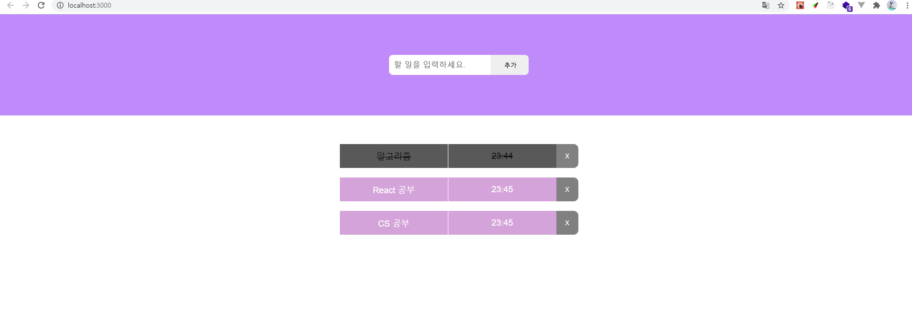

[TOC]

# TypeScript

> 공식문서 : https://www.typescriptlang.org/docs/
>
> 한글번역: https://typescript-kr.github.io/

## TypeScript란?

>  MS에서 개발한 JS의 Superset 언어
>
>  https://www.samsungsds.com/kr/insights/TypeScript.html


### **컴파일 언어, 정적 타입 언어**

자바스크립트는 동적 타입의 인터프리터 언어로 런타임에서 오류를 발견할 수 있습니다. 

이에 반해 타입스크립트는 정적 타입의 컴파일 언어이며 타입스크립트 컴파일러 또는 바벨(Babel)을 통해 자바스크립트 코드로 변환됩니다. 코드 작성 단계에서 타입을 체크해 오류를 확인할 수 있고 미리 타입을 결정하기 때문에 실행 속도가 매우 빠르다는 장점이 있습니다. 

하지만 코드 작성 시 매번 타입을 결정해야 하기 때문에 번거롭고 코드량이 증가하며 컴파일 시간이 오래 걸린다는 단점이 있습니다.


### **자바스크립트 슈퍼셋(Superset)**

타입스크립트는 자바스크립트의 슈퍼셋, 즉 자바스크립트 기본 문법에 타입스크립트의 문법을 추가한 언어입니다. 따라서 유효한 자바스크립트로 작성한 코드는 확장자를 .js에서 .ts로 변경하고 타입스크립트로 컴파일해 변환할 수 있습니다.


### **객체 지향 프로그래밍 지원**

타입스크립트는 ES6(ECMAScript 6)에서 새롭게 사용된 문법을 포함하고 있으며 클래스, 인터페이스, 상속, 모듈 등과 같은 객체 지향 프로그래밍 패턴을 제공합니다.


## TypeScript를 사용하는 이유

### **높은 수준의 코드 탐색과 디버깅**

타입스크립트는 코드에 목적을 명시하고 목적에 맞지 않는 타입의 변수나 함수들에서 에러를 발생시켜 버그를 사전에 제거합니다. 

또한 코드 자동완성이나 실행 전 피드백을 제공하여 작업과 동시에 디버깅이 가능해 생산성을 높일 수 있습니다. 

실제로 한 연구에 따르면 모든 자바스크립트 버그의 15%가 사전에 타입스크립트로 감지할 수 있다고 합니다.

### **자바스크립트 호환**

타입스크립트는 자바스크립트와 100% 호환됩니다. 따라서 프론트엔드 또는 백엔드 어디든 자바스크립트를 사용할 수 있는 곳이라면 타입스크립트도 쓸 수 있습니다. 타입스크립트는 앱과 웹을 구현하는 자바스크립트와 동일한 용도로 사용 가능하며 서버 단에서 개발이 이루어지는 복잡한 대형 프로젝트에서도 빛을 발합니다.

### **강력한 생태계**

타입스크립트는 그리 오래되지 않은 언어임에도 불구하고 강력한 생태계를 가지고 있습니다. 대부분의 라이브러리들이 타입스크립트를 지원하며 마이크로소프트의 비주얼 스튜디오 코드(VSCode)를 비롯해 각종 에디터가 타입스크립트 관련 기능과 플러그인을 지원합니다.

### **점진적 전환 가능**

기존의 자바스크립트 프로젝트를 타입스크립트로 전환하는데 부담이 있다면 추가 기능이나 특정 기능에만 타입스크립트를 도입함으로써 프로젝트를 점진적으로 전환할 수 있습니다. 자바스크립트에 주석을 추가하는 것에서부터 시작해 시간이 지남에 따라 코드베이스가 완전이 바뀌도록 준비 기간을 가질 수 있습니다.


## TypeScript 기본 문법

### **기본 타입**

>  타입스크립트는 다양한 기본 타입을 제공합니다.
> Boolean, Number, String, Object, Array, Tuple, Enum, Any, Void, Null, Undefined, Never

```typescript
let str: string = 'hi';
let num: number = 100;

let arr: Array = [1, 2, 3];
let arr2: number[] = [1, 2, 3];

let obj: object = {};
let obj2: { name: string, age: number} = {
 name: 'hoho',
 age: 22
};
```

```typescript
function add(a: number, b: number): number {
return a+b;
}
//옵셔널 파라미터
function log(a: string, b?: string, c?: string) {
 console.log(a);
}
```


기본 타입 중 자바스크립트에 존재하지 않는 타입은 다음과 같습니다.

• Tuple: 배열의 타입 순서와 배열 길이를 지정할 수 있는 타입

```typescript
var arr: [string, number] = ['aa', 100];
```

• Enum: Number 또는 String 값 집합에 고정된 이름을 부여할 수 있는 타입입니다. 값의 종류가 일정한 범위로 정해져 있는 경우에 유용합니다. 기본적으로 0부터 시작하며 값은 1씩 증가합니다.

```typescript
enum Shoes {
 Nike = '나이키',
 Adidas= '아디다스'
}
```

• Any: 모든 데이터 타입을 허용합니다.

• Void: 변수에는 undefined와 null만 할당하고 함수에는 리턴 값을 설정할 수 없는 타입입니다.

• Never: 특정 값이 절대 발생할 수 없을 때 사용합니다.


### Interface

> type을 정의한 규칙

```typescript
interface User {
 age: number;
 name: string;
}
```

- 변수와 함수에 활용

```typescript
var person: User = {
 age: 30,
 name: 'aa'
}

function getUser(user: User) {
 console.log(user);
}
```

- 인덱싱

```typescript
interface StringArray {
 [index: number]: string;
}

var arr2: StringArray = ['a', 'b', 'c'];
arr[0] = 10 //Error;
```

- 딕셔너리

```typescript
interface StringRegexDictionary {
 [key: string]: RegExp
}

var obj: StringRegexDictionary = {
 cssFile: /\.css$/,
 jsFile: 'a' //Error
}

obj['cssFile'] = /\.css$/;
obj['jsFile'] = 'a' //Error
```

- 인터페이스 확장

```typescript
interface Person{
 name: string;
 age: number;
}

interface User extends Person{
 language: string;
}
```


### **오퍼레이터**

- Union 타입: 자바스크립트의 OR 연산자와 같은 의미의 타입입니다. Union 타입으로 지정하면 각 타입의 공통된(보장된) 속성에만 접근 가능합니다.

```typescript
function askSomeone(someone: Developer2 | Person) {
 console.log(someone);
}
```

- Intersection 타입: 자바스크립트의 AND 연산자와 같은 의미의 타입입니다. 각각의 모든 타입이 포함된 객체를 넘기지 않으면 에러가 발생합니다.

```typescript
function askSomeone(someone: Developer & Person) {
 console.log(someone);
}
```

### Generic

> 여러 타입에서 동작하는 컴포넌트 생성하는데 사용
>
> 제네릭이란 타입을 마치 함수의 파라미터처럼 사용하는 것을 의미

```typescript
function logText(text: T):T {
 return text;
}

logText<string>('aa');
logText<number>(100);
```


### 타입추론

> Typescript가 코드를 해석하는 과정

```typescript
var a = true;

a = 100; //Error
```

- a는 boolean 타입으로 추론했기 때문에 Number 타입을 할당하면 에러 발생


### 타입 단언

> 타입 단언이란 타입스크립트가 해석하는 것보다 더 확실한 목적을 가지고 개발자가 해당 코드에 타입을 직접 지정하는 것을 의미

```typescript
var a;
a = 10;
a = 'string';
var b = a as string;

//타입추론시 HTMLDivElementㅣnull로 반환
var div = document.querySelector('div') as HTMLDivElement;
div.innerText;
```

- 위의 타입 단언으로 null을 대비한 분기문을 작성하지 않아도 됩니다.


### **타입 호환**

> 타입 호환이란 특정 타입이 다른 타입에 잘 호환되는지를 의미합니다.

- 구조적 타이핑: 코드 구조 관점에서 타입이 서로 호환되는지를 판단하는 것입니다. 구조적으로 더 큰 타입은 작은 타입을 호환할 수 없습니다.

```typescript
interface Developer {
 name: string;
 age: string;
}
interface Person {
 name: string;
}

var developer: Developer;
var person: Person;

developer = person; //Error
person = developer;
```


---

### React에 TypeScript 추가하기

> https://ko.reactjs.org/docs/static-type-checking.html#adding-typescript-to-a-project

```bash
$ npm install --save-dev typescript
```


## [TodoList](./todolist)

> 간단한 TodoList 작성

### 1. Todo Interface

> id: 고유 id값
>
> taskName: 할일
>
> created: 작성시간
>
> done: 완료 여부

```typescript
export interface ITodo {
  id: number;
  taskName: string;
  created: string;
  done: boolean;
}
```


### 2. TodoTask.tsx

> 하나의 TodoTask

```tsx
import { ITodo } from '../interfaces'

interface Props {
  task: ITodo;
  deleteTask(taskIdToDelete: number): void;
  completeTask(taskIdToComplete: number): void;
}

const TodoTask = ({ task, deleteTask, completeTask }: Props) => {
  return (
    <div className="task">
      <div className={task.done ? "done" : "content"}
        onClick={() => completeTask(task.id)}
        >
        <span>{task.taskName}</span>
        <span>{task.created}</span>
      </div>
      <button onClick={() => {
        deleteTask(task.id);
      }}>X</button>
    </div>
  )
}

export default TodoTask
```


### 3.  App.tsx

> Create, Read, Delete

```tsx
import React, { useState, ChangeEvent } from 'react';
import "./App.css";
import TodoTask from './components/TodoTask';
import {ITodo} from './interfaces'

const App = () => {

  const [task, setTask] = useState<string>("");
  const [todoList, setTodoList] = useState<ITodo[]>([]);
  const [id, setId] = useState<number>(0);

  const handleChange = (event: ChangeEvent<HTMLInputElement>): void => {
    setTask(event.target.value);
  };

  const addTask = (): void => {
    const newTask = {id: id+1, taskName: task, created: new Date().toTimeString().slice(0, 5), done: false};
    setId(id+1);
    setTodoList([...todoList, newTask]);
    setTask("");
  };

  const deleteTask = (taskIdToDelete: number): void => {
    setTodoList(todoList.filter((task) => {
      return task.id !== taskIdToDelete;
    }))
  };

  const completeTask = (taskIdToComplete: number): void => {
    setTodoList(todoList.map((task) => {
      if (task.id === taskIdToComplete) {
        task.done = !task.done;
      }
      return task;
    }))
  };

  return (
    <div className="App">
      <div className="header">
        <div className="inputContainer">
          <input 
            type="text" 
            placeholder="할 일을 입력하세요." 
            name="task" 
            value={task}
            onChange={handleChange}
            onKeyPress={(event) => {
              if (event.key === "Enter"){
                if (task.trim() !== "") {
                  addTask();
                } else {
                  alert('할 일을 입력해주세요.')
                }
            }}
          }/>
        </div>
        <button onClick={
          () => {
            if (task.trim() !== "") {
              addTask();
            } else {
              alert('할 일을 입력해주세요.')
            }}
        }>추가</button>
      </div>
      <div className="todoList">
        {todoList.map((task: ITodo, key:number) => {
          return <TodoTask key={key} task={task} 
                          completeTask={completeTask}
                          deleteTask={deleteTask}/>
        })}
      </div>
    </div>
  );
}

export default App;
```


### 4. 결과


