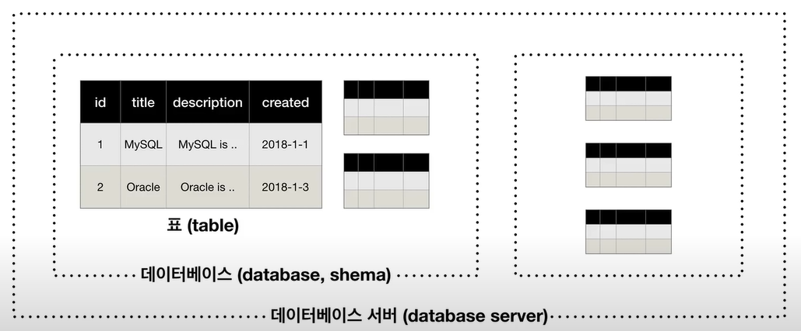
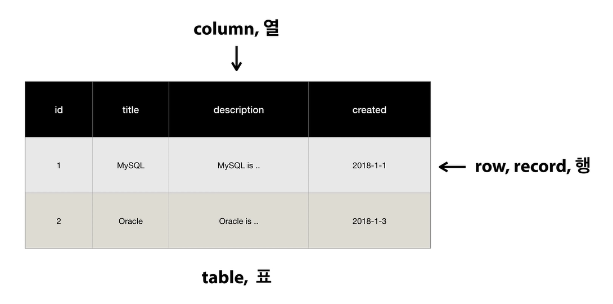
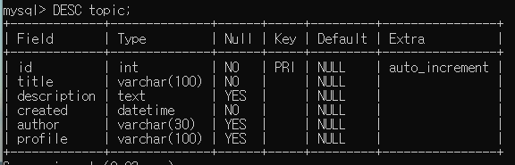
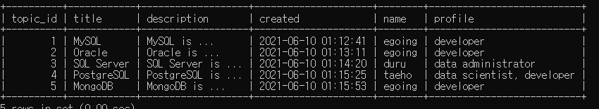
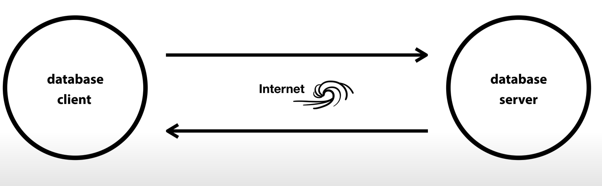

[TOC]

## MySQL

데이터베이스 서버 - 데이터베이스 -  표 - (스키마 = 데이터)




### SQL

> Structured Query Language(구조화 질의어)



row, column, table

```bash
$ cd C:\Program Files\MySQL\MySQL Server 8.0\bin

$ mysql -uroot -p
# password 입력하면 mysql-monitor 실행됨
```

```mysql
-- DB 생성
CREATE DATABASE opentutorials;
-- DB 제거
DROP DATABASE opentutorials;
-- DB 확인
SHOW DATABASES;
-- DB 사용하겠다
USE opentutorials;

mysql> UPDATE mysql.user SET Password=PASSWORD('your_new_password') -- 비밀번호 변경
```


- MySQL cheatsheet
  - 검색할때 cheatsheet 사용하면 편리
  - https://devhints.io/mysql


```mysql
CREATE TABLE topic(
    id INT(11) NOT NULL AUTO_INCREMENT, -- 자동으로 1씩 증가시켜준다.
    title VARCHAR(100) NOT NULL,
    description TEXT NULL, -- 값 없는거 허용한다.
    created DATETIME NOT NULL,
    author VARCHAR(30) NULL,
    profile VARCHAR(100) NULL,
    PRIMARY KEY(id)
);
```


### CRUD

Create, Read 는 존재

U, D 가 없어야 하는 경우 존재!! (ex. 거래 내역 등 수정,삭제 하면 범죄가 되는 경우)

```mysql
DESC topic; -- topic table 구조확인
```



#### INSERT

```mysql
INSERT INTO topic (title, description,created,author,profile) VALUES('MySQL', 'MySQL is ...', NOW(),'egoing','developer');
```

#### SELECT

```mysql
SELECT id, title FROM topic WHERE author='egoing' ORDER BY id DESC LIMIT 2;
```

#### UPDATE

```mysql
UPDATE topic SET description='Oracle is ...', title='Oracle' WHERE id=2;
-- WHERE로 변경할 데이터 선택 중요!!
```

#### DELETE

```mysql
DELETE FROM topic WHERE id=5;
```


### 관계형 데이터베이스

혁신(innovation), 본질(essence) : CRUD

> key: value 들의 간단한 관계를 테이블화 시킨 간단한 데이터베이스

```mysql
RENAME TABLE topic TO topic_backup; -- table 이름 변경
```

topic, author TABLE 생성


#### JOIN

```mysql
SELECT * FROM topic LEFT JOIN author ON topic.author_id = author.id;

SELECT topic.id AS topic_id,title,description,created,name,profile FROM topic LEFT JOIN author ON topic.author_id = author.id;
```






##### database server

- MySQL

##### database client

- MySQL monitor, MySQL Workbench(GUI 방식)


##### Back-up

- mysqldump
- binary log


```mysql
-- 테이블은 남겨두고 데이터만 삭제
-- 복구 불가능 (DELETE는 가능)
TRUNCATE TABLE {table_name};
```

