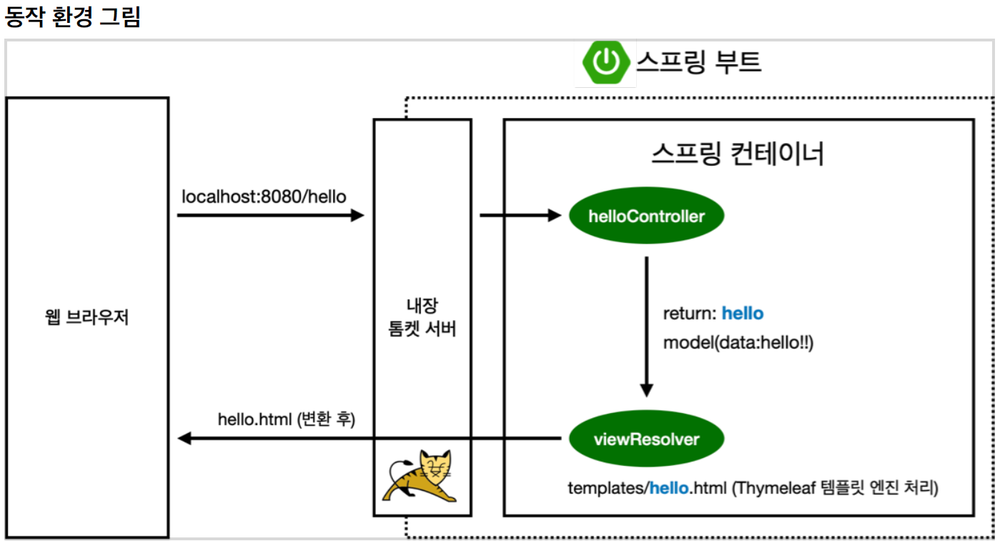

> https://www.inflearn.com/course/%EC%8A%A4%ED%94%84%EB%A7%81-%EC%9E%85%EB%AC%B8-%EC%8A%A4%ED%94%84%EB%A7%81%EB%B6%80%ED%8A%B8

[TOC]

# 프로젝트 환경설정

## 1. 프로젝트 생성

#### Project

- 예전에는 Maven 요즘 추세는 Gradle로 넘어오는 추세

#### Language

- Java

#### Spring Boot

- version 선택

#### Project Metadata

Group :  기업 도메인명

Artifact : 프로젝트명

#### Dependencies

- Spring Web
- Thymeleaf (회사마다 다름)
  - html을 만들어주는 template engine


#### Open project


main - java 아래 실제 packages

test: test source code 관련 => 요즘 Test가 매우 중요하다.


`build.gradle` 

버전 설정, 라이브러리 가져오기


`main/java/hello.hellospring/HelloSpringApplication` 에서 main 메서드 실행


- 스프링 서버 실행된 것


## 2. 라이브러리 살펴보기

```
dependencies {
	implementation 'org.springframework.boot:spring-boot-starter-thymeleaf'
	implementation 'org.springframework.boot:spring-boot-starter-web'
	testImplementation 'org.springframework.boot:spring-boot-starter-test'
}
```

- 의존 관계에 있는 것들을 다운로드한다.


#### 스프링 부트 라이브러리

##### spring-boot-starter-web

- spring-boot-starter-tomcat: 톰캣 (웹서버)

- spring-webmvc: 스프링 웹 MVC

- spring-boot-starter-thymeleaf: 타임리프 템플릿 엔진(View)

- spring-boot-starter(공통): 스프링 부트 + 스프링 코어 + 로깅

- ##### spring-boot

  - spring-core

- ##### spring-boot-starter-logging

  - 실무에서는 System.out.print 보다 많이 사용
  - logback, slf4j

#### 테스트 라이브러리

##### spring-boot-starter-test

- junit: 테스트 프레임워크
- mockito: 목 라이브러리
- assertj: 테스트 코드를 좀 더 편하게 작성하게 도와주는 라이브러리
- spring-test: 스프링 통합 테스트 지원


## 3. View 환경설정

> https://docs.spring.io/spring-boot/docs/current/reference/html/features.html#features.developing-web-applications.spring-mvc.welcome-page
>
> Welcome page

`src/resources/static/index.html`

Indexl.html을 먼저 찾아서 실행한다. 못찾으면 index template를 찾는다.


#### @GetMapping : get method

```java
package hello.hellospring.controller;

import org.springframework.stereotype.Controller;
import org.springframework.ui.Model;
import org.springframework.web.bind.annotation.GetMapping;

@Controller
public class HelloController {

    @GetMapping("hello")
    public String hello(Model model) {
        model.addAttribute( "data",  "spring!!");
        return "hello";
    }
}
```

return 값으로 문자를 반환하면 `viewResolver`가 화면을 찾아서 처리한다.

```markdown
인텔리제이 Ultimate버전에서는 ctrl + (return "hello")`를 마우스 클릭하면 자동으로  hello.html로 이동한다.

안되는 경우 
1. src 마우스 우클릭 -> Mark Directory As -> source root로 설정
2. File -> Invalidate Caches
```



- resources:templates/ + {ViewName} + .html
- resources/templates/hello.html 반환


## 4. 빌드하고 실행하기

`./gradlew build`

`cd build/libs`

`java -jar hello-spring-0.0.1-SNAPSHOP.jar`

실행


`./gradlew clean` : 빌드 사라짐

`./gradlew clean build` : 지우고 다시 빌드
