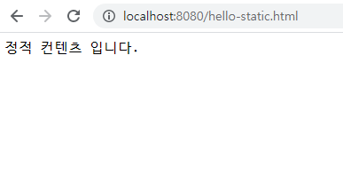
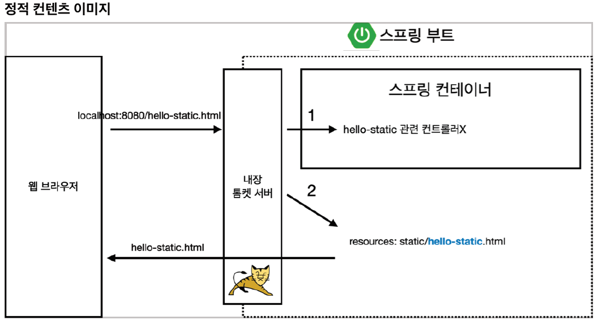
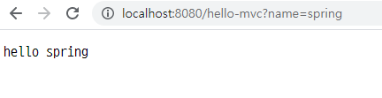
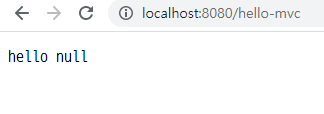
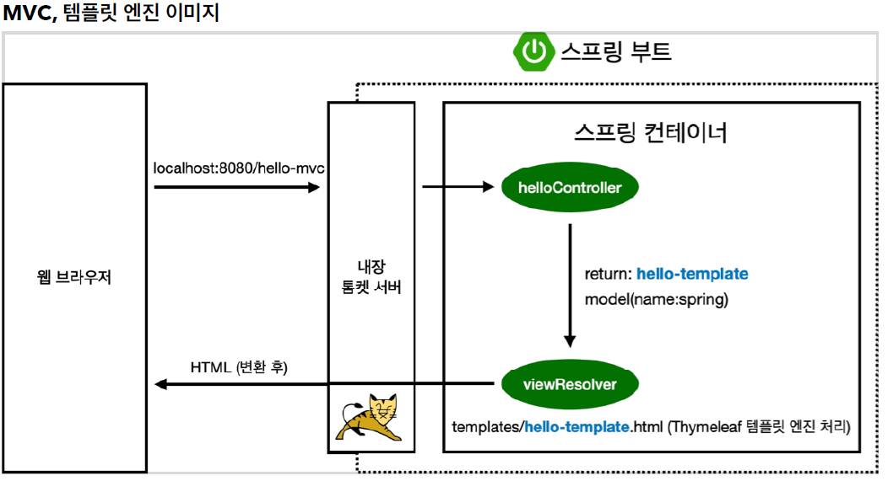
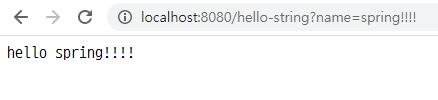
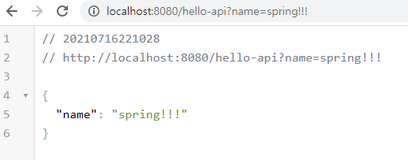
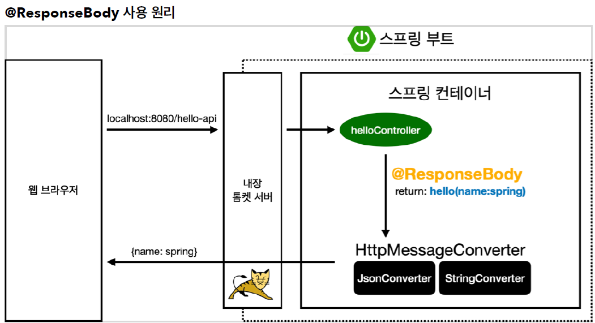

[TOC]

# 스프링 웹 개발 기초

## 1. 정적 컨텐츠

> 파일을 그대로 웹 브라우저에 전달
>
> https://docs.spring.io/spring-boot/docs/current/reference/html/features.html#features.developing-web-applications.spring-mvc.static-contenthttps://docs.spring.io/spring-boot/docs/current/reference/html/features.html#features.developing-web-applications.spring-mvc.static-content

정적 컨텐츠 그대로 반환해준다.






1. localhost:8000/hello-static.html 요청이 오면
2. 내장 톰켓 서버에서 받아서 컨트롤러에서 hello-static이 있는지 찾아본다.
3. 없으면 resources/static을 확인
4. 있으면 hello-static.html 반환


## 2. MVC와 템플릿 엔진

> 서버에서 변형해서 html을 바꿔서 내려주는 방식

```java
@GetMapping("hello-mvc")
public String helloMvc(@RequestParam("name") String name, Model model){
    model.addAttribute("name", name);
    return "hello-template";
}
```

`2021-07-16 21:47:07.426  WARN 8444 --- [nio-8080-exec-2] .w.s.m.s.DefaultHandlerExceptionResolver : Resolved [org.springframework.web.bind.MissingServletRequestParameterException: Required request parameter 'name' for method parameter type String is not present]`

- request parameter : name을 넣어줘야 한다.
- @RequestParam(value="name", required =false) 으로 변경 default값은required= true

<name 넣은 경우>




<name 생략한 경우>







1. 웹 브라우저에서 localhost:8080/hello-mvc 요청
2. 내장 톰켓서버 거쳐서 스프링에 넘겨준다.
3. Mapping이 되어 있으므로 hello-template을 return해준다.
4. viewResolver에서 templates/hello-template.html을 반환해준다.
5. Thymeleaf 엔진에서 변환해서 웹브라우저로 보내준다.

> 다음과 같이 변환되어 보여진다.

```html
<!doctype html>
<html>
<body>
<p>hello spring!!!!</p>
</body>
</html>
```


## 3. API

> JSON이라는 데이터 포맷으로 클라이언트한테  데이터 전달
>
> 서버끼리 통신할 때 사용

```java
@GetMapping("hello-string")
@ResponseBody
public String helloString(@RequestParam("name") String name){
    return "hello " + name; // "hello spring"
}
```

### @ResponseBody

- 응답HTTP body부에 내용을 직접 넣어 준다.



```html
hello spring!!!!
```

- 문자 그대로 나온다.


`Alt + Insert` : Generate 단축키 (Getter/Setter 검색해서 생성)

`Ctrl + Shift + Enter` : 인텔리제이 자동완성 단축키


```java
    @GetMapping("hello-api")
    @ResponseBody
    public Hello helloApi(@RequestParam("name") String name){
        Hello hello = new Hello();
        hello.setName(name);
        return hello;
    }

    static class Hello {
        private String name;

        public String getName() {
            return name;
        }

        public void setName(String name) {
            this.name = name;
        }
    }
```




- JSON 방식으로 응답한다.




1. `localhost:8080/hello-api` 요청
2. 내장 톰켓서버에서 있는지 확인
3. 있는데 @ResponseBody가 붙어있으면, 뷰 리졸버( viewResolver )를 사용하지 않음
   - HTTPMessageConverter가 작동
   - 기본 문자처리: StringHttpMessageConverter
   - 기본 객체처리: MappingJackson2HttpMessageConverter
   - 깊이 있게 들어가면 바꿀 수 있지만 실무에선 거의 손대지 않는다.
4. 객체가 넘어오면? default = json 방식으로 데이터를 만들어서 넘겨준다.

