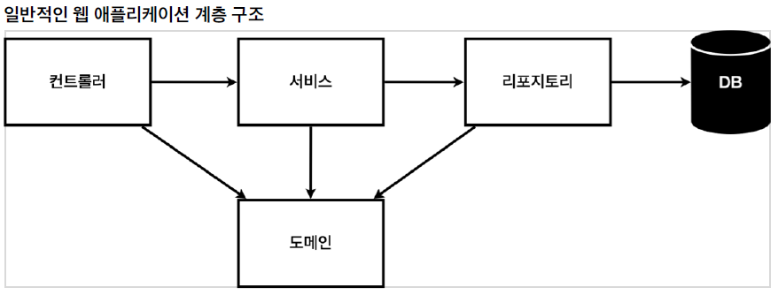
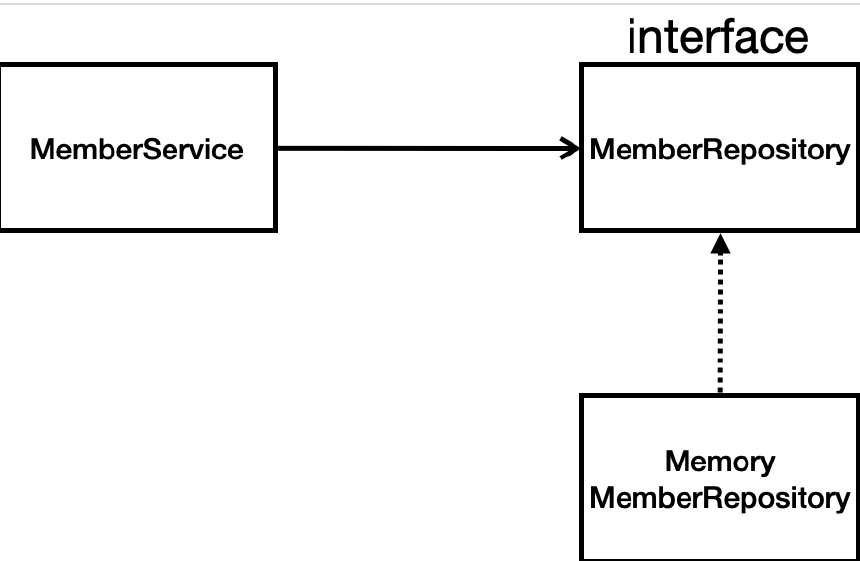

[TOC]

# 회원 관리 예제 - 백엔드 개발


### 비즈니스 요구사항 정리

- 데이터: 회원ID, 이름
- 기능: 회원 등록, 조회
- 아직 데이터 저장소가 선정되지 않음(가상의 시나리오)




- 컨트롤러 : MVC의 컨트롤러 역할
- 서비스: 핵심 비즈니스 로직 구현
- 리포지토리: 데이터베이스에 접근, 도메인 객체를 DB에 저장하고 관리
- 도메인: 비즈니스 도메인 객체
  - ex)회원, 주문, 쿠폰 등등




- 아직 데이터 저장소가 선정되지 않아서, 가벼운 메모리 기반의 데이터 저장소 사용


`shift + F6` : rename


### 회원 리포지토리 테스트 케이스 작성

- Test는 순서에 의존되지 않도록 설계해야한다.
- Test가 끝나면 데이터를 clear를 해줘야한다.

```java
// MemorymemberRepository
public void clearStore() {
    store.clear();
}

// MemorymemberRepositoryTeset
@AfterEach // 각 테스트가 끝날때마다 실행
public void afterEach(){
    repository.clearStore();
}
```


- 구현하기 전에 테스트 케이스를 먼저 만들고 설계하는 방법도 있다.
  - 테스트 주도 개발(TDD)


### 회원 서비스 개발

`Ctrl + Alt + v` : Optional로 만들어주는 단축키

`Ctrl + Alt + m` : extract method

service class는 business에 가까운 네이밍을 사용해야 한다.


### 회원 서비스 테스트

`Ctrl + Shift + T`: 테스트 껍데기 자동으로 만들어주는 단축키

MemberService에서 만든 `MemoryMemberRepository`와 테스트케이스에서 만든게 서로 다른 instance를 사용하는 문제 발생

`MemoryMemberRepository`에서 static으로 선언되어 있어 문제는 없지만 바뀌면 서로 다른 DB 사용하면서 문제

##### MemberService.java

```java
// 기존
public class MemberService {
	private final MemberRepository memberRepository = new MemoryMemberRepository();
}
```

```java
// 수정
public class MemberService {
	private final MemberRepository memberRepository;
	public MemberService(MemberRepository memberRepository) {
	this.memberRepository = memberRepository;
	}
}
```

##### MemberServiceTest.java

```java
// 기존
MemberService memberService = new MemberService();
MemoryMemberRepository memberRepository = new MemoryMemberRepository();
```

```java
// 수정
MemberService memberService;
MemoryMemberRepository memberRepository;

@BeforeEach
public void beforeEach() {
    memberRepository = new MemoryMemberRepository();
    memberService = new MemberService(memberRepository);
}
```

=> 이런걸 Dependency Injection(DI) 이라고 한다.