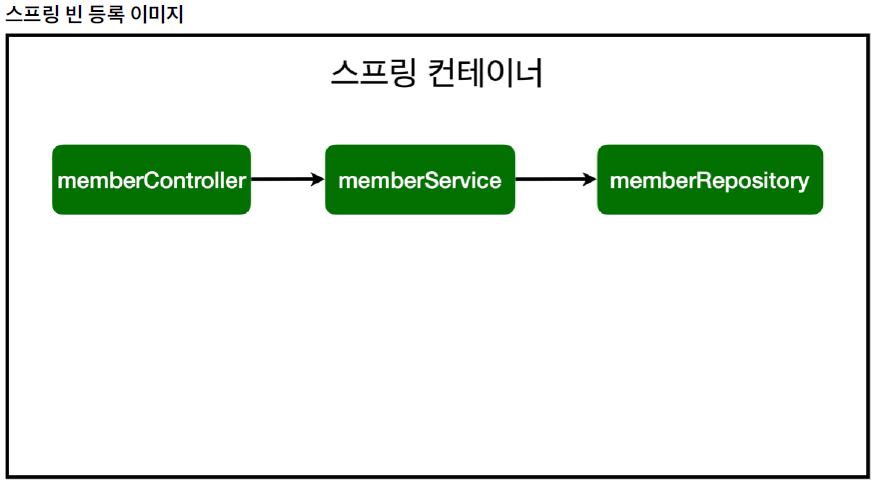

[TOC]


# 스프링 빈과 의존관계

### 스프링 빈을 등록하는 2가지 방법

> 둘 다 알아야한다.

#### 빈(Bean)

>  Spring IoC 컨테이너가 관리하는 자바 객체를 빈(Bean)이라는 용어로 부른다.



1. 컴포넌트 스캔과 자동 의존관계 설정

   - @Component 애노테이션이 있으면 스프링 빈으로 자동 등록된다.

   - @Controller, @Service, @Repository 애노테이션에 들어가보면 @Component가 있다.

2. 자바 코드로 직접 스프링 빈 등록하기


### 1. 컴포넌트 스캔과 자동 의존관계 설정

```java
import hello.hellospring.service.MemberService;
import org.springframework.beans.factory.annotation.Autowired;
import org.springframework.stereotype.Controller;

@Controller
public class MemberController {

    private final MemberService memberService;

    @Autowired
    public MemberController(MemberService memberService) {
        this.memberService = memberService;
    }
}
```

- 생성자에 @Autowired 가 있으면 스프링이 연관된 객체를 스프링 컨테이너에서 찾아서 넣어준다. 
- 이렇게 객체 의존관계를 외부에서 넣어주는 것을 DI (Dependency Injection), 의존성 주입이라 한다.
- 이전 테스트에서는 개발자가 직접 주입했고, 여기서는 @Autowired에 의해 스프링이 주입해준다.


- MemberService는 순수한 자바 클래스 코드이기 떄문에 스프링에서 알 수 없다.
- Controller로 외부 요청 받고, Service에서 Business Logic을 만들고, Repository에서 저장하는 정형화된 패턴
  - `@Controller, @Service, @Repository`

```java
@Service
public class MemberService {

    private final MemberRepository memberRepository;

    @Autowired
    public MemberService(MemberRepository memberRepository) { // Dependency Injection
        this.memberRepository = memberRepository;
    }
```

```java
@Repository
public class MemoryMemberRepository implements MemberRepository{

    private static Map<Long, Member> store = new HashMap<>();
    private static long sequence = 0L; //  0,1,2 key값 생성

    @Override
    public Member save(Member member) {
        member.setId(++sequence);
        store.put(member.getId(), member);
        return member;
    }
```


### 2. 자바 코드로 직접 스프링 빈 등록하기

- 자바 코드로 직접 등록할때도 Controller는 컨포넌트 스캔으로 올라가기 때문에 @Controller를 추가해야 한다.

```java
import hello.hellospring.repository.MemberRepository;
import hello.hellospring.repository.MemoryMemberRepository;
import hello.hellospring.service.MemberService;
import org.springframework.context.annotation.Bean;
import org.springframework.context.annotation.Configuration;

@Configuration
public class SpringConfig {

    @Bean
    public MemberService memberService() {
        return new MemberService(memberRepository());
    }

    @Bean
    public MemberRepository memberRepository() {
        return new MemoryMemberRepository();
    }
}
```

#### 필드주입방법

> 바꿀 수 있는 방법이 없어서 안좋다.

```java
@Controller
public class MemberController {

    @Autowired private MemberService memberService;

}
```

#### Setter주입방법

> 누군가가 MemberControler를 호출했을때, public하게 노출된다.

```java
@Controller
public class MemberController {

    private MemberService memberService;
    
    @Autowired
    public void setMemberService(MemberService memberService) {
        this.memberService = memberService;
    }
}
```

#### 생성자 주입방법

> 조립시점에 한번 생성하고 변경 못하도록 한다.
>
> 가장 권장되는 방법

```java
@Controller
public class MemberController {

    private MemberService memberService;

    @Autowired
    public MemberController(MemberService memberService) {
        this.memberService = memberService;
    }
}
```


#### 참고 

> 실무에서는 주로 정형화된 컨트롤러, 서비스, 리포지토리 같은 코드는 컴포넌트 스캔을 사용한다.
> 그리고 정형화 되지 않거나, 상황에 따라 구현 클래스를 변경해야 하면 설정을 통해 스프링 빈으로 등록한다. 
>
> (코드로 등록하는 경우 설정 파일만 바꾸면 되서 변경하기 쉽다.)

