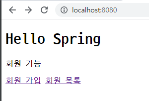
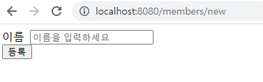
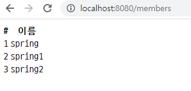

[TOC]


# 회원 관리 예제 - 웹MVC 개발

```java
@Controller
public class MemberController {

    private MemberService memberService;

    @Autowired
    public MemberController(MemberService memberService) {
        this.memberService = memberService;
    }

    @GetMapping("/members/new")
    public String createForm() {
        return "members/createMemberForm";
    }

    @PostMapping("/members/new")
    public String create(MemberForm form) {
        Member member = new Member();
        member.setName(form.getName());

        memberService.join(member);

        return "redirect:/";
    }

    @GetMapping("/members")
    public String list(Model model) {
        List<Member> members = memberService.findMembers();
        model.addAttribute("members", members);
        return "members/memberList";
    }

}
```

- GET / POST에 따라 Mapping하고, html을 return을 설정해준다.







