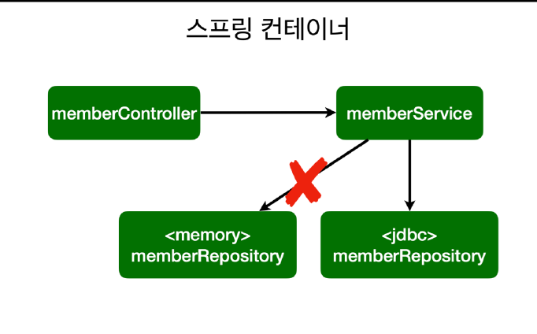

[TOC]

# 스프링 DB접근기술

#### H2 데이터베이스 / 순수 Jdbc



- 개방-폐쇄 원칙(OCP, Open-Closed Principle)
  - 확장에는 열려있고, 수정, 변경에는 닫혀있다.
- 스프링의 DI (Dependencies Injection)을 사용하면 기존 코드를 전혀 손대지 않고, 설정만으로 구현
- 코드 수정 없이 Config만 바꿔서 DB 변경 가능


### 스프링 통합 테스트

- 테스트 할 때는 그냥 편하게 @Autowired 사용
  - 테스트를 다른 곳에서 가져다 쓸 일이 없다.

```java
@Autowired MemberService memberService;
@Autowired MemberRepository memberRepository;
```


```java
@SpringBootTest // 스프링 컨테이너와 테스트를 함께 실행한다.
@Transactional // test를 실행할 때 transaction을 실행하고 rollback을 해준다. DB에 반영안하기 때문에 다음 테스트도 실행 가능
```

- 컨테이너까지 올리는 통합테스트 보다는 단위 테스트를 잘 만들어서 진행하는게 좋다.


### 스프링 JdbcTemplate

- 순수 Jdbc와 동일한 환경설정을 하면 된다.
- 스프링 JdbcTemplate과 MyBatis 같은 라이브러리는 JDBC API에서 본 반복 코드를 대부분제거해준다. 하지만 SQL은 직접 작성해야 한다.


### JPA 

> **Java Persistence API(제일 중요:star: )**

- JPA는 기존의 반복 코드는 물론이고, 기본적인 SQL도 JPA가 직접 만들어서 실행해준다.
- JPA를 사용하면, SQL과 데이터 중심의 설계에서 객체 중심의 설계로 패러다임을 전환을 할 수 있다.
- JPA를 사용하면 개발 생산성을 크게 높일 수 있다.


###  스프링 데이터 JPA

> 스프링 데이터 JPA는 JPA를 편리하게 사용하도록 도와주는 기술, 따라서 JPA를 먼저 학습한 후에 스프링 데이터 JPA를 학습해야 한다.

```java
@Configuration
public class SpringConfig {

    private final MemberRepository memberRepository;

    @Autowired
    public SpringConfig(MemberRepository memberRepository) {
        this.memberRepository = memberRepository;
    }

    @Bean
    public MemberService memberService() {
        return new MemberService(memberRepository);
    }
}
```

- 스프링 데이터 JPA가 SpringDataJpaMemberRepository 를 스프링 빈으로 자동 등록해준다.


#### 스프링 데이터 JPA 제공 기능

- 인터페이스를 통한 기본적인 CRUD
- findByName() , findByEmail() 처럼 메서드 이름 만으로 조회 기능 제공
- 페이징 기능 자동 제공