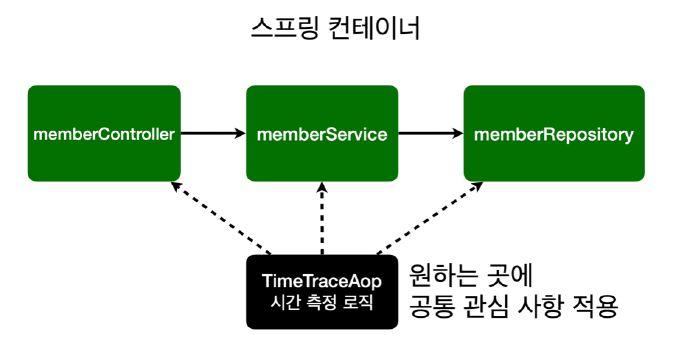
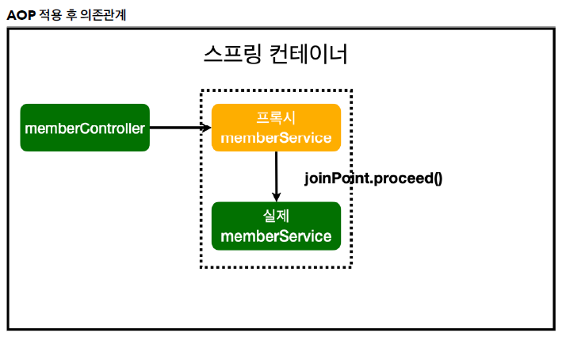
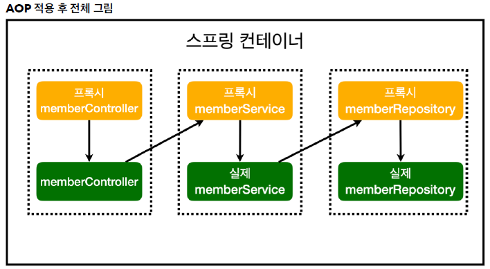

[TOC]

# AOP

> **Aspect Oriented Programming**

### 문제점

- 모든 메소드의 호출 시간을 측정하고 싶다면?
- 회원 가입 시간, 회원 조회 시간을 측정하고 싶다면?

=> 하나하나 변경해야하는 문제 발생


### 해결방법

- 공통 관심 사항(cross-cutting concern) vs 핵심 관심 사항(core concern) 분리



ex) 시간측정 로직을 한 군데 모아두고 원하는 곳에 적용


`Ctrl + Alt + n` : inline refactoring

```java
// TimeTraceAop.java
package hello.hellospring.aop;

import org.aspectj.lang.ProceedingJoinPoint;
import org.aspectj.lang.annotation.Around;
import org.aspectj.lang.annotation.Aspect;
import org.springframework.stereotype.Component;

@Aspect
@Component
public class TimeTraceAop {

    @Around("execution(* hello.hellospring..*(..))") // AOP 적용대상 선택
    public Object execute(ProceedingJoinPoint joinPoint) throws Throwable {
        long start = System.currentTimeMillis();
        System.out.println("START: " + joinPoint.toString());
        try {
            return joinPoint.proceed();
        } finally {
            long finish = System.currentTimeMillis();
            long timeMs = finish - start;
            System.out.println("END: "+ joinPoint.toString() + " " + timeMs + "ms");
        }
    }
}

```

```bash
# 결과
START: execution(String hello.hellospring.controller.MemberController.list(Model))
START: execution(List hello.hellospring.service.MemberService.findMembers())
START: execution(List org.springframework.data.jpa.repository.JpaRepository.findAll())
Hibernate: select member0_.id as id1_0_, member0_.name as name2_0_ from member member0_
END: execution(List org.springframework.data.jpa.repository.JpaRepository.findAll()) 101ms
END: execution(List hello.hellospring.service.MemberService.findMembers()) 108ms
END: execution(String hello.hellospring.controller.MemberController.list(Model)) 117ms
```


#### 해결

- 회원가입, 회원 조회등 핵심 관심사항과 시간을 측정하는 공통 관심 사항을 분리한다.
- 시간을 측정하는 로직을 별도의 공통 로직으로 만들었다.
- 핵심 관심 사항을 깔끔하게 유지할 수 있다.
- 변경이 필요하면 이 로직만 변경하면 된다.
- 원하는 적용 대상을 선택할 수 있다.




- 프록시 사용
- memberService를 가지고 복제해서 코드를 조작하는 기술



